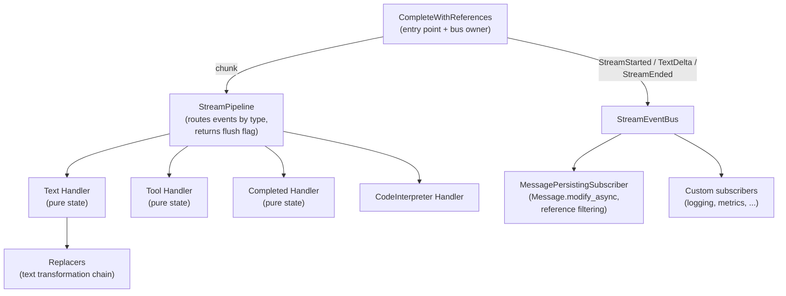
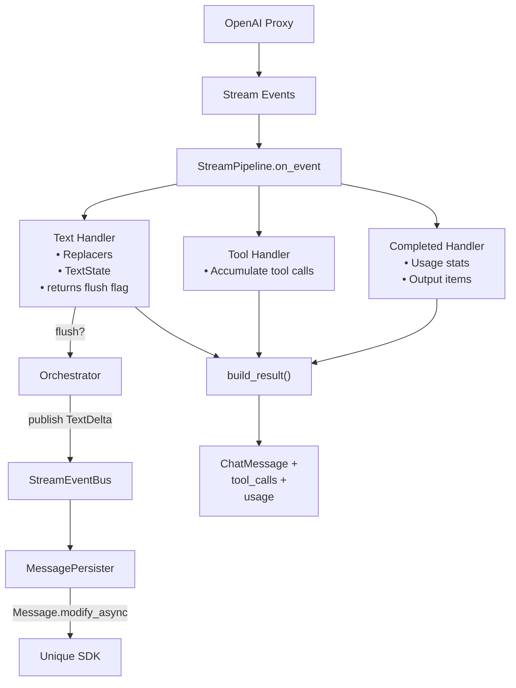

# Overview: Streaming Pipeline Design

## Problem

LLM providers emit tokens incrementally. The toolkit must:

1. Display text to users in real-time (via Unique SDK)
2. Normalise citation patterns across chunk boundaries
3. Assemble a typed response for downstream code
4. Support multiple wire formats (Responses API, Chat Completions, future sources)
5. Let additional side-effects (logging, tracing, analytics) hook in without touching pipeline code

## Solution: Handler Pipeline + Typed Event Bus

The architecture separates **stream consumption** (pipelines + handlers) from **side-effects**
(persistence, observability) via a typed event bus:

### Entry Point (`CompleteWithReferences`)

- Opens the stream from the OpenAI proxy
- Runs its own `async for` loop (not a shared generic runner)
- Catches `httpx.RemoteProtocolError` for graceful partial-stream handling
- Owns a `StreamEventBus` and auto-registers `MessagePersistingSubscriber` (unless the caller passes a pre-configured bus)
- Publishes `StreamStarted` before the loop, `TextDelta` whenever the pipeline reports a text flush boundary, and `StreamEnded` in `finally`
- Calls `pipeline.reset()` before each run and `pipeline.on_stream_end()` in `finally`

### Pipeline (`StreamPipeline`)

- Routes events to typed handlers via `isinstance` checks
- Unknown events are ignored (forward compatibility)
- `on_event` returns a `bool` indicating whether the text handler crossed a flush boundary; the orchestrator uses this to decide when to publish `TextDelta`
- Collects handler outputs via `build_result()`
- **No SDK calls, no bus, no settings** — pure dispatch

### Handlers

Small, focused classes that:

- Process one event type
- Maintain private state (reset between runs)
- Implement the handler protocol for their slot
- **Text handlers return `bool` from `on_chunk` / `on_text_delta` / `on_stream_end`** to signal flush boundaries to the orchestrator; they do not publish events themselves
- **No SDK calls, no knowledge of retrieved chunks**

### Subscribers

Reactive components wired to the `StreamEventBus`:

- `MessagePersistingSubscriber` (default): owns every `Message.modify_async` call plus reference filtering via `filter_cited_sdk_references`. Keys chunks by `message_id` so overlapping streams do not leak.
- Custom subscribers can be added via `orchestrator.bus.subscribe(handler)` — logging, OpenTelemetry spans, analytics, etc.

## Data Flow

## Key Design Decisions

| Decision | Rationale |
|----------|-----------|
| Protocols over ABCs | Structural typing; easy fakes in tests |
| Pure handlers + pure pipeline | Zero-mock unit tests; SDK / retrieval concerns live in subscribers |
| Typed event bus (`StreamEventBus`) | Decouple persistence from stream mechanics; extensible without pipeline changes |
| Default subscriber auto-registered | Callers get working behaviour out of the box; advanced callers can inject a custom bus |
| Explicit `reset()` | Sequential reuse without state leakage |
| Typed dispatch via `isinstance` | Forward compatible; unknown events ignored |
| Own `async for` loop per entry point | Can catch and handle mid-stream errors |
| Replacer chain in text handler | Extensible text transformation |
| `on_event` returns flush flag | Orchestrator decides when to publish `TextDelta` without peeking at handler internals |
