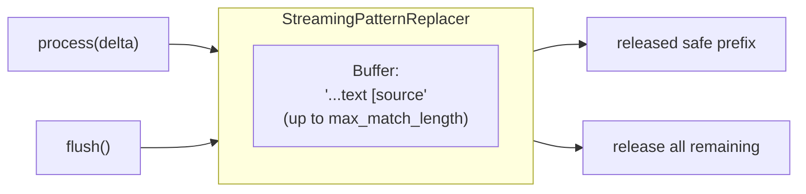

# Pattern Replacer: Cross-Chunk Text Transformation

## Problem

Tokens arrive incrementally. A citation pattern like `[source 1]` might be split:

```
Chunk 1: "The answer is [source"
Chunk 2: " 1]."
```

Naive per-chunk replacement would miss or corrupt these matches.

## Solution: Buffered Replacer

`StreamingPatternReplacer` holds back trailing characters that might be part of a partial match:



## Protocol

```python
class StreamingReplacerProtocol(Protocol):
    def process(self, delta: str) -> str:
        """Append delta, apply patterns, return safe prefix."""
        ...

    def flush(self) -> str:
        """End of stream: apply final patterns, return all remaining."""
        ...
```

## Pattern Lists

Two pattern lists serve different output needs:

| List | Output | Use Case |
|------|--------|----------|
| `NORMALIZATION_PATTERNS` | `<sup>N</sup>` | Streaming (direct to UI) |
| `BATCH_NORMALIZATION_PATTERNS` | `[N]` | Batch (needs post-processing) |

### NORMALIZATION_PATTERNS (Streaming)

Converts model-emitted citations directly to `<sup>N</sup>`:

| Input Pattern | Output |
|--------------|--------|
| `[<source 1>]` | `<sup>1</sup>` |
| `[source0]`, `source_0` | `<sup>0</sup>` |
| `source_number="3"` | `<sup>3</sup>` |
| `[**2**]` | `<sup>2</sup>` |
| `SOURCE n°5` | `<sup>5</sup>` |
| `[source: 1, 2, 3]` | `<sup>1</sup><sup>2</sup><sup>3</sup>` |
| `[user]`, `[assistant]`, `[none]` | `` (stripped) |

**Single source of truth:** Both streaming and batch processing (`reference.py`) import from `pattern_replacer.py`.

## Usage

```python
from unique_toolkit.framework_utilities.openai.streaming.pattern_replacer import (
    NORMALIZATION_PATTERNS,
    NORMALIZATION_MAX_MATCH_LENGTH,
    StreamingPatternReplacer,
)

replacer = StreamingPatternReplacer(
    replacements=NORMALIZATION_PATTERNS,
    max_match_length=NORMALIZATION_MAX_MATCH_LENGTH,  # 80
)

# During streaming
safe_text = replacer.process(delta)

# At stream end
remaining = replacer.flush()
```

## Cascade Flush

Text handlers use cascade flush so upstream replacers' buffered tails reach downstream:

```python
async def on_stream_end(self) -> None:
    remaining = ""
    for replacer in self._replacers:
        if remaining:
            remaining = replacer.process(remaining)  # feed upstream tail
        remaining += replacer.flush()
```

## Extending: Custom Replacers

Any class implementing `StreamingReplacerProtocol` can be added to the chain:

```python
class MyCustomReplacer:
    def __init__(self) -> None:
        self._buffer = ""

    def process(self, delta: str) -> str:
        # Your transformation logic
        return transformed

    def flush(self) -> str:
        return self._buffer

# Use in handler
text_handler = ResponsesTextDeltaHandler(
    settings=settings,
    replacers=[
        StreamingPatternReplacer(...),
        MyCustomReplacer(),
    ],
)
```
