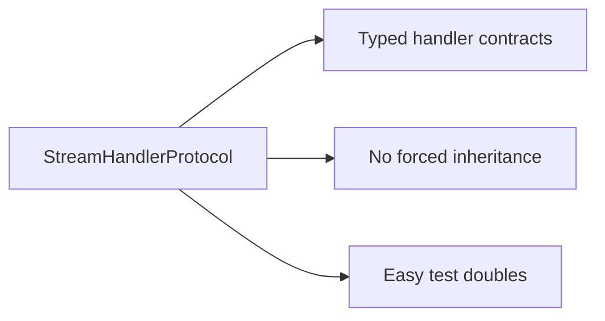
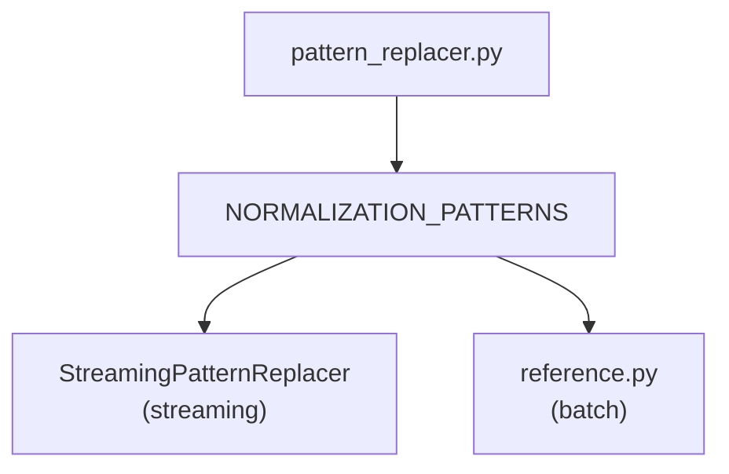

# Architecture Review: Extensibility and Adaptability

## Summary

The streaming pipeline demonstrates solid architectural patterns. The protocol-based design enables extension without modification, and the handler pipeline cleanly separates concerns. Some areas warrant attention for long-term maintainability.

## Strengths

### 1. Protocol-Based Design ✓



**Impact:** New handlers can be added without touching base classes. Tests can use minimal fakes.

### 2. Single Source of Truth for Patterns ✓



**Impact:** Citation normalisation stays consistent between streaming and batch paths.

### 3. Clean Separation of Concerns ✓

| Layer | Responsibility |
|-------|---------------|
| CompleteWithReferences | Stream ownership, error handling |
| StreamPipeline | Event routing |
| Handlers | Event processing, state |
| Replacers | Text transformation |

### 4. Forward Compatibility ✓

Unknown events are ignored:

```python
async def on_event(self, event):
    if isinstance(event, KnownType):
        await self._handler.on_event(event)
        return
    # Unknown events silently pass through
```

**Impact:** New SDK versions won't break existing code.

---

## Areas for Consideration

### 1. Pipeline Assembly is Manual

**Current state:** Callers build handlers and pipeline explicitly:

```python
text_handler = ResponsesTextDeltaHandler(settings, replacers=replacers)
tool_handler = ResponsesToolCallHandler()
completed_handler = ResponsesCompletedHandler()
code_interpreter_handler = ResponsesCodeInterpreterHandler(settings)

pipeline = ResponsesStreamPipeline(
    text_handler=text_handler,
    tool_call_handler=tool_handler,
    completed_handler=completed_handler,
    code_interpreter_handler=code_interpreter_handler,
)
```

**Consideration:** For common use cases, a factory or builder could reduce boilerplate:

```python
# Possible future API
pipeline = ResponsesStreamPipeline.default(settings, replacers=replacers)
```

**Trade-off:** Current explicit assembly provides maximum flexibility. A builder would trade flexibility for convenience.

### 2. Tight Coupling to Unique SDK

**Current state:** Handlers directly call `unique_sdk.Message.modify_async`:

```python
await unique_sdk.Message.modify_async(
    user_id=...,
    company_id=...,
    id=chat.last_assistant_message_id,
    ...
)
```

**Consideration:** For testing or alternative backends, an abstraction layer could help:

```python
class MessagePersistence(Protocol):
    async def update_streaming_text(self, text: str, original: str) -> None: ...
    async def finalize_message(self) -> None: ...
```

**Trade-off:** The current approach is simpler and the SDK is unlikely to change. Abstraction adds complexity without immediate benefit.

### 3. Handler State Reset Discipline

**Current state:** Callers must call `pipeline.reset()` before each run. The `CompleteWithReferences` classes do this correctly.

**Consideration:** If someone uses the pipeline directly without `CompleteWithReferences`, they might forget:

```python
# Direct pipeline usage (rare but possible)
pipeline.reset()  # Easy to forget
async for event in stream:
    await pipeline.on_event(event)
```

**Mitigation options:**
- Document clearly (current approach)
- Auto-reset on first event (could mask bugs)
- Make pipeline single-use (reduces flexibility)

### 4. Two Similar but Distinct APIs

**Current state:** Responses API and Chat Completions have parallel structures:

```
ResponsesStreamPipeline       ChatCompletionStreamPipeline
ResponsesTextDeltaHandler     ChatCompletionTextHandler
ResponsesToolCallHandler      ChatCompletionToolCallHandler
...                           ...
```

**Observation:** This is intentional—the two APIs have different event shapes. The duplication is appropriate given their semantic differences.

**What to watch:** If a third wire format (e.g., Anthropic) is added, consider whether shared abstractions emerge naturally or if parallel structures remain the right choice.

---

## Extensibility Scorecard

| Dimension | Rating | Notes |
|-----------|--------|-------|
| Add new handler | ✓✓✓ | Protocol + pipeline slot |
| Add new wire format | ✓✓ | Copy and adapt parallel structure |
| Custom text transformation | ✓✓✓ | StreamingReplacerProtocol |
| Alternative SDK backend | ✓ | Would require handler changes |
| Test in isolation | ✓✓✓ | Protocols enable easy fakes |

---

## Recommendations

### Now

1. **Keep the explicit assembly pattern** — flexibility outweighs boilerplate for a library
2. **Maintain the parallel Responses/ChatCompletions structures** — their semantics differ enough

### Future (if needed)

1. **Factory functions for common configurations** — if the same assembly pattern repeats across apps
2. **MessagePersistence abstraction** — if alternative backends become a real requirement
3. **Shared base handlers** — only if a third wire format reveals meaningful commonality

---

## Conclusion

The architecture is well-suited for its current requirements. The protocol-based design provides clean extension points. The explicit handler assembly, while verbose, gives callers full control. The main maintenance risk is pattern drift between streaming and batch citation processing, which is already mitigated by the shared `NORMALIZATION_PATTERNS`.

No immediate changes recommended. The architecture should be revisited when adding a third wire format to evaluate whether abstractions have emerged.
