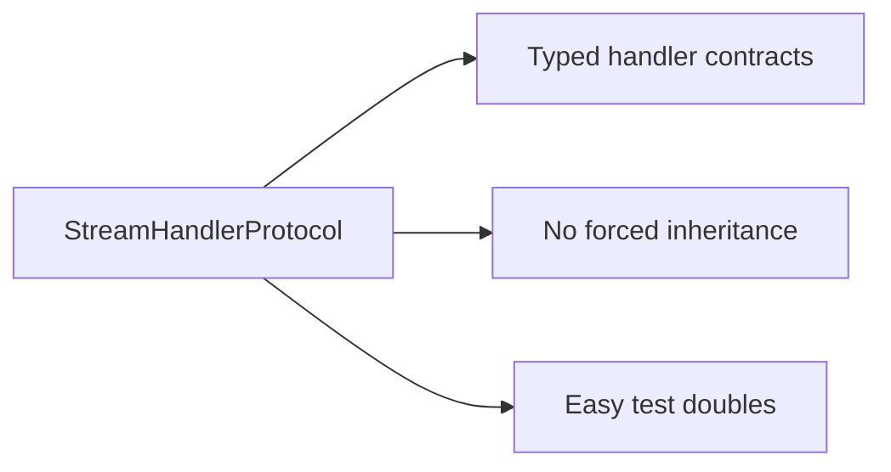
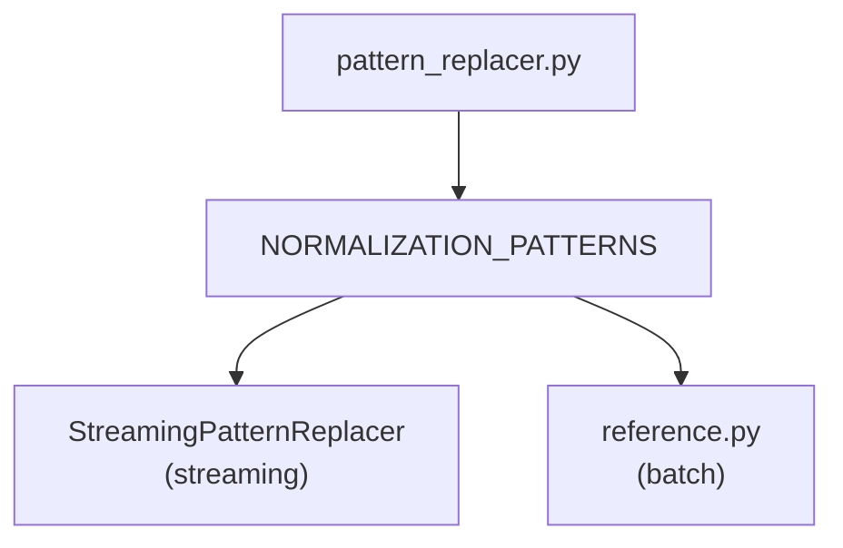
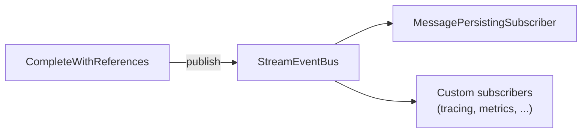

# Architecture Review: Extensibility and Adaptability

## Summary

The streaming pipeline demonstrates solid architectural patterns. The protocol-based design
enables extension without modification, the handler pipeline cleanly separates concerns, and
the typed event bus (April 2026 refactor) decouples persistence side-effects from the streaming
mechanics entirely. Some areas still warrant attention for long-term maintainability.

## Strengths

### 1. Protocol-Based Design ✓



**Impact:** New handlers can be added without touching base classes. Tests can use minimal fakes.

### 2. Single Source of Truth for Patterns ✓



**Impact:** Citation normalisation stays consistent between streaming and batch paths.

### 3. Clean Separation of Concerns ✓

| Layer | Responsibility |
|-------|---------------|
| CompleteWithReferences | Stream ownership, error handling, owns the `StreamEventBus` |
| StreamPipeline | Event routing; returns a flush flag for orchestrator bookkeeping |
| Handlers | Event processing and state only — **pure**, no SDK, no chunks |
| Replacers | Text transformation |
| Bus subscribers | Side-effects: persistence (`MessagePersistingSubscriber`), telemetry, analytics, ... |

### 4. Forward Compatibility ✓

Unknown events are ignored:

```python
async def on_event(self, event):
    if isinstance(event, KnownType):
        return await self._handler.on_event(event)
    return False  # unknown events silently pass through
```

**Impact:** New SDK versions won't break existing code.

### 5. Side-Effects Decoupled via Typed Event Bus ✓ (added April 2026)



**Impact:** The pipeline was previously tightly coupled to `unique_sdk` and had to be threaded
with retrieved `ContentChunk`s. Now `StreamStarted` / `TextDelta` / `StreamEnded` events carry
everything a subscriber needs. Handlers are unit-testable without SDK mocks, and new side-effects
can be added by subscribing to the bus instead of modifying the pipeline.

---

## Areas for Consideration

### 1. Pipeline Assembly is Manual

**Current state:** Callers build handlers and pipeline explicitly:

```python
text_handler = ResponsesTextDeltaHandler(replacers=replacers)
tool_handler = ResponsesToolCallHandler()
completed_handler = ResponsesCompletedHandler()
code_interpreter_handler = ResponsesCodeInterpreterHandler()

pipeline = ResponsesStreamPipeline(
    text_handler=text_handler,
    tool_call_handler=tool_handler,
    completed_handler=completed_handler,
    code_interpreter_handler=code_interpreter_handler,
)
```

**Consideration:** For common use cases, a factory or builder could reduce boilerplate:

```python
# Possible future API
pipeline = ResponsesStreamPipeline.default(replacers=replacers)
```

**Trade-off:** Current explicit assembly provides maximum flexibility. A builder would trade
flexibility for convenience.

### 2. ~~Tight Coupling to Unique SDK~~ Resolved ✓

**Previous state:** Handlers directly called `unique_sdk.Message.modify_async` and required
injected `ContentChunk`s for reference filtering.

**Resolution:** The April 2026 refactor moved every SDK call into
`MessagePersistingSubscriber`, which reacts to domain events on the `StreamEventBus`. Handlers
and pipelines no longer import `unique_sdk` or know about `ContentChunk` at all.

**What callers get for free:**

- Default persister is auto-registered when no bus is passed.
- Callers who pass `bus=StreamEventBus()` opt out of the default and wire their own subscribers
  (useful for non-Unique backends, audit logging, replay harnesses, ...).
- Unit tests construct pipelines with zero SDK mocks.

### 3. Handler State Reset Discipline

**Current state:** Callers must call `pipeline.reset()` before each run. The
`CompleteWithReferences` classes do this correctly.

**Consideration:** If someone uses the pipeline directly without `CompleteWithReferences`, they
might forget:

```python
# Direct pipeline usage (rare but possible)
pipeline.reset()  # Easy to forget
async for event in stream:
    await pipeline.on_event(event)
```

**Mitigation options:**

- Document clearly (current approach)
- Auto-reset on first event (could mask bugs)
- Make pipeline single-use (reduces flexibility)

### 4. Two Similar but Distinct APIs

**Current state:** Responses API and Chat Completions have parallel structures:

```
ResponsesStreamPipeline       ChatCompletionStreamPipeline
ResponsesTextDeltaHandler     ChatCompletionTextHandler
ResponsesToolCallHandler      ChatCompletionToolCallHandler
ResponsesCompleteWithReferences ChatCompletionsCompleteWithReferences
```

Both orchestrators publish the same `StreamStarted` / `TextDelta` / `StreamEnded` events, so
subscribers are wire-format-agnostic — one `MessagePersistingSubscriber` serves both.

**Observation:** The handler duplication is intentional — the two APIs have different event
shapes. The shared event vocabulary on the bus is the right level to unify at.

**What to watch:** If a third wire format (e.g., Anthropic) is added, consider whether shared
handler abstractions emerge naturally or if parallel structures remain the right choice. The
bus layer will remain stable either way.

### 5. Subscriber Ordering and Error Isolation

**Current state:** Subscribers execute via `publish_and_wait_async`. If one raises, the
`TypedEventBus` surfaces the exception and subsequent subscribers for that event may not run.

**Consideration:** If you wire multiple subscribers (persister + tracer + analytics), a
misbehaving tracer could interrupt persistence. The current code is fine because only one
subscriber is registered by default; callers adding subscribers should wrap their handlers in
try/except or rely on `asyncio.gather(..., return_exceptions=True)` semantics if the bus is
extended to support that.

**Mitigation options:**

- Document that custom subscribers should be error-tolerant
- Add a `safe_subscribe(...)` helper that wraps handlers in try/except and logs
- Make persistence always run first (already the case since it is subscribed first)

---

## Extensibility Scorecard

| Dimension | Rating | Notes |
|-----------|--------|-------|
| Add new handler | ✓✓✓ | Protocol + pipeline slot |
| Add new wire format | ✓✓ | Copy and adapt parallel structure; bus contract is reusable |
| Custom text transformation | ✓✓✓ | `StreamingReplacerProtocol` |
| Alternative SDK backend | ✓✓✓ | Swap the bus subscriber; no handler changes |
| Add cross-cutting concern (tracing, metrics) | ✓✓✓ | Subscribe to the bus; no pipeline changes |
| Test in isolation | ✓✓✓ | Pure handlers + bus events ⇒ zero-mock unit tests |

---

## Recommendations

### Now

1. **Keep the explicit assembly pattern** — flexibility outweighs boilerplate for a library.
2. **Maintain the parallel Responses/ChatCompletions handler structures** — their semantics differ enough.
3. **Keep the bus contract minimal** — three events (`StreamStarted`, `TextDelta`, `StreamEnded`) cover known consumers; resist adding fine-grained events until a real consumer needs them.

### Future (if needed)

1. **Factory functions for common configurations** — if the same assembly pattern repeats across apps.
2. **`safe_subscribe` helper** — if third-party subscribers become common.
3. **Shared base handlers** — only if a third wire format reveals meaningful commonality.
4. **Lift `StreamEvent` out of the OpenAI package** — if the Integrated streaming path also wants to publish to a shared bus.

---

## Conclusion

The architecture is well-suited for its current requirements. The protocol-based design provides
clean extension points; the typed event bus removed the last significant coupling (SDK calls +
chunk injection) from the pipeline. The explicit handler assembly, while verbose, gives callers
full control.

Remaining watchpoints are minor: subscriber error isolation and possible future factory helpers.
The architecture should be revisited when adding a third wire format, or if a second consumer
(e.g. Integrated streaming) wants to share the event vocabulary.
