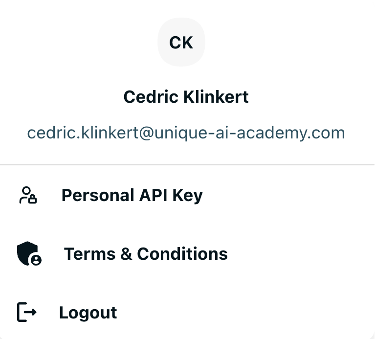
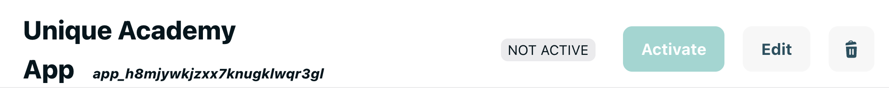

# Authentication with Unique AI Platform

There are two ways of obtaining authentication credentials to use the Unique AI Platform.

## 1. Personal API Key

The personal api key can be obtained by clicking on the `Personal API Key` button in the top right corner of the Unique AI Platform.
Use this method if you are at a development stage and want to test something quick and local.


{ width=300 }

On clicking onto the personal api key button the following popup appears 


and the secrets must be used according to the following table into the environment variables

| Toolkit Secret Variable | Platform Secret Name | Example | 
|--|--|--|
|UNIQUE_AUTH_COMPANY_ID | Company ID| `346386357988860534` |
|UNIQUE_AUTH_USER_ID | User ID | `347188092944093062` |
|UNIQUE_APP_ID | App ID | `app_iaii8qhvt5j80wo9i4wmwqqc` |
|UNIQUE_APP_KEY | Api Key | `ukey_<redacted>`|

The `UNIQUE_API_BASE_URL` can be obtained from your admin and the current `UNIQUE_API_VERSION` is `2023-12-06`.

## 2. Creating an APP

The added advantage of a dedicated app is that you can reach your application from the platform when certain events occur. You will therefore have additional authentication credentials to keep your application secure.

You would use this method if you are developing a custom applications that would be deployed for multiple users.


1) On the sidebar click on the following symbol { width=50 } and click on the { width=150 } button to create a new app.

2) Enter a name and a description

{ height=100 } 

after saving you will see the following screen

 

3) Activate the App

In the header of the page you find the app id as well as an activation button



where the app can be activated and deactivated.


4) Create an API key for the App

After activation new section allows to create an api key for the app


once created the following pop up will show


with the generated key.

You can how expose your application's endpoint to the platform by registering an endpoint.

{ height=100 } 

Additionally to the url, we must give a name and a description to the endpoint and decide to what event the app is subscribing to

{ height=100 } 

We can now add the two secrets to `unique.env`

```
UNIQUE_APP_ENDPOINT=https://<your-app-url>
UNIQUE_APP_ENDPOINT_SECRET=usig_<redacted>
```