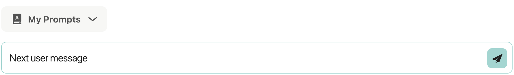

# Chat Service - Advanced Rendering 

In this section we will learn how to use specialy formatted strings to create artifacts on the Unique frontend.


## Prompt Buttons

Prompt buttons allow the user to easily add follow-up prompts suggested by the agent to their prompt field. When a user clicks a prompt button, the suggested text automatically appears in the user's input field, making it easy to continue the conversation with pre-formatted queries.

The assistant message will look as:


When clicked, the text will appear in the user prompt window:



For implementation examples, see the [Prompt Buttons Examples](../modules/examples/chat/advanced_rendering.md#prompt-buttons).

## LaTeX Formulas

The chat system supports rendering LaTeX formulas in chat messages using Markdown. This feature allows you to include mathematical or scientific equations in a readable format, enhancing communication in technical discussions.

### Who is it for

This feature is designed for:

* **Mathematicians, scientists, and engineers** who need to share complex equations.
* **Educators and students** collaborating on mathematical or scientific problems.
* **Anyone** who needs to communicate mathematical or technical content effectively in chat.

### Benefits

* **Clarity**: Share complex mathematical or scientific formulas in a readable format.
* **Efficiency**: Quickly render formulas without needing external tools.
* **Collaboration**: Enhance communication in technical discussions.

### Use Cases

* **Educational Discussions**: Teachers and students discussing mathematical problems.
* **Technical Collaboration**: Engineers and scientists sharing equations during project discussions.
* **Documentation**: Including formulas in chat for reference or explanation.

### Supported LaTeX Formula Syntax

We support LaTeX formulas in the following formats only:

* **Inline math**: use `\(...\)`  
  Example: `The area is \( \pi r^2 \).`
* **Block (display) math**: use `\[...\]` on its own line  
  Example: `\[ E = mc^2\]`

**Note**: Other delimiters such as `$...$` or `$$...$$` are **not supported**.

### Using with LLMs

If your LLM does not automatically produce the required delimiters, include an instruction in the system prompt such as:

> "Render all LaTeX math using `\(...\)` for inline and `\[...\]` for block equations. Do not use `$...$` or `$$...$$`."

You can also reinforce this by adding:

* "Prefer inline math for short, in-sentence expressions."
* "Use block math for standalone or multi-line equations."

### Step-by-Step Guide

To render LaTeX formulas in chat messages, you need to use the LaTeX shorthand syntax for equations. This involves wrapping the formula in escaped square brackets `\[...\]` for block math or `\(...\)` for inline math.

#### Key Points

1. **Use LaTeX shorthand syntax**:  
   * For block math: Wrap the formula in escaped square brackets `\[...\]`.
   * For inline math: Wrap the formula in escaped parentheses `\(...\)`.
2. **Ensure correct LaTeX syntax**:  
   * Follow standard LaTeX syntax rules within the brackets.

### Examples

The `create_latex_formula_string` helper function creates block math formulas. Here's how a rendered formula appears:


For detailed implementation examples including helper functions, manual formatting, inline math, and complex formulas, see the [LaTeX Formulas Examples](../modules/examples/chat/advanced_rendering.md#latex-formulas).

### Tips & Tricks

* Ensure that your LaTeX code is correctly formatted and follows the standard LaTeX syntax.
* The shorthand syntax `\[...\]` is specifically for rendering LaTeX in our chat messages (block math).
* The shorthand syntax `\(...\)` is for inline math within sentences.
* If you encounter any issues with rendering, double-check that the formula is correctly wrapped in escaped brackets and that the LaTeX syntax is accurate.
* Use inline math `\(...\)` for short expressions within sentences.
* Use block math `\[...\]` for standalone or multi-line equations.

### Limitations

* **Syntax Errors**: Incorrect LaTeX syntax will result in rendering issues.
* **Formatting Rules**: Only formulas wrapped in `\[...\]` (block) or `\(...\)` (inline) will render.
* **Unsupported Delimiters**: The delimiters `$...$` or `$$...$$` are not supported and will not render.
* **Complexity**: Extremely complex formulas may require additional testing to ensure proper display.

## Images

Images can be rendered directly within chat messages using Markdown syntax. This feature allows you to share visual content seamlessly, enhancing collaboration and understanding in real-time.

### Steps to Embed an Image

1. **Upload the Image**: First, upload the image to the chat. This can typically be done by dragging and dropping the image file into the chat window or using the upload button provided in the chat interface.
2. **Copy the Image URL**: Once the image is uploaded, it will be assigned a unique URL in the format `unique://content/content_id`. Copy this URL.
3. **Insert the Markdown**: In your chat message, use the Markdown syntax to embed the image. Replace `unique://content/cont_1234` with the actual URL of your uploaded image.

For implementation examples, see the [Images Examples](../modules/examples/chat/advanced_rendering.md#images).

### Tips & Tricks

* **Image Source**: Only images that have been uploaded into the chat can be displayed. The image URL must follow the format `unique://content/content_id`.
* **Security Considerations**: For security reasons, our chat application does not render images that:
  * Do not follow the `unique://content/content_id` format.
  * Are not part of the chat the user is currently in.
* **Content ID**: The `content_id` is a unique identifier assigned to each uploaded image. Ensure you use the correct `content_id` associated with the image you want to display.
* **Preview Before Sending**: Double-check the Markdown syntax to ensure the image renders correctly.
* **Organize Content IDs**: Keep track of your uploaded image IDs for easy reuse.
* **Combine with Text**: Add context to your images by including descriptive text in your message.

### Limitations

* **Image Source**: Only images uploaded into the chat can be displayed. External URLs are not supported.
* **Security Restrictions**:
  * Images must follow the `unique://content/content_id` format.
  * Images not part of the current chat cannot be rendered.
* **Content ID**: Ensure you use the correct `content_id` associated with the image you want to display.

## Financial Chart

The `financialchart` block enables rich visualization of stock market data within chat messages using a JSON structure. This feature supports time-series price charts along with detailed financial metrics — perfect for financial bots, stock monitoring tools, or investment platforms.


### Comparative View

When multiple instruments are provided, the chart displays a **comparative view**, showing the relative performance of each instrument over time. This allows for direct comparison between stocks or other financial assets within the same visual context.


### Syntax

Wrap your JSON payload in a code block with the `financialchart` tag:

````
```financialchart
// JSON payload (see below)
```
````

The payload must be an **array of objects**, each describing a single financial instrument. Each object should contain:
- `info`: Company and instrument details (name, ticker, exchange, currency)
- `priceHistory`: Array of date/value pairs for historical prices
- `metrics`: Array of financial metrics with name, value, and timestamp
- `lastUpdated`: Timestamp of when the data was last updated
- `version`: Version number of the data structure

For detailed implementation examples, see the [Financial Chart Examples](../modules/examples/chat/advanced_rendering.md#financial-chart).

### Supported Metric Names

| **Name** | **Description** |
| -------- | --------------- |
| Open | Opening price of the last session |
| High | Highest price during the session |
| Close | Closing price |
| Market Cap | Market capitalization |
| Price Earnings Ratio | P/E ratio |
| Volume | Trading volume |
| Year High | Highest price in past year |
| Year Low | Lowest price in past year |
| Dividend Yield | Dividend yield % |
| Volatility 30 Days | 30-day price volatility |

## Full Examples

For complete, runnable examples of all advanced rendering features, see the [Advanced Rendering Examples](../modules/examples/chat/advanced_rendering.md) section.


