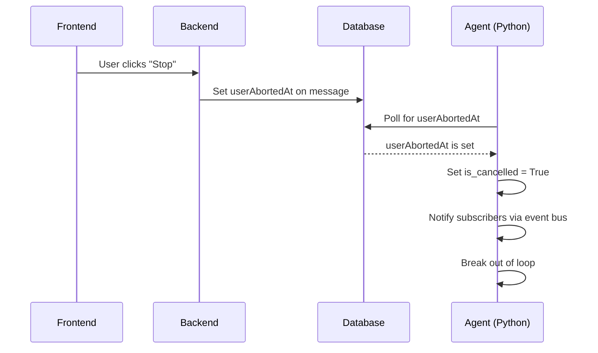

# Task Cancellation

When a user clicks "Stop" in the chat frontend, the platform sets a `userAbortedAt` flag on the assistant message in the database. The toolkit provides a `CancellationWatcher` to detect this flag and gracefully stop long-running agent loops or tool executions.

## How It Works



The `CancellationWatcher` is available on every `ChatService` instance via the `cancellation` property:

```{.python #cancellation-init-watcher}
from unique_toolkit import ChatService

chat_service = ChatService(event)
watcher = chat_service.cancellation
```

## Checking for Cancellation

### Single-Shot Check

Use `check_cancellation_async()` to poll the database once. Returns `True` if the user has requested cancellation.

```{.python #cancellation-check-async}
if await chat_service.cancellation.check_cancellation_async():
    # handle cancellation
    return
```

A synchronous variant is also available:

```{.python #cancellation-check-sync}
if chat_service.cancellation.check_cancellation():
    return
```

### Reading the Flag

After a successful check, `is_cancelled` stays `True` for the lifetime of the watcher. Use this for lightweight checks between operations without hitting the database again:

```{.python #cancellation-is-cancelled-flag}
if chat_service.cancellation.is_cancelled:
    break
```

## Running a Coroutine with Cancellation

For long-running async operations, `run_with_cancellation` executes a coroutine while polling for cancellation in the background:

```{.python #cancellation-run-with-cancellation}
result = await chat_service.cancellation.run_with_cancellation(
    some_long_running_coroutine(),
    poll_interval=2.0,
)
```

If the user cancels during execution, the coroutine is cancelled and `None` is returned by default. You can specify a custom return value with `cancel_result` to avoid `None` checks:

```{.python #cancellation-run-with-cancel-result}
result = await chat_service.cancellation.run_with_cancellation(
    some_long_running_coroutine(),
    cancel_result=my_default_response,
)
# result is guaranteed to be the same type as the coroutine's return
```

## Subscribing to Cancellation Events

The watcher exposes a `TypedEventBus` via `on_cancellation`. Subscribe a handler to be notified the moment cancellation is detected:

```{.python #cancellation-subscribe-event-bus}
from unique_toolkit.chat.cancellation import CancellationEvent

async def on_cancel(event: CancellationEvent):
    logger.info(f"Cancelled: message {event.message_id}")
    # perform cleanup, save partial results, etc.

sub = chat_service.cancellation.on_cancellation.subscribe(on_cancel)
try:
    # ... run your agent loop ...
finally:
    sub.cancel()
```

Both sync and async handlers are supported. The subscription is cleaned up by calling `sub.cancel()`.

## Putting It Together

A typical agent loop combines all three mechanisms:

```{.python #cancellation-agent-loop-combined}
async def run(self):
    sub = self.chat_service.cancellation.on_cancellation.subscribe(
        self._on_cancellation
    )
    try:
        for i in range(max_iterations):
            # 1. Check before starting an iteration
            if await self.chat_service.cancellation.check_cancellation_async():
                break

            # 2. Run LLM call — stream abort is handled by the platform
            response = await self._stream_complete()

            # 3. Check the flag after the LLM call returns
            if self.chat_service.cancellation.is_cancelled:
                break

            # 4. Run tools with background cancellation polling
            result = await self.chat_service.cancellation.run_with_cancellation(
                self._execute_tools(response),
                cancel_result=default_result,
            )

            if self.chat_service.cancellation.is_cancelled:
                break
    finally:
        sub.cancel()
        await self.chat_service.modify_assistant_message_async(
            set_completed_at=True,
        )
```

The three layers provide defense in depth:

| Mechanism | When to use |
|-----------|-------------|
| `check_cancellation_async()` | At the start of each iteration — polls the DB |
| `is_cancelled` | Between operations — lightweight flag check, no DB call |
| `run_with_cancellation()` | Around long-running coroutines — automatic background polling |

## API Reference

::: unique_toolkit.chat.cancellation.CancellationWatcher

::: unique_toolkit.chat.cancellation.CancellationEvent
