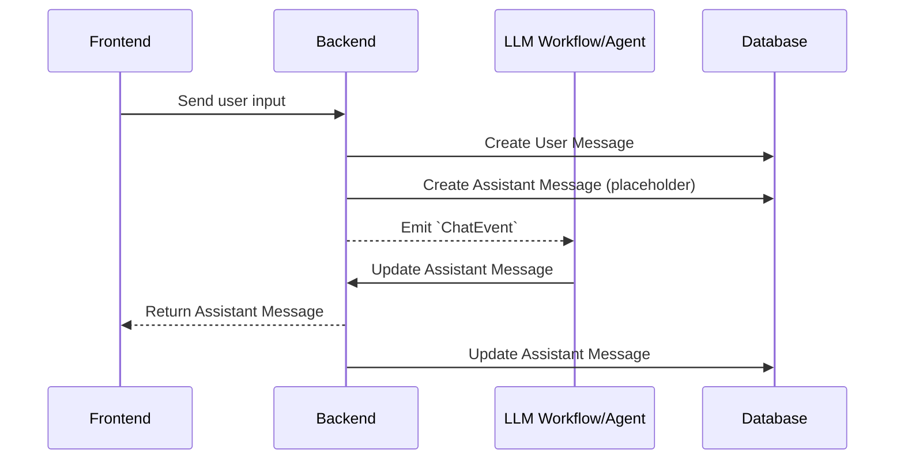

# Chat Service - Basics

<!--
```{.python #import_language_model_name}
from unique_toolkit import LanguageModelName
```
-->

<!--
```{.python #trivial_message_from_user}
messages = (
        OpenAIMessageBuilder()
        .system_message_append(content="You are a helpful assistant")
        .user_message_append(content=event.payload.user_message.text)
        .messages
    )
```
-->


The chat service is responsible for all interactions with the Unique chat frontend as seen below


The following elements are directly influenced by it.

| Element | Description | 
|--|--------|
| User Message | The request as entered by the user |
| Assistant Message | The answer of the agent/workflow or LLM |
| Json Value | The final request sent to the LLM that creates the assistant message|
| Debug Info | Debug information generated during the processing of the request|


The `ChatService` from the `unique_toolkit` is used to communicate to these elments. Please see [Event Driven Applications](../application_types/event_driven/index.md) on how to initialize services and setup a development setup. The service itself can be imported as

```{python #unique_chat_service_import}
from unique_toolkit import ChatService
```

## Chat State

The `ChatService` is a stateful service and therefore should be freshly instantiated for each request sent by a user from the frontend. 

## Basics
The below sequence diagram shows the dataflow on user input.




### The Chat Event

For each input of the user the application obtains a `ChatEvent`, this objects contains the `id's` of the user message in the database as well as the following assistant message entry. We can use these entries to return the final as well as intermediate results to the user using 

```{python #chat_service_intermediate_assistant_result}
chat_service.modify_assistant_message(
        content="Intermediate assistant message",
    )
```

The functionality automatically uses the last assistant message within the chat.

The message can be updated as many times as desired to display intermediate results but it is important to ensure that the user has time to read it between the updates. Especially, when using the `async` version `modify_assistant_message_async` a short async sleep after modification can be helpful.


```{python #chat_service_final_assistant_result}
chat_service.modify_assistant_message(
        content="Final assistant message",
    )
```

<!--
```{.python file=docs/.python_files/minimal_chat_with_manual_modifiy.py}
import time
<<full_sse_setup_with_services>>
    <<chat_service_intermediate_assistant_result>>
    time.sleep(2)
    <<chat_service_final_assistant_result>>
```
-->