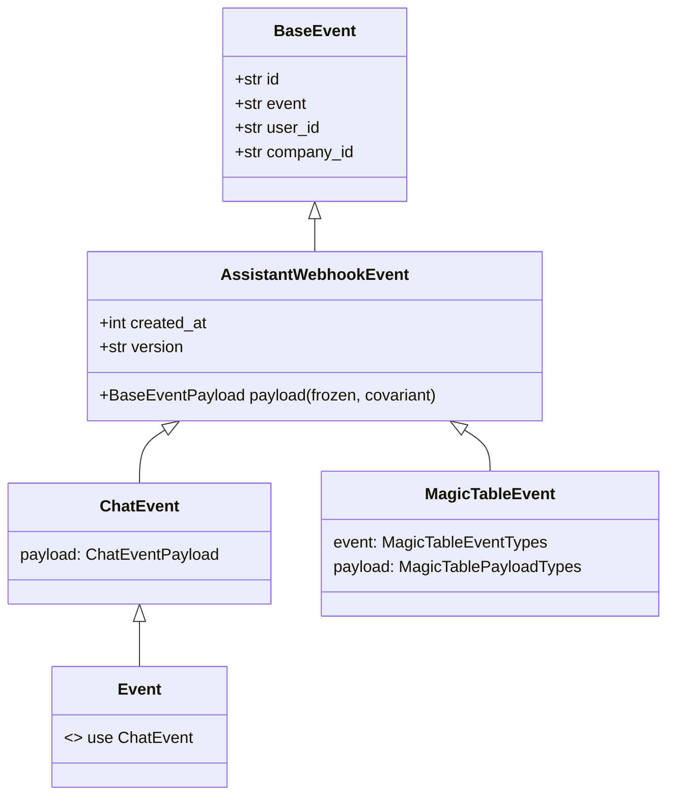
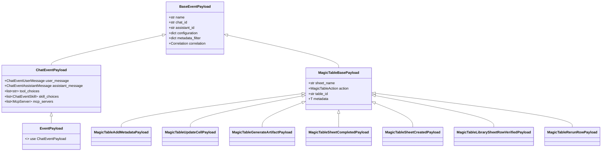

# Event

Events are the building blocks of the Unique platform. They are used to trigger actions and to communicate between different parts of the platform.
Various actions in the platform trigger differnet events. Each of these events has a specific payload that is used to trigger the action.
So it is crucial to understand them to be able to build applications reactive to the platform.

Chat and ingestion event names are defined in the `unique_toolkit.app.schemas.EventName`
StrEnum. Agentic Table (magic-table) event names are defined separately in
`unique_toolkit.agentic_table.schemas.MagicTableEventTypes`.

## Event class hierarchy

All assistant-context webhook events share a common envelope, `AssistantWebhookEvent`,
which extends the generic `BaseEvent`. `ChatEvent` and `MagicTableEvent` are **siblings**
under that envelope — `MagicTableEvent` is *not* a subclass of `ChatEvent`. Each
specializes the `payload` type. `AssistantWebhookEvent.payload` is covariant and
`frozen`, so a service may accept any assistant-context event and read the shared
`BaseEventPayload` shape in a type-checked way.

`BaseEvent` and `AssistantWebhookEvent` are generic: `BaseEvent[FilterOptionsT]` and
`AssistantWebhookEvent[FilterOptionsT, PayloadT_co]`. Both `ChatEvent` and
`MagicTableEvent` bind `FilterOptionsT` to `UniqueChatEventFilterOptions`.

### Payload hierarchy

Payloads share `BaseEventPayload` (the common envelope: `chat_id`, `assistant_id`,
`metadata_filter`, `correlation`, ...). `ChatEventPayload` adds chat-only fields;
`MagicTableBasePayload` adds magic-table fields and is further specialized per action.
`MagicTablePayloadTypes` is the discriminated union (on `action`) of the concrete
magic-table payloads, and is what `MagicTableEvent.payload` resolves to.

### Chat

The chat interface triggers the following events:

| Event Name | Description | Event Type | Payload Type |
|------------|-------------|--------------|--------------|
| `unique.chat.user-message.created` | Triggered when a user sends a message to the chat | - | - |
| `unique.chat.external-module.chosen` | Triggered when a user chooses an external module to use in the chat | `ChatEvent` | `ChatEventPayload` |

### Ingestion

The knowledge base ingestion process triggers the following events:

| Event Name | Description | Payload Type |
|------------|-------------|--------------|
| `unique.ingestion.content.uploaded` | Triggered when a new file is uploaded to the knowledge base | - |
| `unique.ingestion.content.finished` | Triggered when the ingestion of a file is finished | - |

### Agentic Table

The Agentic Table interface triggers the following events:

| Event Name | Description | Event Type | Payload Type |
|------------|-------------|--------------|--------------|
| `unique.magic-table.update-cell` | Triggered when a cell is updated | `MagicTableEvent` | `MagicTableUpdateCellPayload` |
| `unique.magic-table.add-meta-data` | Triggered when a new question, question file, or source file is added | `MagicTableEvent` | `MagicTableAddMetadataPayload` |
| `unique.magic-table.generate-artifact` | Triggered when a report generation button is clicked | `MagicTableEvent` | `MagicTableGenerateArtifactPayload` |
| `unique.magic-table.sheet-completed` | Triggered when the sheet is marked as completed | `MagicTableEvent` | `MagicTableSheetCompletedPayload` |
| `unique.magic-table.library-sheet-row.verified` | Triggered when a row in a "Library" sheet is verified | `MagicTableEvent` | `MagicTableLibrarySheetRowVerifiedPayload` |
| `unique.magic-table.sheet-created` | Triggered when a new sheet is created | `MagicTableEvent` | `MagicTableSheetCreatedPayload` |
| `unique.magic-table.rerun-row` | Triggered when a row is re-run (e.g. after its sources change) | `MagicTableEvent` | `MagicTableRerunRowPayload` |

