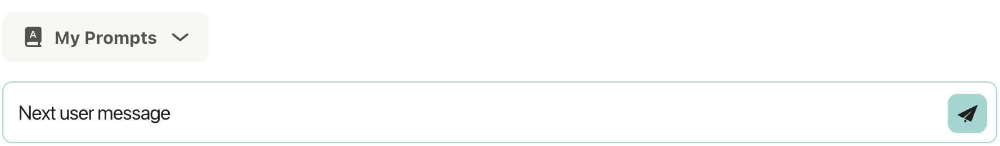

# Chat Service - Advanced Rendering 

In this section we will learn how to use specialy formatted strings to create artifacts on the Unique frontend.


## Prompt Buttons

Prompt buttons allow the user to easily add follow-up prompts suggested by the agent to their prompt field 

```{.python #rendering_prompt_buttons}
prompt_button_string = create_prompt_button_string(button_text="Click me", next_user_message="Next user message")
chat_service.create_assistant_message(
    content=f"Here is a prompt button:\n {prompt_button_string}",
)
```

The assistant message will look as


and when clicked the text will appear in the user prompt windown


<!--
```{.python file=docs/.python_files/chat_prompt_button.py}
<<full_sse_setup_with_services>>
    <<rendering_prompt_buttons>>
    <<free_user_input>>
```
-->

## Latex Formulas

```{.python #rendering_latex_formula}
latex_formula_string = create_latex_formula_string(
    latex_expression=r"\int_{a}^{b} f(x) \, dx"
)
chat_service.create_assistant_message(
    content=f"Here is a latex formula: {latex_formula_string}",
)
```
<!--
```{.python file=docs/.python_files/chat_latex_formula.py}
<<full_sse_setup_with_services>>
    <<rendering_latex_formula>>
    <<free_user_input>>
```
-->

The formula will appear as


## Images

Images can be rendered directly within chat messages using Markdown syntax. This feature allows you to share visual content seamlessly, enhancing collaboration and understanding in real-time.

### Steps to Embed an Image

1. **Upload the Image**: First, upload the image to the chat. This can typically be done by dragging and dropping the image file into the chat window or using the upload button provided in the chat interface.
2. **Copy the Image URL**: Once the image is uploaded, it will be assigned a unique URL in the format `unique://content/content_id`. Copy this URL.
3. **Insert the Markdown**: In your chat message, use the Markdown syntax to embed the image. Replace `unique://content/cont_1234` with the actual URL of your uploaded image.

```{.python #rendering_image}
# Example: Rendering an image that was uploaded to the chat
# The content_id is obtained from the uploaded image
content_id = "cont_nwnfwd7kq5czq04begyb6ub8"  # Example content ID
image_markdown = f""
chat_service.create_assistant_message(
    content=f"This is an image that I took from a note:\n{image_markdown}",
)
```

### Tips & Tricks

* **Image Source**: Only images that have been uploaded into the chat can be displayed. The image URL must follow the format `unique://content/content_id`.
* **Security Considerations**: For security reasons, our chat application does not render images that:
  * Do not follow the `unique://content/content_id` format.
  * Are not part of the chat the user is currently in.
* **Content ID**: The `content_id` is a unique identifier assigned to each uploaded image. Ensure you use the correct `content_id` associated with the image you want to display.
* **Preview Before Sending**: Double-check the Markdown syntax to ensure the image renders correctly.
* **Organize Content IDs**: Keep track of your uploaded image IDs for easy reuse.
* **Combine with Text**: Add context to your images by including descriptive text in your message.

### Limitations

* **Image Source**: Only images uploaded into the chat can be displayed. External URLs are not supported.
* **Security Restrictions**:
  * Images must follow the `unique://content/content_id` format.
  * Images not part of the current chat cannot be rendered.
* **Content ID**: Ensure you use the correct `content_id` associated with the image you want to display.

## Financial Chart

The `financialchart` block enables rich visualization of stock market data within chat messages using a JSON structure. This feature supports time-series price charts along with detailed financial metrics — perfect for financial bots, stock monitoring tools, or investment platforms.


### Comparative View

When multiple instruments are provided, the chart displays a **comparative view**, showing the relative performance of each instrument over time. This allows for direct comparison between stocks or other financial assets within the same visual context.


### Syntax

Wrap your JSON payload in a code block with the `financialchart` tag:

````
```financialchart
// JSON payload (see below)
```
````

The payload must be an **array of objects**, each describing a single financial instrument.

```{.python #rendering_financial_chart}
import json
from datetime import datetime, timezone

# Example: Creating a financial chart payload
financial_data = [
    {
        "info": {
            "companyName": "Apple",
            "instrumentName": "Apple Rg",
            "ticker": "AAPL",
            "exchange": "NASDAQ",
            "currency": "USD"
        },
        "priceHistory": [
            {"date": "2025-01-02", "value": 243.85},
            {"date": "2025-01-03", "value": 245.12},
            # ... more price history entries
        ],
        "metrics": [
            {
                "name": "Open",
                "value": 221.45,
                "timestamp": "2025-03-27T09:30:01-04:00"
            },
            # ... more metrics
        ],
        "lastUpdated": "2025-03-28T16:10:09.243846",
        "version": 1
    }
]

# Format as financialchart code block
financial_chart_markdown = f"```financialchart\n{json.dumps(financial_data, indent=2)}\n```"

chat_service.create_assistant_message(
    content=f"Here is the stock performance:\n{financial_chart_markdown}",
)
```

### Supported Metric Names

| **Name** | **Description** |
| -------- | --------------- |
| Open | Opening price of the last session |
| High | Highest price during the session |
| Close | Closing price |
| Market Cap | Market capitalization |
| Price Earnings Ratio | P/E ratio |
| Volume | Trading volume |
| Year High | Highest price in past year |
| Year Low | Lowest price in past year |
| Dividend Yield | Dividend yield % |
| Volatility 30 Days | 30-day price volatility |

## Full Examples
??? example "Full Examples Rendering (Click to expand)"
    
    <!--codeinclude-->
    [Button](../../../examples_from_docs/chat_prompt_button.py)
    [Latex](../../../examples_from_docs/chat_latex_formula.py)
    <!--/codeinclude-->


