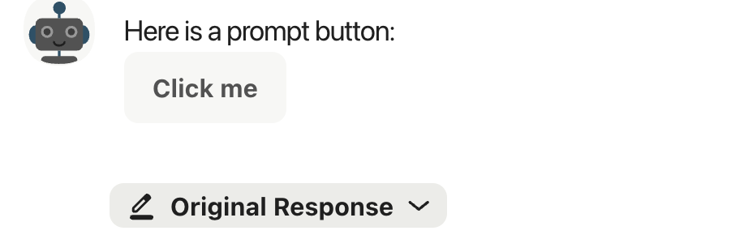
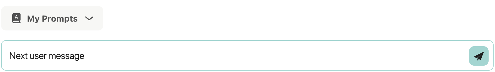
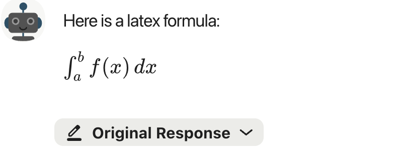

# Chat Service - Advanced Rendering 

In this section we will learn how to use specialy formatted strings to create artifacts on the Unique frontend.


## Prompt Buttons

Prompt buttons allow to create a proposition to the user for the next prompt

```{.python #rendering_prompt_buttons}
prompt_button_string = create_prompt_button_string(button_text="Click me", next_user_message="Next user message")
chat_service.create_assistant_message(
    content=f"Here is a prompt button:\n {prompt_button_string}",
)
```

The assistant message will look as



and when clicked the text will appear in the user prompt windown


<!--
```{.python file=docs/.python_files/chat_prompt_button.py}
<<full_sse_setup_with_services>>
    <<rendering_prompt_buttons>>
    <<free_user_input>>
```
-->

## Latex Formulas

```{.python #rendering_latex_formula}
latex_formula_string = create_latex_formula_string(
    latex_expression=r"\int_{a}^{b} f(x) \, dx"
)
chat_service.create_assistant_message(
    content=f"Here is a latex formula: {latex_formula_string}",
)
```
<!--
```{.python file=docs/.python_files/chat_latex_formula.py}
<<full_sse_setup_with_services>>
    <<rendering_latex_formula>>
    <<free_user_input>>
```
-->

The formula will appear as


## Full Examples
??? example "Full Examples Rendering (Click to expand)"
    
    <!--codeinclude-->
    [Button](../../../examples_from_docs/chat_prompt_button.py)
    [Latex](../../../examples_from_docs/chat_latex_formula.py)
    <!--/codeinclude-->


