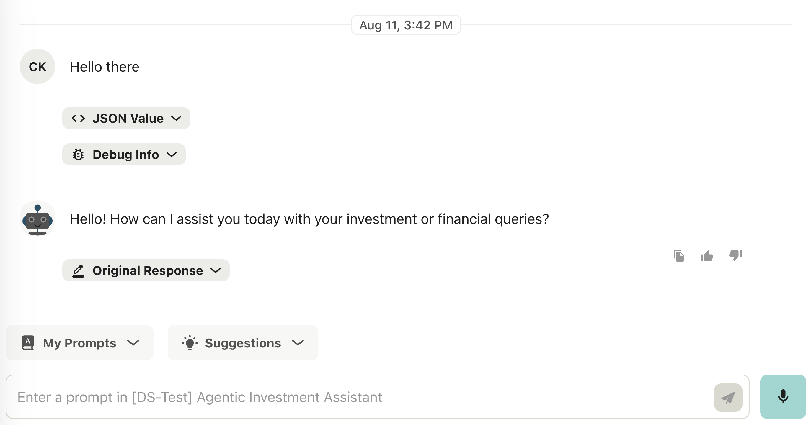
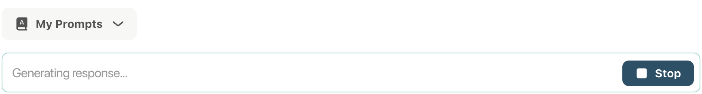

# Chat Service

<!--
```{.python #import_language_model_name}
from unique_toolkit import LanguageModelName
```
-->

<!--
```{.python #trivial_message_from_user}
messages = (
        OpenAIMessageBuilder()
        .system_message_append(content="You are a helpful assistant")
        .user_message_append(content=event.payload.user_message.text)
        .messages
    )
```
-->


The chat service is responsible for all interactions with the Unique chat frontend as seen below




The following elements are directly influenced by it.

| Element | Description | 
|--|--------|
| User Message | The request as entered by the user |
| Assistant Message | The answer of the agent/workflow or LLM |
| Json Value | The final request sent to the LLM that creates the assistant message|
| Debug Info | Debug information generated during the processing of the request|


The `ChatService` from the `unique_toolkit` is used to communicate to these elments. Please see [Event Driven Applications](../../../application_types/event_driven_applications.md) on how to initialize services and setup a development setup. The service itself can be imported as

```{python #unique_chat_service_import}
from unique_toolkit import ChatService
```

## Chat State

The `ChatService` is a stateful service and therefore should be freshly instantiated for each request sent by a user from the frontend. 

## Create assistant messages

The most used functionality is to create an assistant message via a stream to the frontend


```{.python #chat_service_complete_with_references}
chat_service.complete_with_references(
        messages = messages,
        model_name = LanguageModelName.AZURE_GPT_4o_2024_1120)
```


<!--

```{.python file=docs/.python_files/minimal_chat_app.py}
<<full_sse_setup>>
    <<trivial_message_from_user>>
    <<chat_service_complete_with_references>>
```
-->


Alternatively a message can be created directly by

```{python #chat_service_create_assistant_message}
assistant_message = chat_service.create_assistant_message(
        content="Hello from Unique",
    )
```

<!--
```{.python file=docs/.python_files/minimal_chat_with_manual_message_create.py}
<<full_sse_setup>>
    <<chat_service_create_assistant_message>>
```
-->

??? example "Full Examples (Click to expand)"
    
    <!--codeinclude-->
    [Simple Streaming](../../../examples_from_docs/minimal_chat_app.py)
    [Simple Manual Response](../../../examples_from_docs/minimal_chat_with_manual_message_create.py)
    <!--/codeinclude-->

## Modifying messages

## Edit texts 

Both user messages as well as assistant message may be modified via the `message_id`. If no id is specified the last message in the chat history will be modified.

```{python #chat_service_modify_user_message}
chat_service.modify_user_message(
        content="Modified User Message",
        message_id=event.payload.user_message.id,
    )
```

```{python #chat_service_modify_assistant_message}
chat_service.modify_assistant_message(
        content="Modified User Message",
        message_id=assistant_message.id
    )
```

<!--
```{.python file=docs/.python_files/minimal_chat_with_manual_message_create_and_modification.py}
<<full_sse_setup>>
    <<chat_service_create_assistant_message>>
    <<chat_service_modify_assistant_message>>
```
-->

## Unblocking the next user input

For each user interaction the plattform is expected to answer in some form. 
Thus, the user input is blocked during the process leading to this answer as seen below. 



It can be unblocked using 

```{python #chat_service_free_user_input}
chat_service.free_user_input()
```

<!--
```{.python file=docs/.python_files/minimal_chat_with_manual_message_create_free_user_input.py}
<<full_sse_setup>>
    <<chat_service_create_assistant_message>>
    <<chat_service_modify_assistant_message>>
    <<chat_service_free_user_input>>
```
-->

which should be called at the end of an agent interaction. Alternatively the user input can be freed by setting the `set_completed_at` flag in `create_assistant_message` or `modify_assistant_message`.


## Debug Information
Debuging information can be added to both the user and assistant messages but only the debug information that is added to the user message will be shown in the chat frontend.

Therefore we recommend to use 

```{python #chat_service_modify_user_message_debug_info}

debug_info = event.get_initial_debug_info()
debug_info.update({"timing": "20s till completion"})


chat_service.modify_user_message(
        content="Modified User Message",
        message_id=event.payload.user_message.id,
        debug_info=debug_info
    )
```
<!--
```{.python file=docs/.python_files/minimal_chat_edit_debug_information.py}
<<full_sse_setup>>
    <<chat_service_create_assistant_message>>
    <<chat_service_modify_assistant_message>>
    <<chat_service_modify_user_message_debug_info>>
    <<chat_service_free_user_input>>
```
-->


The debug information will be updated after a refresh of the page and look as follows


??? example "Full Examples (Click to expand)"
    
    <!--codeinclude-->
    [Modifying Assistant Message](../../../examples_from_docs/minimal_chat_with_manual_message_create_and_modification.py)
    [Unblocking](../../../examples_from_docs/minimal_chat_with_manual_message_create_free_user_input.py)
    [Debug Information](../../../examples_from_docs/minimal_chat_edit_debug_information.py)
    <!--/codeinclude-->


## Message Assessments

Once an assistant has answered its time to access the quality of its answer. This happense usually through an LLM call to a more sophisticated or a task specialized LLM. The result of the assessment can be reported  using the message assessments by the Unique plattform.

<!--
```{python #message_assessment_imports}
from unique_toolkit.chat.schemas import ChatMessageAssessmentStatus, ChatMessageAssessmentType, ChatMessageAssessmentLabel
```
-->
```{python #chat_service_create_message_assessment}
if not assistant_message.id:
    raise ValueError("Assistant message ID is not set")

message_assessment = chat_service.create_message_assessment(
        assistant_message_id=assistant_message.id,
        status=ChatMessageAssessmentStatus.PENDING,
        type=ChatMessageAssessmentType.COMPLIANCE,
        title="Following Guidelines",
        explanation="",
        is_visible=True,
    )
```

During the assessment a pending indication can be shown as below. 


Once the assessment is finished it can be reported using

```{python #chat_service_modify_message_assessment}
chat_service.modify_message_assessment(
    assistant_message_id=assistant_message.id,
    status=ChatMessageAssessmentStatus.DONE,
    type=ChatMessageAssessmentType.COMPLIANCE,
    title="Following Guidelines",
    explanation="The agents choice of words is according to our guidelines.",
    label=ChatMessageAssessmentLabel.GREEN,
)
```

which displays as


<!--
```{.python file=docs/.python_files/minimal_chat_with_message_assessment.py}
<<common_imports>>
<<full_sse_setup>>
    <<chat_service_create_assistant_message>>
    <<chat_service_create_message_assessment>>
    <<chat_service_modify_message_assessment>>
```
-->

