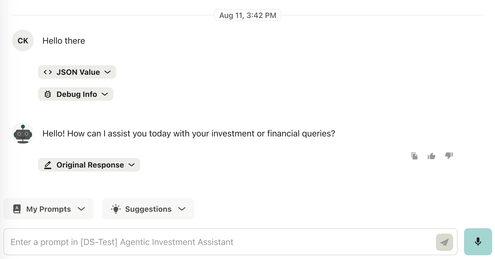
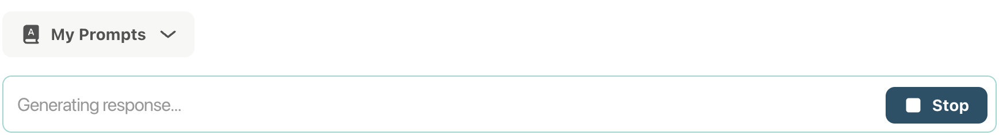
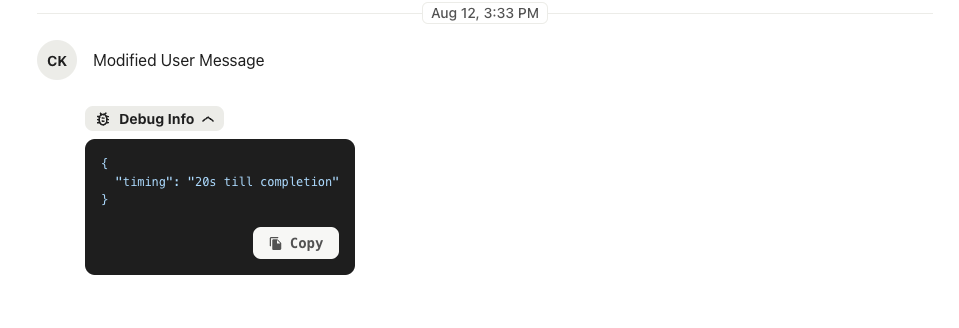

# Chat Service

The chat service is responsible for all interactions with the Unique chat frontend as seen below



To communicate to it the `ChatService` from `unique_toolkit` is used. Please see [Event Driven Applications](../../../application_types/event_driven_applications.md) on how to initialize services.

## Creating assistant messages

The most used functionality is to create an assistant message directly or via a stream. To create a simple message
use


```{python #chat_service_create_assistant_message}
assistant_message = chat_service.create_assistant_message(
        content="Hello from Unique",
        set_completed_at=True,
    )
```

the `set_completed_at` flag indicates if the answer is final and the user can write into the chat field again. If it is set to `False` the stop button remains active, therefore it is essential to set it at the final interaction with an assistant message.



## Modifying assistant and user messages

Both user messages as well as assistant message may be modified. Ideally, this happens before the `set_completed_at` flag is set but it remains possible after as well. 

```{python #chat_service_modify_user_message}
chat_service.modify_user_message(
        content="Modified User Message",
        message_id=event.payload.user_message.id,
    )
```

```{python #chat_service_modify_assistant_message}
chat_service.modify_assistant_message(
    content="Modified Assistant Message",
    message_id=assistant_message.id 
)
```

## Debug Information
Debuggin information can be added to both the user and assistant messages but only the debug information that is added to the user message will be shown in the chat frontend.
Therefore we recommend to use 

```{python #chat_service_modify_user_message}
chat_service.modify_user_message(
        content="Modified User Message",
        message_id=event.payload.user_message.id,
        debug_info={"timing": "20s till completion"}
    )
```

The debug information will be updated after a refresh of the page and look as follows




## Message Assessments

Once an assistant has answered its time to access the quality of its answer. This can be done using the message assessments by the Unique plattform.

```{python #chat_service_create_message_assessment}
chat_service.create_message_assessment(
        assistant_message_id=assistant_message.id,
        status=ChatMessageAssessmentStatus.PENDING,
        type=ChatMessageAssessmentType.COMPLIANCE,
        title="hell no",
        explanation="whatever",
        is_visible=True,
    )
```

```{python #chat_service_modify_message_assessment}
chat_service.modify_message_assessment(
    assistant_message_id=assistant_message.id,
    status=ChatMessageAssessmentStatus.DONE,
    type=ChatMessageAssessmentType.COMPLIANCE,
    title="hell no",
    explanation="whatever",
    label=ChatMessageAssessmentLabel.GREEN,
)
```