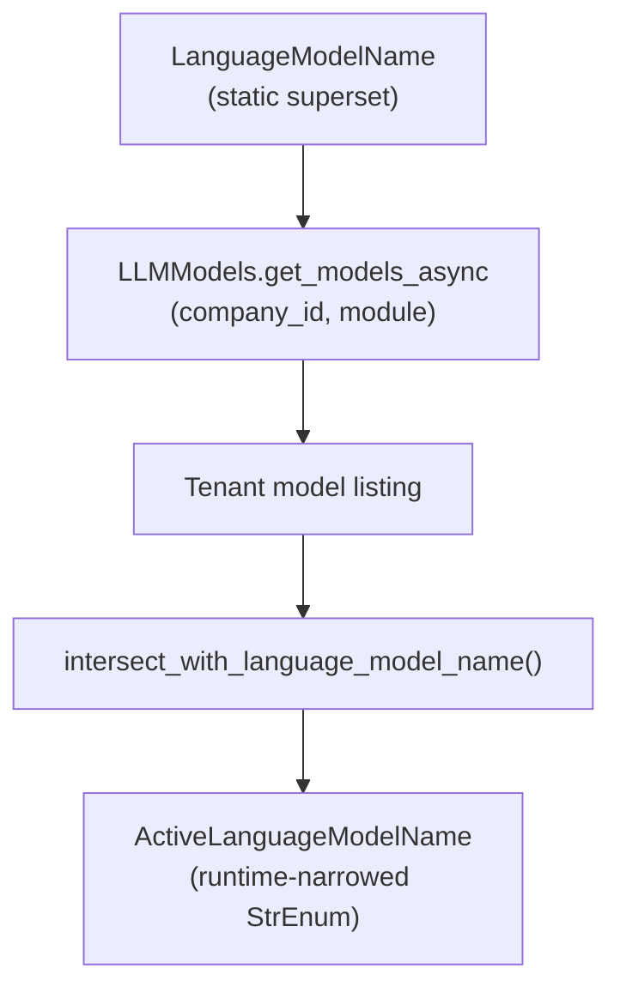

# Tenant-Scoped Dynamic Language Models

This guide documents the pattern for **API-backed dynamic enums**: a static superset in code, narrowed at runtime to the models a tenant can actually use.

For static model properties (token limits, capabilities, providers), see the [Language Models Overview](language_model_overview.md).

## Pattern

Dynamic language model enums combine two layers:

1. **Static superset** — `LanguageModelName` is always defined in code. IDEs and type checkers use it for autocomplete, validation helpers, and `LanguageModelInfo` lookups.
2. **Runtime narrowing** — At request or startup time (never at import), fetch the tenant's available models via the SDK, then intersect the response with `LanguageModelName` to produce a smaller `StrEnum` subclass (typically `ActiveLanguageModelName`).

Fetch calls are **lazy and explicit**. Importing `unique_toolkit.language_model` does not call the platform API. Call `get_active_language_models_async` when you have a real `company_id` and need tenant-scoped options.



Results are cached in-process for five minutes per `(company_id, model_source, user_id)` key. Use `clear_active_language_model_caches()` in tests to reset state.

## Prerequisites

Before calling any dynamic model API:

1. **Configure credentials** — Set up `unique.env` with app credentials and tenant context (see [Getting Started](../../setup/getting_started.md)). Initialize with `UniqueSettings.from_env_auto_with_sdk_init()` (loads `unique.env` and configures the SDK). `ensure_sdk_initialized()` rejects missing or dummy credentials.
2. **Provide a valid `company_id`** — Typically from `UNIQUE_AUTH_COMPANY_ID`. `ensure_company_id()` rejects empty strings and placeholder values (`dummy`, `dummy_company_id`, etc.).
3. **`user_id` (optional)** — Defaults to `"dynamical_enum_retrieval"`, a fixed sentinel for dynamic enum retrieval (not a real end-user id). Pass an explicit `user_id` when your call site has one.

!!! note "Environment"
    Use the same `UniqueSettings` / SDK setup as other toolkit examples (`UNIQUE_APP_ID`, `UNIQUE_APP_KEY`, `UNIQUE_API_BASE_URL`, company and user context).

## API Surface

All functions below live in `unique_toolkit.language_model.dynamic` and are re-exported from `unique_toolkit.language_model`.

### Fetching active models

| Function | Returns |
|----------|---------|
| `get_active_language_models_async(company_id, *, model_source, user_id="dynamical_enum_retrieval")` | `type[StrEnum]` narrowed to the tenant's available models |

Index members by enum name (e.g. `ActiveModels.AZURE_GPT_4o_2024_1120`) or use `.value` for the string id.

**`model_source`** selects which platform listing to use:

| Value | Behavior |
|-------|----------|
| `"unique_ai"` | `module=UNIQUE_AI` — models from the `UNIQUEAI_ALLOWED_MODELS` allowlist intersected with cluster deployments. If this list is empty, the toolkit logs a warning and falls back to the general listing. |
| `"general"` | Full cluster listing plus tenant custom models, without the UNIQUE_AI module filter. |

Use `"unique_ai"` for Unique AI product surfaces (tools, agents, configuration UIs). Use `"general"` when you need every deployable model on the cluster.

Underlying SDK calls: see the [LLM Models API](https://unique-ag.github.io/ai/unique-sdk/latest/api_resources/llm_models/) (`LLMModels.get_models_async`).

### Default model selection

| Function | Returns |
|----------|---------|
| `get_default_active_language_model_async(company_id, *, user_id="dynamical_enum_retrieval")` | `LanguageModelName` |

Default resolution uses the tenant's `"unique_ai"` active set, then applies this ranking:

1. `DEFAULT_LANGUAGE_MODEL` (from the `DEFAULT_LANGUAGE_MODEL` environment variable) when it appears in the active set.
2. Otherwise the first member in **static** `LanguageModelName` definition order that appears in the active set (stable; not API response order).

### JSON schema and LMI fields

Configuration models often use the `LMI` annotated type from `unique_toolkit._common.validators` — a `LanguageModelInfo` field whose JSON-schema input accepts `LanguageModelName`, a free-text string, or `LanguageModelInfo`. For tenant-scoped UIs, narrow that input to the active set.

| Function | Module | Purpose |
|----------|--------|---------|
| `get_schema_with_available_language_models(model, available_models)` | `unique_toolkit.language_model.dynamic` | Returns a JSON schema with `LanguageModelInfo` fields restricted to `available_models`; rewrites invalid defaults to the resolved default. |
| `build_lmi_annotation(available_models)` | `unique_toolkit._common.validators` | Drop-in `Annotated` replacement for `LMI` when building custom Pydantic models or schemas. Removes the free-string branch — only the narrowed enum remains in `json_schema_input_type`. |

Pass model name strings (e.g. `[m.value for m in ActiveModels]`) or any list that intersects with `LanguageModelName`.

### Errors (fail-closed)

The toolkit does not silently return empty enums or fall back to unrestricted model pickers.

| Exception | When |
|-----------|------|
| `ActiveLanguageModelConfigurationError` | SDK not initialized, invalid `company_id`, API failure, or zero intersection after fetch (wraps `NoModelIntersectionError`). |
| `NoModelIntersectionError` | Raw intersection failure: none of the API model strings match a `LanguageModelName` member. Usually surfaced as `ActiveLanguageModelConfigurationError` from the fetch helpers. |

If the API returns model keys the toolkit enum does not yet include, add the model to `LanguageModelName` (or adjust deployment configuration) before expecting a narrowed enum.

## Security and Tenant Isolation

- **Tenant scoping** — Every fetch passes `company_id` to the SDK; the platform enforces per-tenant visibility.
- **Allowlist** — UNIQUE_AI listings are further restricted by `UNIQUEAI_ALLOWED_MODELS` (cluster config plus allowlist intersection).
- **Key format** — Operations configure Azure entries with `modelKey` strings (e.g. deployment names). The API returns toolkit enum identifiers such as `AZURE_GPT_4o_2024_1120`. Intersection matches on enum **name** or **value**.

## RJSF and Configuration UIs

Frontend configuration forms (RJSF) consume Pydantic `model_json_schema()` output.

**Without narrowing**, an `LMI` field exposes `anyOf`: full enum ref **or** free-text string — users can type arbitrary model names.

Two helpers narrow this, at different layers:

- **`get_schema_with_available_language_models(model, available_models)`** operates on the generated JSON schema. It filters the shared `LanguageModelName` enum in `$defs` — narrowing **every** referencing field at once, including bare-enum and `list[LMI]` fields — and rewrites stored defaults outside the active set to the tenant default. The free-string `anyOf` branch is **left intact** (the schema lists the available models but does not forbid a free-form string); enforce the tenant set at runtime with the validator below.
- **`build_lmi_annotation(available_models)`** is a drop-in `LMI` annotation for **runtime validation**. Its `json_schema_input_type` is the narrowed enum, so a field built with it rejects out-of-tenant models on validation **and** drops the free-string branch from that field's schema.

Wire these helpers at your service boundary when you have tenant context (for example, a configuration endpoint that receives `company_id`).

## Example

Illustrative async flow — fetch active models for a tenant, then narrow a configuration schema:

```{.python #dynamic-language-models-example}
import os

from pydantic import BaseModel

from unique_toolkit._common.validators import LMI
from unique_toolkit.app.unique_settings import UniqueSettings
from unique_toolkit.language_model import (
    get_active_language_models_async,
    get_schema_with_available_language_models,
)


class AssistantConfig(BaseModel):
    language_model: LMI


UniqueSettings.from_env_auto_with_sdk_init()

company_id = os.environ["UNIQUE_AUTH_COMPANY_ID"]

ActiveModels = await get_active_language_models_async(
    company_id,
    model_source="unique_ai",
)

schema = get_schema_with_available_language_models(
    AssistantConfig,
    [m.value for m in ActiveModels],
)
```

## Related Resources

- [Language Models Overview](language_model_overview.md) — static model catalog and properties
- [Getting Started](../../setup/getting_started.md) — credentials and environment setup
- [LLM Models API](https://unique-ag.github.io/ai/unique-sdk/latest/api_resources/llm_models/) — SDK `LLMModels.get_models_async`
