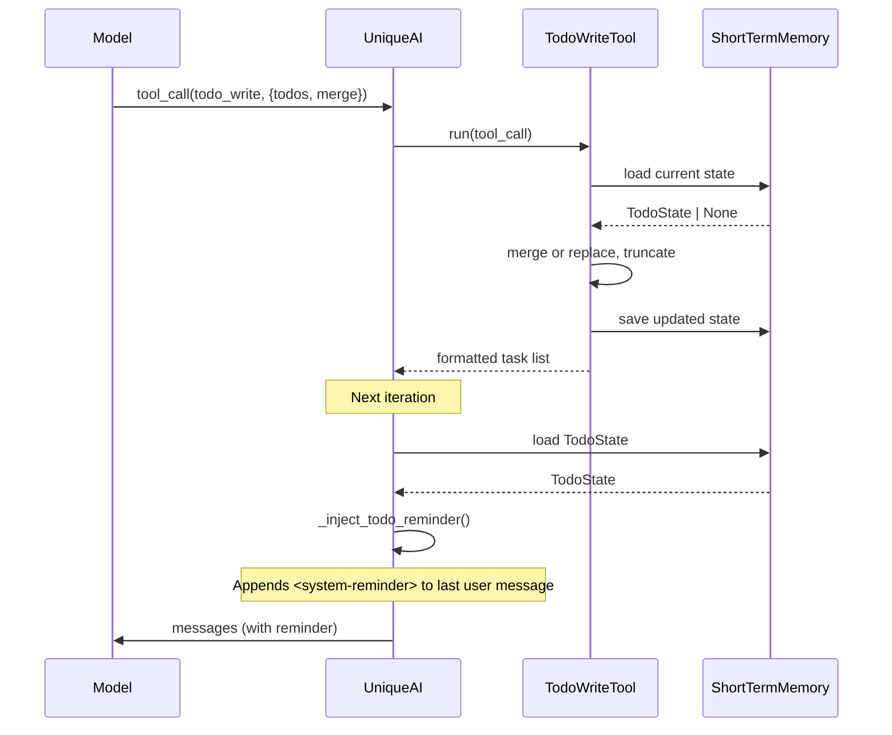

# TODO Task Tracking

Agent-side task tracking tools that give the model a persistent, visible TODO list
for multi-step work. Inspired by the TodoWrite/TodoRead pattern in Claude Code.

## Why

Long agentic conversations lose track of progress. The model may repeat steps,
skip items, or forget the overall plan. TODO tracking solves this by:

- Giving the model a structured task list it controls
- Injecting current progress into every turn via `<system-reminder>`
- Persisting state across iterations within the same chat session

## Architecture



### Components

| Component | Location | Purpose |
|-----------|----------|---------|
| `TodoItem`, `TodoState`, `TodoWriteInput` | `unique_toolkit/agentic/tools/todo/schemas.py` | Pydantic data models |
| `TodoConfig` | `unique_toolkit/agentic/tools/todo/config.py` | Per-tool configuration |
| `TodoWriteTool`, `TodoReadTool` | `unique_toolkit/agentic/tools/todo/service.py` | Tool implementations |
| `format_todo_state`, `format_todo_system_reminder` | `unique_toolkit/agentic/tools/todo/service.py` | Formatting helpers |
| `_inject_todo_reminder` | `unique_orchestrator/unique_ai.py` | System-reminder injection |
| `_build_todo_memory_manager` | `unique_orchestrator/unique_ai_builder.py` | Wiring and feature detection |

## Enabling

Add `todo_write` and `todo_read` to the tool list in your space configuration:

```python
from unique_toolkit.agentic.tools.schemas import ToolBuildConfig

tools = [
    ToolBuildConfig(name="todo_write", is_enabled=True),
    ToolBuildConfig(name="todo_read", is_enabled=True),
    # ... other tools
]
```

Both tools are registered with `ToolFactory` on import. If neither tool appears
in the tool list, the feature is completely dormant -- no memory manager is
created, no injection occurs, and no behavior changes for existing users.

## Configuration

`TodoConfig` extends `BaseToolConfig` with three fields:

| Field | Type | Default | Description |
|-------|------|---------|-------------|
| `memory_key` | `str` | `"agent_todo_state"` | ShortTermMemory key for persisting state |
| `max_todos` | `int` | `20` (1-50) | Maximum items stored; excess is truncated |
| `inject_system_reminder` | `bool` | `True` | Whether to inject progress into messages |

Pass config via `ToolBuildConfig.configuration`:

```python
ToolBuildConfig(
    name="todo_write",
    is_enabled=True,
    configuration=TodoConfig(max_todos=30),
)
```

## Tool Behavior

### TodoWriteTool (`todo_write`)

Accepts a list of `TodoItem` objects and a `merge` flag:

- **`merge=True`** (default): Updates existing items by ID, appends new ones,
  preserves items not mentioned in the call.
- **`merge=False`**: Replaces the entire list.

After merge/replace, the list is truncated to `max_todos` and saved to
ShortTermMemory. Returns a formatted summary.

Each `TodoItem` has:
- `id` -- unique string identifier
- `content` -- task description
- `status` -- one of `pending`, `in_progress`, `completed`, `cancelled`

### TodoReadTool (`todo_read`)

Takes no parameters. Returns the current formatted task list.

### Status Icons

```
[ ] pending
[>] in_progress
[x] completed
[-] cancelled
```

### System-Reminder Injection

When `inject_system_reminder=True` (the default), the orchestrator's
`_inject_todo_reminder()` method runs during message composition:

1. Loads `TodoState` from ShortTermMemory
2. **Skips injection** if state is empty or all items are completed
3. Formats the state as a `<system-reminder>` block
4. Appends it to the content of the **last user message**

This ensures the model sees its current progress on every turn without
consuming a separate system message slot.

## Testing

### Unit Tests

`tests/agentic/tools/test_todo_service.py` -- 22 tests covering:
- `TodoState.merge()` logic (update, append, preserve)
- `TodoWriteTool.run()` (create, merge, replace, truncate, formatting)
- `TodoReadTool.run()` (empty state, existing state)
- Format helpers, tool registration, config validation

`unique_orchestrator/tests/test_todo_injection.py` -- 11 tests covering:
- Injection enabled/disabled, empty state, all-completed skip
- Correct injection target (last user message)
- `_build_todo_memory_manager()` detection logic

### Multi-Step Workflow Tests

`tests/agentic/tools/test_todo_eval.py` -- scripted conversation simulations:
- Full lifecycle: pending -> in_progress -> completed across multiple iterations
- Merge behavior with mid-conversation additions
- Truncation at max_todos boundary
- System-reminder content validation after each state change

### Manual QA Scenarios

Use these prompts in a real chat session with TODO tools enabled:

**Scenario 1: Multi-step research (should create todos)**
```
Compare the performance of Tesla, Apple, and Microsoft stock over the last year.
For each, provide key metrics, recent news, and your recommendation.
```
- Expect: 3+ todos created, progressive status updates, formatted list in responses.

**Scenario 2: Simple question (should NOT create todos)**
```
What's the current price of AAPL?
```
- Expect: Direct answer, no todo_write calls.

**Scenario 3: Merge behavior**
```
Research emerging market trends.
```
Then follow up with:
```
Also add a section about regulatory risks.
```
- Expect: New todos added via merge, original list preserved.

**Scenario 4: Large task list**
```
Create a comprehensive analysis of all 30 DJIA components including financial
metrics, recent earnings, analyst ratings, and technical indicators.
```
- Expect: List truncated at `max_todos`, clean formatted output.

**Scenario 5: Session continuity**
Send a multi-step prompt, wait for todos to be created, then send a follow-up.
- Expect: `<system-reminder>` in composed messages shows previous state;
  model resumes from where it left off.

**What to check:**
- Tool calls visible in debug logs (`TodoWriteTool: saved N items`)
- `<system-reminder>` block present in composed messages (enable debug logging)
- Task list rendered in assistant responses
- Status transitions follow `pending -> in_progress -> completed` lifecycle

## Design Doc

For the full design rationale, alternatives considered, and future work (PubSub
frontend rendering, PlanningMiddleware integration), see the design document
in the finance agentic harness docs.
