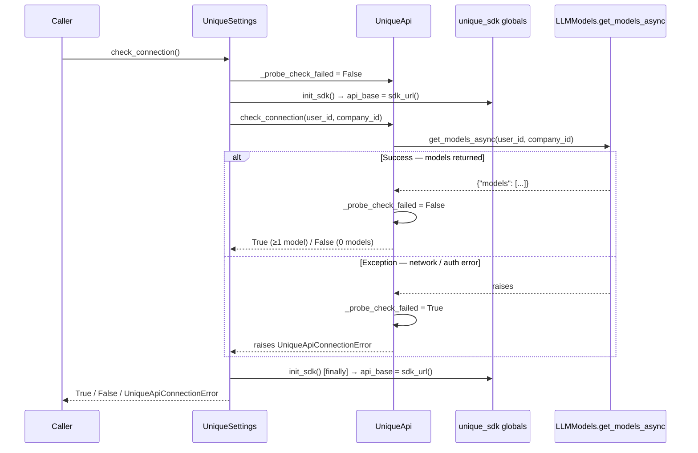
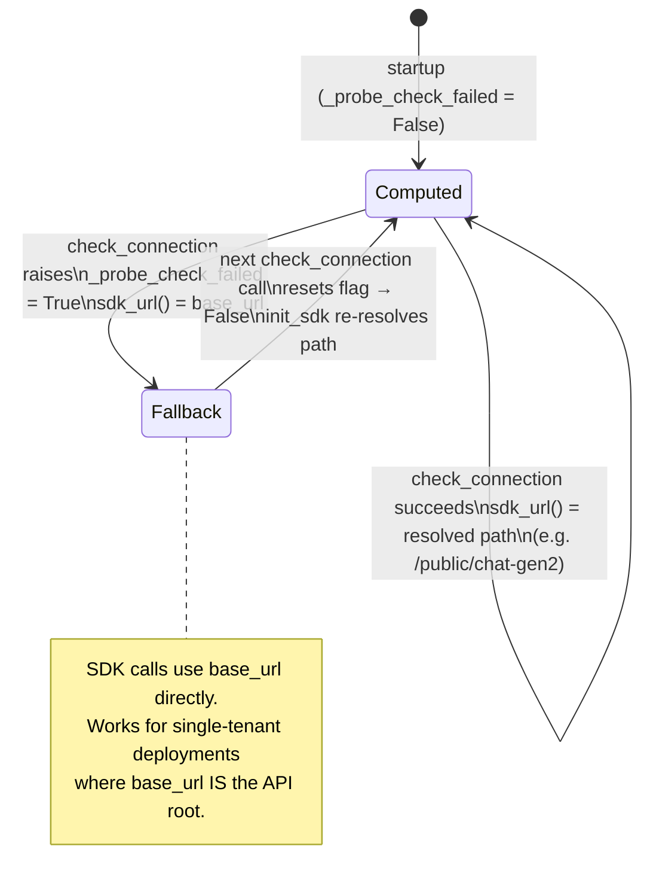

# API Connection Check

> **Audience:** Developers integrating the toolkit who want to verify connectivity at startup or diagnose URL resolution issues.
> **Class:** `unique_toolkit.app.unique_settings`

---

## When to use what

| You have… | Call… |
|---|---|
| A fully configured `UniqueSettings` | `await settings.check_connection()` |
| Only a `UniqueApi` instance (e.g. in a test) | `await api.check_connection(user_id, company_id)` |

`UniqueSettings.check_connection` is the standard entry point. It handles SDK initialisation automatically. `UniqueApi.check_connection` is the lower-level primitive — useful when you need to probe a specific base URL without a full settings object.

---

## Full call flow



---

## `sdk_url()` fallback state machine

`UniqueApi` holds a private `_probe_check_failed` flag. It controls what `sdk_url()` returns, which in turn controls what `init_sdk()` writes to `unique_sdk.api_base`.



**Key invariant:** `UniqueSettings.check_connection` always resets `_probe_check_failed = False` *before* calling `init_sdk()`. This guarantees every retry probes the canonical computed URL rather than a stale fallback, so a transient failure does not permanently redirect the SDK to the wrong path.

---

## Return values and exceptions

| Outcome | `_probe_check_failed` | `sdk_url()` | Return / raise |
|---|---|---|---|
| ≥1 model returned | `False` | computed path | `True` |
| 0 models returned | `False` | computed path | `False` |
| Network / auth error | `True` | `base_url` | raises `UniqueApiConnectionError` |

`UniqueApiConnectionError` carries `.base_url` (the configured env value) so you can log exactly which URL was attempted.

---

## Typical usage

```python
from unique_toolkit.app.unique_settings import UniqueApiConnectionError, UniqueSettings

settings = UniqueSettings.from_env_auto_with_sdk_init()

try:
    connected = await settings.check_connection()
    if connected:
        print("API ready, models available")
    else:
        print("API reachable but no models configured")
except UniqueApiConnectionError as exc:
    print(f"Cannot reach API at {exc.base_url}: {exc}")
```
