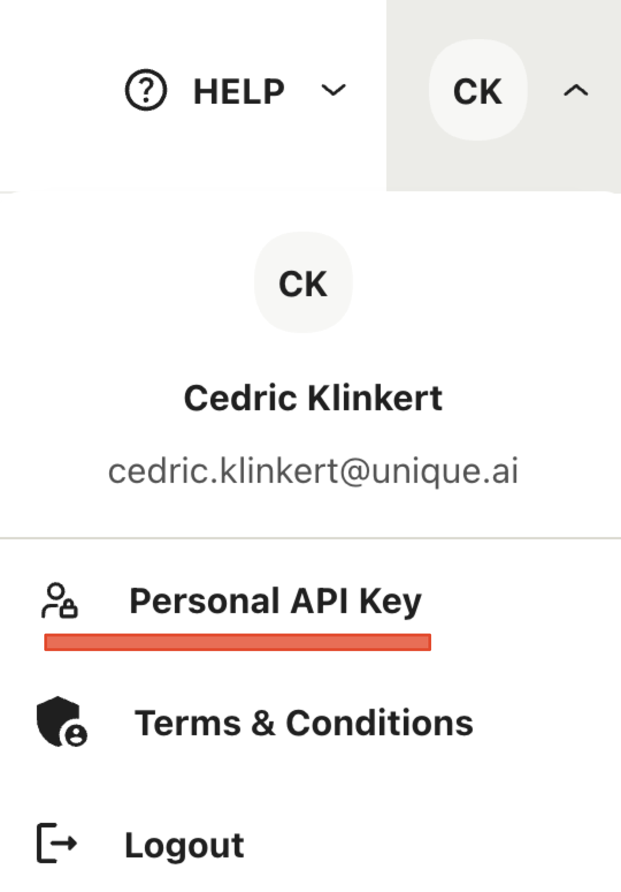

# Getting started

## Installation

Unique Toolkit is available on [PyPI](https://pypi.org/project/unique_toolkit/) and can be installed using `pip`/`poetry` or `uv`:

We highly recommend using a virtual environment to install Unique Toolkit and SDK.

## Secrets and how to find them

The following secrets need to be setup in a `unique.env` file located as described below or in the environment

```env
UNIQUE_AUTH_COMPANY_ID=         # Your company id
UNIQUE_AUTH_USER_ID=            # Your user id

UNIQUE_API_BASE_URL=            # The backend url of Unique's public API
UNIQUE_API_VERSION=             # The version Unique's public API

UNIQUE_APP_ID=                  # The app id as obtained in the App section of Unique
UNIQUE_APP_KEY=                 # The app key as obtained in the App section of Unique
```

??? info "Environment File Locations (Click to expand)"
    
    The toolkit automatically searches for your `unique.env` file in the following locations (in order of priority):

    ### 1. Custom Location (Highest Priority)
    Set the `UNIQUE_ENV_FILE` environment variable to specify a custom location:

    ```bash
    # Linux/macOS
    export UNIQUE_ENV_FILE="/path/to/your/custom/unique.env"

    # Windows PowerShell
    $env:UNIQUE_ENV_FILE = "C:\path\to\your\custom\unique.env"

    # Windows Command Prompt
    set UNIQUE_ENV_FILE=C:\path\to\your\custom\unique.env
    ```

    ### 2. Current Working Directory
    ```
    ./unique.env
    ```
    The toolkit will look for `unique.env` in the directory where you run your script.

    ### 3. User Configuration Directory (Recommended)

    The toolkit follows operating system conventions for configuration files:

    #### Linux/Unix
    ```
    ~/.config/unique/unique.env
    ```

    #### macOS
    ```
    ~/Library/Application Support/unique/unique.env
    ```

    !!! tip "Alternative for macOS"
        You can also use the Linux-style path on macOS: `~/.config/unique/unique.env`

    #### Windows
    ```
    %APPDATA%\unique\unique.env
    ```
### User and Company IDs

These IDs can be obtained by inspecting you Personal API Key that can be found when clicking onto your account in the top right corner of the frontend

{ align=center width=200 }

### API

The `UNIQUE_API_BASE_URL` can be obtained from your admin and the current API version is `2023-12-06`.

### App credentials
The app credentials can be obtained when creating an app in the corresponding section 

.

The `APP_ID` is immediately visible after creating an app and starts with `app_` followed by a 24-character alphanumeric string. The `APP_KEY` can be generated once the app is activated under the section **API Keys**.

## App endpoint

An app endpoint is required in the production scenario when the app is running in a container. In this case the Unique plattform reaches the app via the registered endpoints.

[WIP]


## Your first application

Typically we see  two types of applications being build with the Unique Plattform 

1. [**Standalone Applications**](./application_types/standalone_application.md) leveraging the plattform to create artefacts
2. [**Event based Applications**](./application_types/event_driven_applications.md): That use the plattform and report back to it.