# Streaming architecture — visual walkthrough

> **Audience:** A colleague who needs to understand how the OpenAI streaming layer is wired, end‑to‑end.
> **Package:** `unique_toolkit.framework_utilities.openai.streaming`

Each section gives a small diagram focused on one idea. Copy any block into a Mermaid live editor if you need to zoom.

> **A note on naming.** The top-level type inside `pipeline/` is called
> `*StreamEventRouter` (not `*StreamPipeline`). It doesn't chain handlers
> like a Pipes-and-Filters pipeline — it **dispatches** each incoming
> event to the right handler (Responses) or **broadcasts** each chunk to
> all interested handlers (Chat Completions). The folder keeps the
> historical name `pipeline/` for now; everything inside is a router +
> handler + subscriber setup.

---

## 1. The three layers

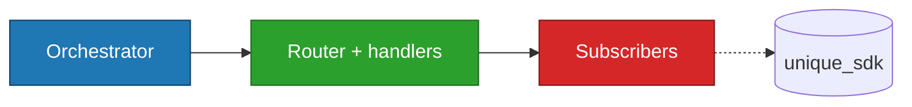

- **Orchestrator** owns the HTTP stream + bus.
- **Router + handlers** are pure state machines.
- **Subscribers** are the only layer allowed to touch `unique_sdk`.

---

## 2. Runtime participants

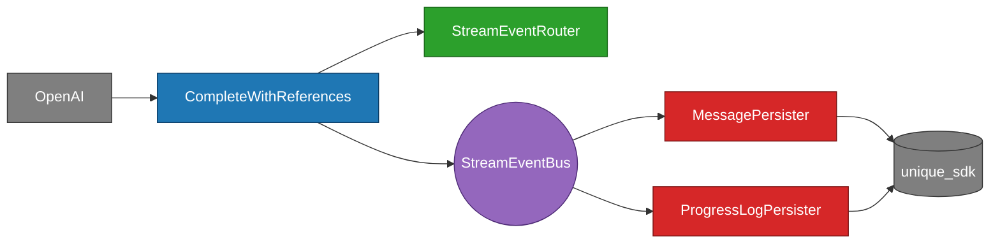

Read it as: OpenAI feeds the orchestrator; the orchestrator fans out to a pure router (for state) and a bus (for side effects).

---

## 3. Domain events on the bus

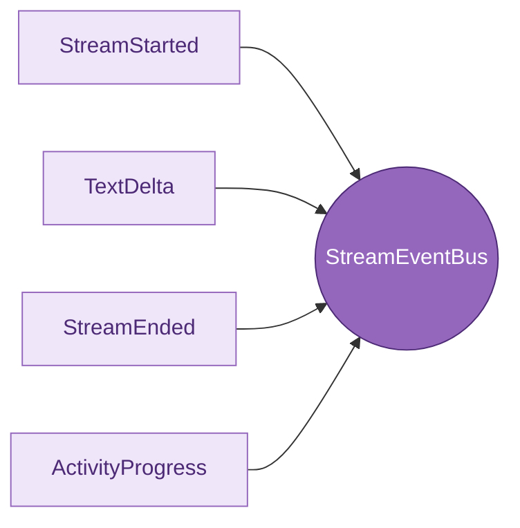

Four events, nothing else. Every subscriber reacts to a subset.

---

## 4. Responsibilities at a glance

Each component has one well-scoped responsibility. The table is the short version; sub-sections go deeper.

| Component | Owns | Must do | Must *not* do |
|---|---|---|---|
| **Orchestrator** (`*CompleteWithReferences`) | HTTP stream, `StreamEventBus`, router instance | Run `async for`, publish domain events with identity, build the final result | Accumulate text, call `unique_sdk`, know regex patterns |
| **Stream event router** (`*StreamEventRouter`) | Handler references | Dispatch events by type (Responses) or broadcast to all handlers (Chat Completions), fan out lifecycle, aggregate appendices, build typed result | Hold state, call SDK, know about identity |
| **Handlers** (`*TextDeltaHandler`, `*ToolCallHandler`, …) | `TextState`, tool-call list, usage, code buffer, inner `TypedEventBus` | Accumulate state, publish inner-bus flushes/progress | Call SDK, know `message_id` / `chat_id`, see `ContentChunk`s |
| **Protocols** (`protocols/`) | Type contracts only | Define the shape handlers must implement | Contain any logic |
| **Events** (`events.py`) | Four frozen dataclasses | Be the wire format between orchestrator and subscribers | Carry behavior |
| **`StreamEventBus`** | Subscriber list | Fan out events to subscribers in registration order | Filter / transform events |
| **Subscribers** (`MessagePersistingSubscriber`, `ProgressLogPersister`) | Per-stream side-effect state (`chunks_by_message`, `logs_by_correlation`) | Translate domain events into SDK calls | Mutate handler state, change event contents |
| **Pattern replacer** (`pattern_replacer.py`) | `NORMALIZATION_PATTERNS`, hold-back buffer | Rewrite citation variants to `N` across chunk boundaries | Know which chunk a citation maps to |

### 4.1 Orchestrator — `ResponsesCompleteWithReferences` / `ChatCompletionsCompleteWithReferences`

- Opens the streaming call to the OpenAI proxy (`responses.create` / `chat.completions.create`).
- Runs its own `async for` loop so it can catch `httpx.RemoteProtocolError` and still finalise with partial output.
- Publishes the four domain events on the bus. Always publishes `StreamEnded` from `finally`.
- **Identity adapter:** subscribes to each handler's inner bus (`text_bus`, `activity_bus`) and re-publishes the payload on the outer bus with `message_id` / `chat_id` attached.
- Calls `router.reset()` at the start of every run so sequential reuse is safe.
- Delegates result construction to `router.build_result(...)` and returns it.

### 4.2 Stream event router — `ResponsesStreamEventRouter` / `ChatCompletionStreamEventRouter`

- **Dispatch, not pipeline.** The name "router" is deliberate — this type does *not* chain handlers in a Pipes-and-Filters sense. It looks at each incoming event and decides which handler(s) should see it.
  - **Responses** uses typed dispatch: each `ResponseStreamEvent` subclass maps to one handler (text delta → text handler, tool call → tool handler, completed → completed handler, code interpreter → CI handler). Unknown events are ignored for forward compatibility.
  - **Chat Completions** uses broadcast dispatch: every `ChatCompletionChunk` carries mixed content (text + tool deltas), so the chunk is sent to both handlers and each decides what to consume.
- Fans out lifecycle: `reset()` and `on_stream_end()` iterate every handler.
- Aggregates capabilities: `get_appendices()` collects strings from any handler implementing `AppendixProducer`.
- Re-exposes handler-owned buses to the orchestrator (`text_bus`, `activity_bus`).
- Builds the typed result (`LanguageModelStreamResponse` / `ResponsesLanguageModelStreamResponse`).

### 4.3 Handlers

- **Text handler.** Apply the replacer chain to each incoming delta, update `TextState.full_text` / `original_text`, publish `TextFlushed` on the handler-local bus at each flush boundary (every non-empty delta for Responses; every `send_every_n_events` chunks for Chat Completions). On `on_stream_end()`, run the cascade flush and publish a final flush if residual text appeared.
- **Tool call handler.** Assemble function call ids, names, and streamed arguments into `LanguageModelFunction`s.
- **Completed handler** (Responses only). Extract `LanguageModelTokenUsage` and output items from `ResponseCompletedEvent`.
- **Code interpreter handler** (Responses only). Deduplicate by `(status, text)` per `item_id`, publish `ActivityProgressUpdate` on state transitions, accumulate executed code and expose it via `get_appendix()`.

### 4.4 Protocols

- `StreamHandlerProtocol` — the lifecycle contract (`reset`, `on_stream_end`).
- `AppendixProducer` — optional capability; any handler can opt in by defining `get_appendix()`.
- `Responses*HandlerProtocol` / `ChatCompletion*HandlerProtocol` — API-specific method shapes so routers can be typed without inheritance.
- Inner-bus payloads (`TextFlushed`, `ActivityProgressUpdate`) live here so handlers and orchestrator share one vocabulary.

### 4.5 Events and bus

- `StreamStarted`: the contract "a stream is now alive for this `message_id`, and these `ContentChunk`s back it". Subscribers use it to seed per-stream state.
- `TextDelta`: "the model produced observable text up to this point". Subscribers render/persist.
- `StreamEnded`: "this is the authoritative final text + appendices". The invariant event — always fires, even on errors.
- `ActivityProgress`: "a tool-like activity (CI, future: web search, retrieval) transitioned to this state".
- `StreamEventBus`: a `TypedEventBus[StreamEvent]` that stores subscribers and awaits them one by one. Callers can add extras through `orchestrator.bus.subscribe(...)`.

### 4.6 Subscribers

- **`MessagePersistingSubscriber`** — the *only* caller of `unique_sdk.Message.modify_async`. On `StreamStarted` it resets `references=[]` and stamps `startedStreamingAt`. On `TextDelta` it writes the current text + filtered references (via `filter_cited_sdk_references`). On `StreamEnded` it concatenates `full_text + appendices` and stamps `stoppedStreamingAt` / `completedAt` — a single final write.
- **`ProgressLogPersister`** — the *only* caller of `unique_sdk.MessageLog.*`. Keyed by `correlation_id`: creates a new log the first time it sees an id, updates on subsequent transitions, skips no-ops.

### 4.7 Pattern replacer

- `NORMALIZATION_PATTERNS` — 18 regex rules, single source of truth for citation normalisation. Also imported by the batch post-processing path so streaming and batch produce identical text for the same input (parity test enforces this).
- `StreamingPatternReplacer` — holds back up to 80 trailing characters so a pattern straddling two deltas still matches; exposes `process(delta)` / `flush()`.
- `filter_cited_sdk_references(chunks, text)` — given the accumulated normalised text, returns only the chunks whose `N` actually appears.

---

## 5. UML notation used in the class diagrams

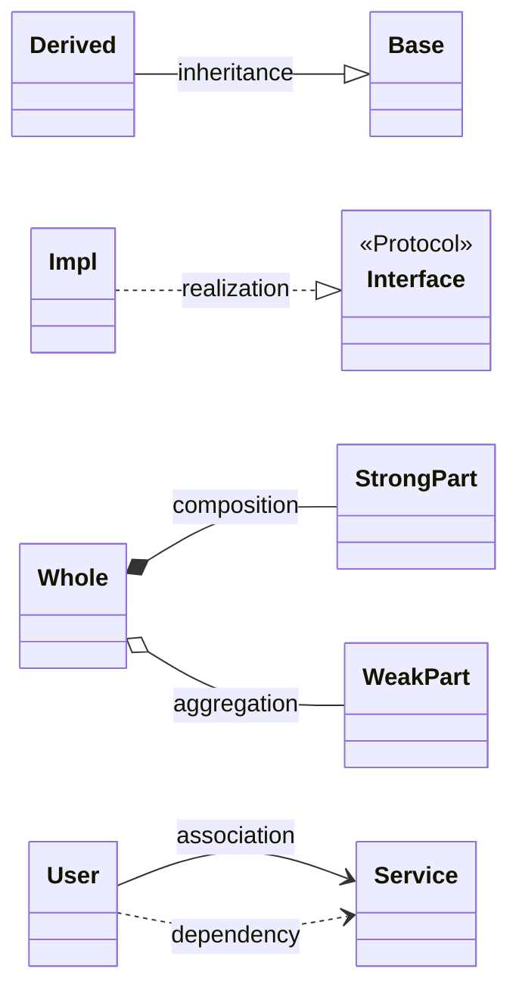

| Arrow | Meaning | When it applies here |
|---|---|---|
| `--\|>` | inheritance | not used (we prefer protocols over base classes) |
| `..\|>` | realization | concrete handler implements a `Protocol` |
| `*--` | composition (filled diamond) | orchestrator *owns* router and bus |
| `o--` | aggregation (empty diamond) | router references handlers (handlers can outlive a router in tests) |
| `..>` | dependency (dashed) | subscriber depends on bus; class uses another class's type |
| `-->` | association | regular reference |

---

## 6. Package layout

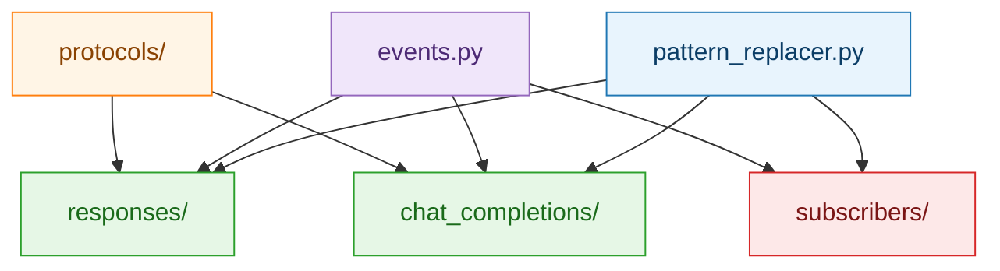

---

## 7. Class relationships — handlers

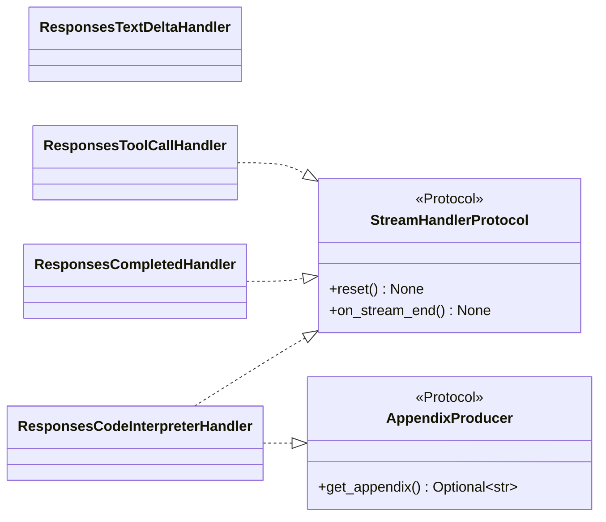

Handlers realize a tiny lifecycle protocol; the code interpreter additionally realizes `AppendixProducer`.

---

## 8. Class relationships — router + orchestrator

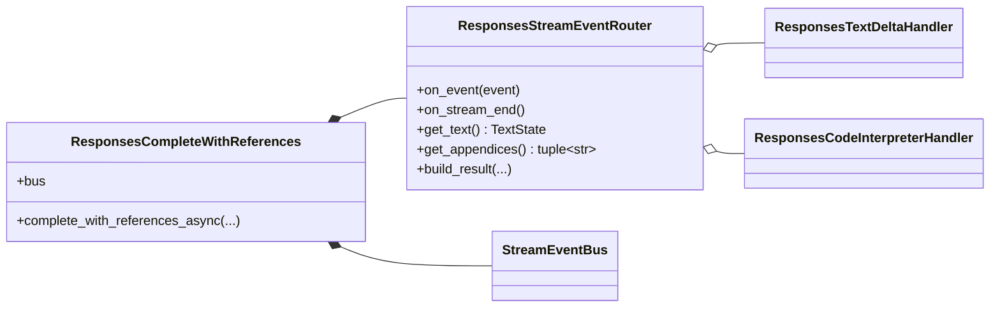

The orchestrator **composes** router + bus (they live and die with it). The router **aggregates** handlers (handlers can be built and tested independently).

---

## 9. Event dataclasses

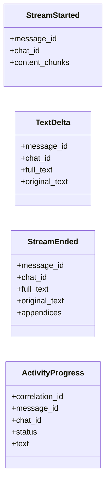

---

## 10. Subscribers

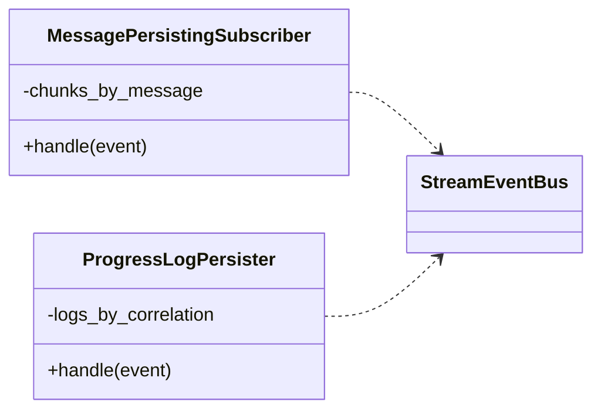

One subscriber per SDK surface:

- `MessagePersistingSubscriber` → `Message.modify_async`
- `ProgressLogPersister` → `MessageLog.create_async` / `update_async`

---

## 11. Sequence — stream lifecycle (happy path)

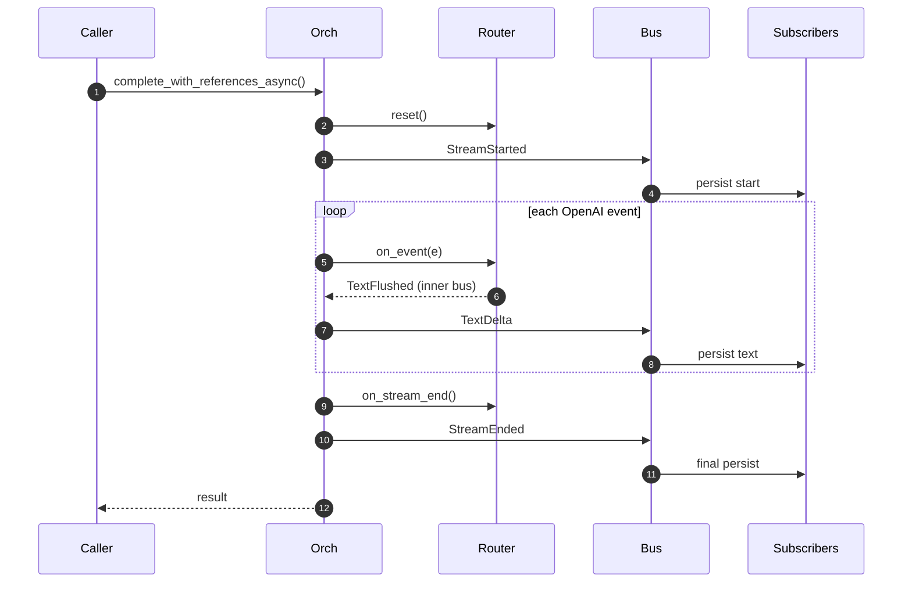

---

## 12. Sequence — code interpreter branch

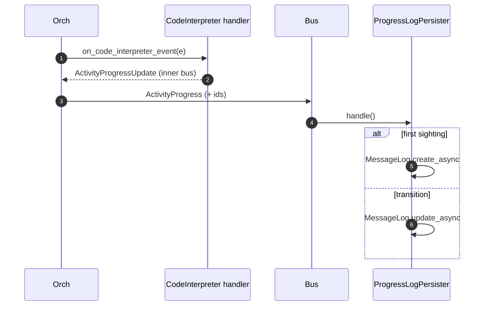

`correlation_id` is the idempotency key — repeated updates coalesce into one log.

---

## 13. Sequence — error path

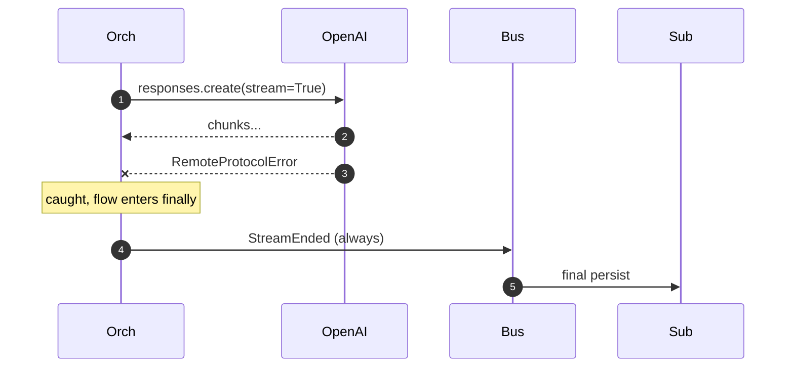

`StreamEnded` is the invariant — it **always** fires from `finally`, so the UI sees a terminal state even on a broken connection.

---

## 14. Orchestrator state machine

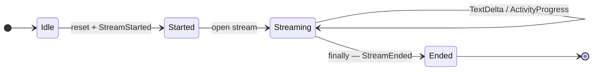

---

## 15. Inner-vs-outer bus (identity adapter)

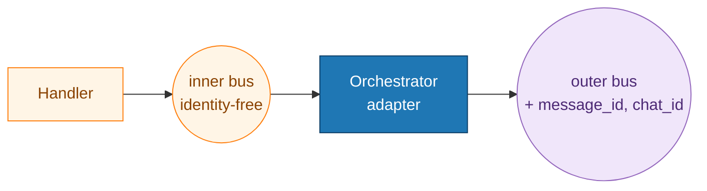

Why: handlers know nothing about `message_id` / `chat_id`, so they're trivially reusable and testable. The orchestrator adds identity when forwarding.

---

## 16. Pattern replacer — streaming normalisation

```mermaid
flowchart LR
    classDef raw  fill:#fde8e8,stroke:#d62728,color:#7a1515
    classDef buf  fill:#fff5e6,stroke:#ff7f0e,color:#8a4303
    classDef norm fill:#e6f7e6,stroke:#2ca02c,color:#1a6a1a
    classDef out  fill:#e8f4fd,stroke:#1f77b4,color:#0b3d66

    M["delta: '…see &#91;source 1&#93;…'"]:::raw
    R[process]:::buf
    B[(80-char hold-back)]:::buf
    PAT[NORMALIZATION_PATTERNS]:::norm
    OUT["'…see &lt;sup&gt;1&lt;/sup&gt;…'"]:::out

    M --> R
    R <--> B
    R --> PAT
    R --> OUT
```

`StreamingPatternReplacer` buffers the last 80 characters so a regex that straddles two deltas still matches.

---

## 17. Cascade flush at end-of-stream

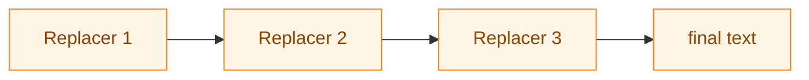

On `on_stream_end`, each replacer's tail is fed into the next replacer's `process()` before that one's `flush()`, so no partial match survives the end of the stream.

---

## 18. Responses vs Chat Completions

| | Responses | Chat Completions |
|---|---|---|
| Event types | Distinct per kind | Unified `ChatCompletionChunk` |
| Flush rule | Every non-empty delta | Every `send_every_n_events` chunks |
| Handlers | text, tools, completed, CI | text, tools |
| Appendices | Code interpreter code | — |
| `ActivityProgress` | Yes | No |
| Default subscribers | MessagePersister + ProgressLogPersister | MessagePersister |
| Result type | `ResponsesLanguageModelStreamResponse` | `LanguageModelStreamResponse` |

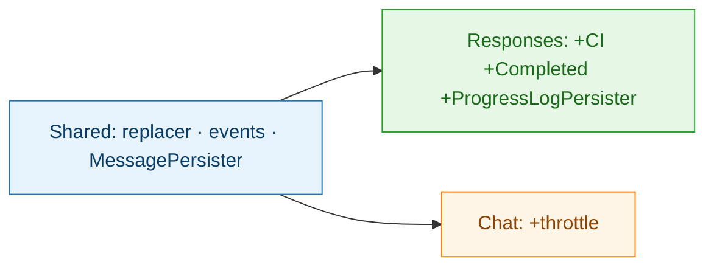

---

## 19. Extension points

| I want to… | Where to plug in |
|---|---|
| Add a wire format | New `*StreamEventRouter` + orchestrator; reuse bus, subscribers, replacer |
| Add an activity | Handler exposes `activity_bus` of `ActivityProgressUpdate` |
| Append to final message | Implement `AppendixProducer.get_appendix()` |
| Tracing / analytics | `orchestrator.bus.subscribe(my_handler)` |
| Replace persistence | Pass `subscribers=[...]` to orchestrator (defaults dropped) |
| New citation format | Add pattern to `NORMALIZATION_PATTERNS` (parity test guards drift) |

---

## 20. Cheat sheet — one-liner per file

| File | One-liner |
|---|---|
| `pipeline/events.py` | Event dataclasses + `StreamEventBus` alias |
| `pipeline/protocols/common.py` | `TextState`, handler protocol, inner-bus payloads, `AppendixProducer` |
| `pipeline/protocols/responses.py` | Responses handler protocols |
| `pipeline/protocols/chat_completions.py` | Chat Completions handler protocols |
| `pipeline/responses/stream_event_router.py` | Typed dispatch + `build_result` + `get_appendices` |
| `pipeline/responses/complete_with_references.py` | Orchestrator — owns bus, publishes domain events |
| `pipeline/responses/text_delta_handler.py` | Pure text accumulator + inner `text_bus` |
| `pipeline/responses/tool_call_handler.py` | Function tool call accumulator |
| `pipeline/responses/completed_handler.py` | Usage + output items |
| `pipeline/responses/code_interpreter_handler.py` | Progress + appendix for CI |
| `pipeline/chat_completions/stream_event_router.py` | Broadcast dispatch over unified chunks |
| `pipeline/chat_completions/complete_with_references.py` | Chat Completions orchestrator |
| `pipeline/chat_completions/text_handler.py` | Throttled text accumulator |
| `pipeline/chat_completions/tool_call_handler.py` | Tool call assembler |
| `pipeline/subscribers/message_persister.py` | Only caller of `Message.modify_async` |
| `pipeline/subscribers/progress_log_persister.py` | Only caller of `MessageLog.*` |
| `pattern_replacer.py` | `NORMALIZATION_PATTERNS` + `StreamingPatternReplacer` |

---

## 21. Elevator pitch

> "We turn the OpenAI async stream into two outputs from one loop: a live-updating assistant message on the Unique platform and a typed result for downstream code. A **stream event router** dispatches each event to pure state handlers that accumulate text, tool calls, usage, and code interpreter blocks; a **typed event bus** fans out four domain events to subscribers. Handlers never call the SDK — **only subscribers do** — so persistence is swap-in/swap-out. Citations are normalised to `N` **during** streaming via a shared pattern list that batch post-processing also uses, guarded by a parity test. Same design on both Responses and Chat Completions — ~80% of the code is shared."
