# Streaming architecture — visual walkthrough

> **Audience:** A colleague who needs to understand how the OpenAI streaming layer is wired, end‑to‑end.
> **Package:** `unique_toolkit.experimental.integrations.openai.streaming`

Each section gives a small diagram focused on one idea. Copy any block into a Mermaid live editor if you need to zoom.

> **Architecture goal.** This layer adapts streaming APIs from provider SDKs
> into the Unique platform update model. A provider stream emits
> provider-specific chunks and events; the router/event-handler layer
> interprets those into the typical things that happen during an LLM stream:
> start, text deltas, end, tool/activity progress, function calls, usage, and
> appendices. The bus then publishes the platform-facing events that
> subscribers translate into `unique_sdk` calls, so the backend can update the
> assistant message and progress logs while the original streaming call is
> still running.

> **A note on naming.** The package is `event_routing/`, and the core runtime type
> is `*StreamEventRouter`. It does not chain event handlers like a Pipes-and-Filters
> pipeline: it **dispatches** each incoming event to the right event handler
> (Responses), or **broadcasts** each chunk to interested event handlers
> (Chat Completions). Treat `event_routing/` as the package for streaming
> event-routing machinery: routers, event handlers, subscribers, events, and bus
> wiring.

---

## 1. The three layers

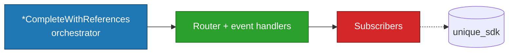

- **`*CompleteWithReferences` orchestrator** owns the provider streaming call and the platform event bus. Today this means `ResponsesCompleteWithReferences` or `ChatCompletionsCompleteWithReferences`.
- **Router + event handlers** normalize provider-specific stream events into state and platform-facing events.
- **Subscribers** are the only layer allowed to touch `unique_sdk`; they send the corresponding message/log updates to the backend.

---

## 2. Runtime participants

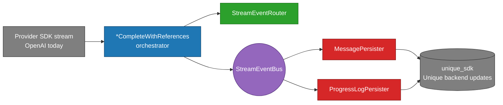

Read it as: a provider SDK feeds a `*CompleteWithReferences` orchestrator; the orchestrator fans out to a pure router (for stream interpretation and state) and a bus (for platform side effects). OpenAI Responses and Chat Completions are the current provider stream shapes, but the boundary is meant to keep the rest of the platform from depending on those wire formats.

---

## 3. Data ownership graph

This is the main ownership rule: each runtime participant owns one kind of
state, and everything crossing a bus is a copied event payload. The router
points at event handlers but does not own their data; subscribers own the
state needed for SDK writes.

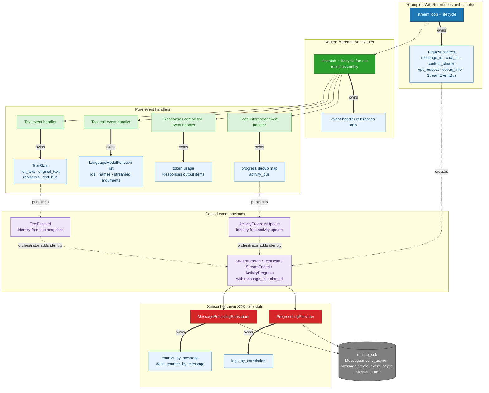

Thick `owns` arrows are the ownership boundaries. Solid arrows are calls or
subscriptions. Dotted arrows are copied event payloads: event handlers publish
identity-free snapshots, then the orchestrator adds `message_id` / `chat_id`
before publishing on `StreamEventBus`.

---

## 4. Domain events on the bus

`StreamEventBus` is the normalized platform-facing contract for a running stream. It is a **routing table of typed channels** — one channel per concrete event. The orchestrator publishes on the matching channel; subscribers subscribe only to the channels they care about. No runtime `isinstance` dispatch at the subscriber boundary.

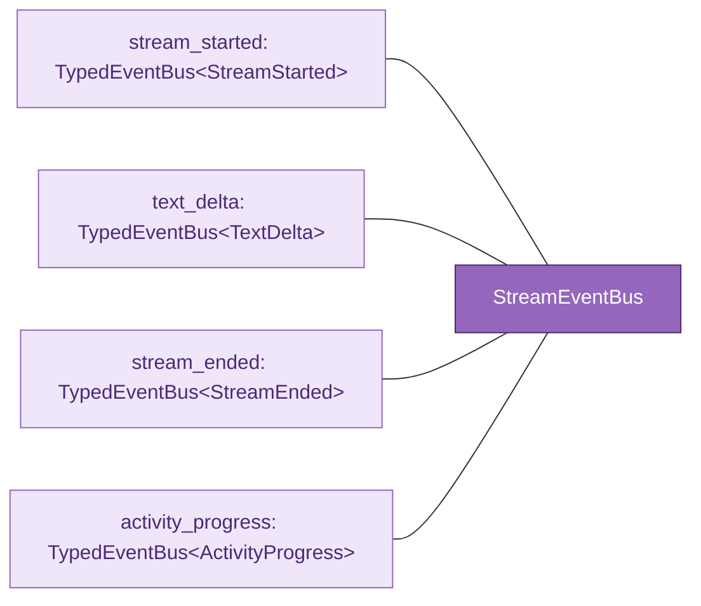

Four channels, nothing else. They cover the updates the Unique backend needs during streaming: message creation/start, incremental text, final text, and tool-like progress. `MessagePersistingSubscriber` subscribes to the three text-lifecycle channels; `ProgressLogPersister` subscribes only to `activity_progress`. The orchestrator wires `ProgressLogPersister` **only when** the router has a progress-producing event handler.

---

## 5. Responsibilities at a glance

Each component has one well-scoped responsibility. The table is the short version; sub-sections go deeper.

| Component | Owns | Must do | Must *not* do |
|---|---|---|---|
| **`*CompleteWithReferences` orchestrator** | HTTP stream, `StreamEventBus`, router instance | Run `async for`, publish domain events with identity, build the final result | Accumulate text, call `unique_sdk`, know regex patterns |
| **Stream event router** (`*StreamEventRouter`) | Event-handler references | Dispatch events by type (Responses) or broadcast to all event handlers (Chat Completions), fan out lifecycle, aggregate appendices, build typed result | Hold state, call SDK, know about identity |
| **Event handlers** (`*TextDeltaEventHandler`, `*ToolCallEventHandler`, …) | `TextState`, tool-call list, usage/output, progress dedup state, inner `TypedEventBus` | Accumulate state, publish inner-bus flushes/progress | Call SDK, know `message_id` / `chat_id`, see `ContentChunk`s |
| **Protocols** (`protocols/`) | Type contracts only | Define the shape event handlers must implement | Contain any logic |
| **Events** (`events.py`) | Four frozen dataclasses | Be the wire format between orchestrator and subscribers | Carry behavior |
| **`StreamEventBus`** | One `TypedEventBus` per event type (`stream_started`, `text_delta`, `stream_ended`, `activity_progress`) | Fan out each event on its own typed channel; subscribers pick the channels they care about | Know the event Union as a broadcast surface; require subscribers to `isinstance`-check |
| **`StreamSubscriber`** (protocol) | — | Expose `register(bus)` that wires per-event callbacks onto the relevant channels | Receive events through a single fan-out entry point |
| **Subscribers** (`MessagePersistingSubscriber`, `ProgressLogPersister`) | Per-stream side-effect state (`chunks_by_message`, `logs_by_correlation`) | Translate domain events into SDK calls; subscribe only to the channels they handle | Mutate event handler state, change event contents |
| **Pattern replacer** (`pattern_replacer.py`) | `NORMALIZATION_PATTERNS`, hold-back buffer | Rewrite citation variants to `N` across chunk boundaries | Know which chunk a citation maps to |

### 5.1 `*CompleteWithReferences` orchestrators

- Opens the streaming call to the provider SDK (`responses.create` / `chat.completions.create` for OpenAI today).
- Runs its own `async for` loop so it can catch `httpx.RemoteProtocolError` and still finalise with partial output.
- Publishes the four domain events on the bus. Always publishes `StreamEnded` from `finally`.
- **Identity adapter:** subscribes to each event handler's inner bus (`text_bus`, `activity_bus`) and re-publishes the payload on the outer bus with `message_id` / `chat_id` attached.
- Calls `router.reset()` at the start of every run so sequential reuse is safe.
- Delegates result construction to `router.build_result(...)` and returns it.

### 5.2 Stream event router — `ResponsesStreamEventRouter` / `ChatCompletionStreamEventRouter`

- **Dispatch, not pipeline.** The name "router" is deliberate — this type does *not* chain event handlers in a Pipes-and-Filters sense. It looks at each incoming event and decides which event handler(s) should see it.
  - **Responses** uses typed dispatch: each `ResponseStreamEvent` subclass maps to one event handler (text delta → text event handler, tool call → tool event handler, completed → completed event handler, code interpreter → CI event handler). Unknown events are ignored for forward compatibility.
  - **Chat Completions** uses broadcast dispatch: every `ChatCompletionChunk` carries mixed content (text + tool deltas), so the chunk is sent to both event handlers and each decides what to consume.
- Fans out lifecycle: `reset()` and `on_stream_end()` iterate every event handler.
- Aggregates capabilities: `get_appendices()` collects strings from any event handler implementing `AppendixProducer`.
- Re-exposes event handler-owned buses to the orchestrator (`text_bus`, `activity_bus`).
- Builds the typed result (`LanguageModelStreamResponse` / `ResponsesLanguageModelStreamResponse`).

### 5.3 Event handlers

- **Text event handler.** Apply the replacer chain to each incoming delta, update `TextState.full_text` / `original_text`, publish `TextFlushed` on the event handler-local bus at each flush boundary (every non-empty delta for Responses; every `send_every_n_events` chunks for Chat Completions). On `on_stream_end()`, drain replacer residuals into `full_text`; the orchestrator then publishes one authoritative `StreamEnded`.
- **Tool call event handler.** Assemble function call ids, names, and streamed arguments into `LanguageModelFunction`s.
- **Completed event handler** (Responses only). Extract `LanguageModelTokenUsage` and output items from `ResponseCompletedEvent`.
- **Code interpreter event handler** (Responses only). Deduplicate by `(status, text)` per `item_id` and publish `ActivityProgressUpdate` on genuine state transitions.

### 5.4 Protocols

- `StreamEventHandlerProtocol` — the lifecycle contract (`reset`, `on_stream_end`).
- `AppendixProducer` — optional capability; any event handler can opt in by defining `get_appendix()`.
- `Responses*EventHandlerProtocol` / `ChatCompletion*EventHandlerProtocol` — API-specific method shapes so routers can be typed without inheritance.
- Inner-bus payloads (`TextFlushed`, `ActivityProgressUpdate`) live here so event handlers and orchestrator share one vocabulary.

### 5.5 Events and bus

- `StreamStarted`: the contract "a stream is now alive for this `message_id`, and these `ContentChunk`s back it". Subscribers use it to seed per-stream state.
- `TextDelta`: "the model produced observable text up to this point". Subscribers render/persist.
- `StreamEnded`: "this is the authoritative final text + appendices". The invariant event — always fires, even on errors.
- `ActivityProgress`: "a tool-like activity (CI, future: web search, retrieval) transitioned to this state".
- `StreamEventBus`: a small dataclass exposing one `TypedEventBus` per event type (`stream_started`, `text_delta`, `stream_ended`, `activity_progress`). The orchestrator publishes on the matching channel (`self._bus.text_delta.publish_and_wait_async(...)`); callers attach extra subscribers per channel (`orchestrator.bus.text_delta.subscribe(my_fn)`). There is deliberately *no* broadcast "subscribe to everything" path — if a subscriber cares about multiple channels, it subscribes its own typed callbacks to each.
- `StreamEvent`: documentation alias for the closed set of events a bus can carry. Not used as a runtime subscription surface.

### 5.6 Subscribers

Subscribers implement the `StreamSubscriber` protocol — a single `register(bus)` method that wires per-event callbacks (`on_started`, `on_text_delta`, …) onto the channels the subscriber cares about. This replaces a fan-out `handle(event)` with `isinstance` branches: channel selection is now the subscribe-time act, and `on_*` methods only run when their channel fires.

- **`MessagePersistingSubscriber`** — the *only* caller of `unique_sdk.Message.modify_async` and `unique_sdk.Message.create_event_async`. `register(bus)` subscribes to `stream_started`, `text_delta`, `stream_ended`. On `StreamStarted` it resets `references=[]` and stamps `startedStreamingAt` via `Message.modify_async`. On `TextDelta` (the hot path) it writes the current text + filtered references (via `filter_cited_sdk_references`) through `Message.create_event_async`. On `StreamEnded` it concatenates `full_text + appendices` and stamps `stoppedStreamingAt` **only when the round produced answer text** — a single final `Message.modify_async` write. Tool-call rounds (empty text) leave `stoppedStreamingAt` null so the message stays in the streaming state (the frontend keeps showing the inline tool-progress steps). `completedAt` is **not** written here; the orchestrator marks completion at end-of-turn via `set_completed_at`.
- **`ProgressLogPersister`** — the *only* caller of `unique_sdk.MessageLog.*`. `register(bus)` subscribes to `activity_progress` only. Keyed by `correlation_id`: creates a new log the first time it sees an id, updates on subsequent transitions, skips no-ops. The orchestrator only registers it when the router actually has a progress-producing event handler (`router.activity_bus is not None`).

### 5.7 Pattern replacer

- `NORMALIZATION_PATTERNS` — 18 regex rules, single source of truth for citation normalisation. Also imported by the batch post-processing path so streaming and batch produce identical text for the same input (parity test enforces this).
- `StreamingPatternReplacer` — holds back up to 80 trailing characters so a pattern straddling two deltas still matches; exposes `process(delta)` / `flush()`.
- `filter_cited_sdk_references(chunks, text)` — given the accumulated normalised text, returns only the chunks whose `N` actually appears.

---

## 6. UML notation used in the class diagrams

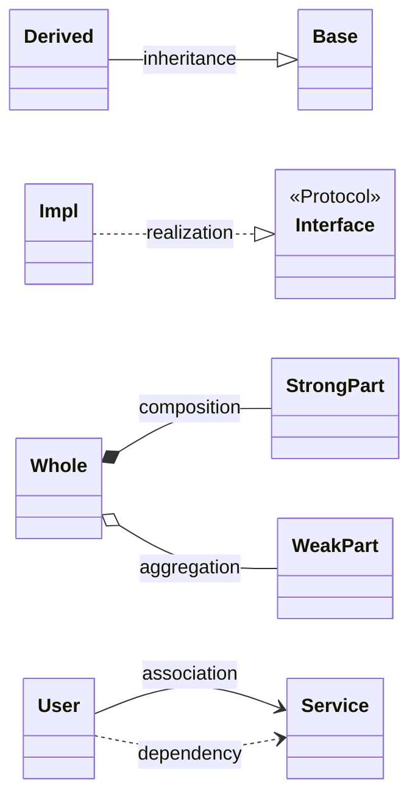

| Arrow | Meaning | When it applies here |
|---|---|---|
| `--\|>` | inheritance | not used (we prefer protocols over base classes) |
| `..\|>` | realization | concrete event handler implements a `Protocol` |
| `*--` | composition (filled diamond) | orchestrator *owns* router and bus |
| `o--` | aggregation (empty diamond) | router references event handlers (event handlers can outlive a router in tests) |
| `..>` | dependency (dashed) | subscriber depends on bus; class uses another class's type |
| `-->` | association | regular reference |

---

## 7. Package layout

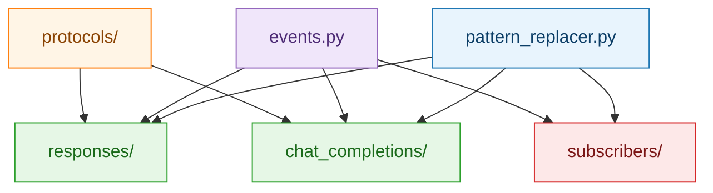

---

## 8. Class relationships — Responses event handlers

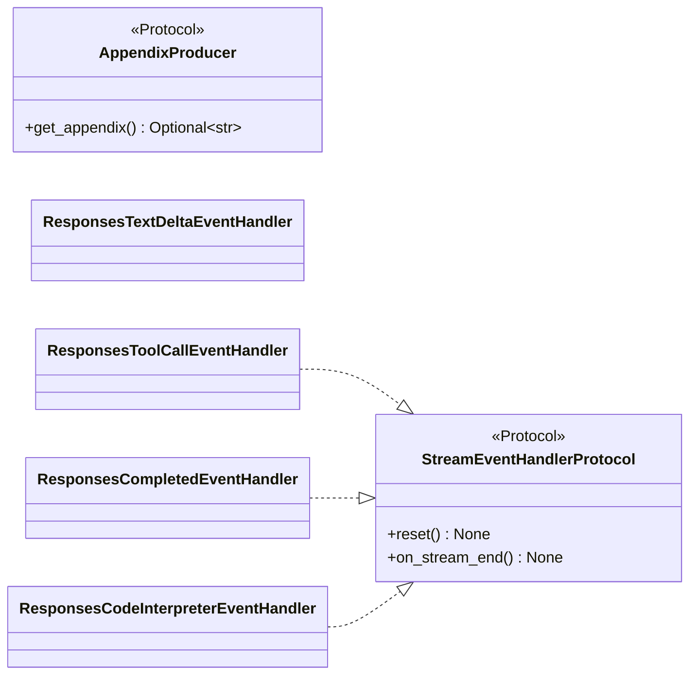

Event handlers realize a tiny lifecycle protocol. `AppendixProducer` is an optional extension point that the router can aggregate, but no default event handler uses it today.

---

## 9. Class relationships — router + `*CompleteWithReferences` orchestrator

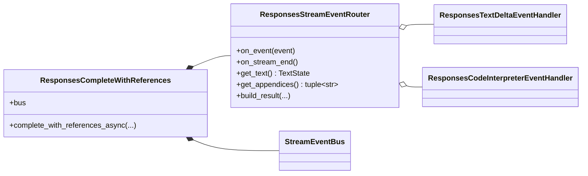

The `*CompleteWithReferences` orchestrator **composes** router + bus (they live and die with it). The router **aggregates** event handlers (event handlers can be built and tested independently).

---

## 10. Event dataclasses

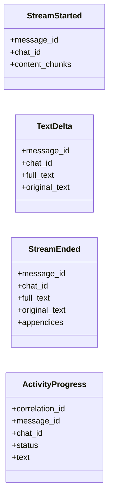

---

## 11. Subscribers

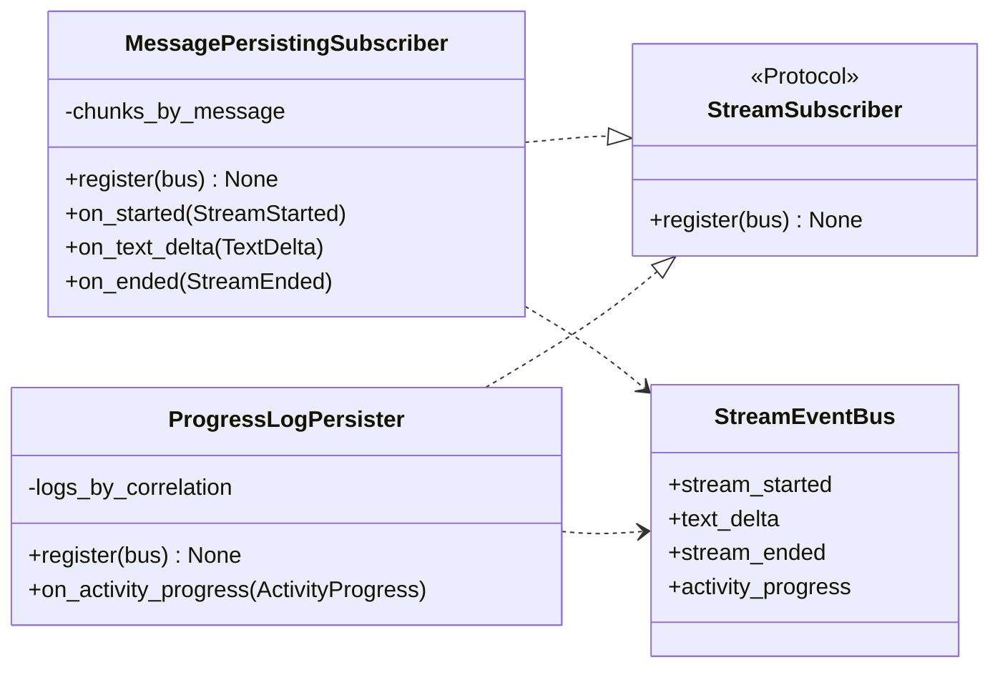

One subscriber per SDK surface, each subscribed only to the channels it handles:

- `MessagePersistingSubscriber` → `Message.modify_async` (stream_started / stream_ended) · `Message.create_event_async` (text_delta)
- `ProgressLogPersister` → `MessageLog.create_async` / `update_async` (reacts to `activity_progress` only)

---

## 12. Sequence — stream lifecycle (happy path)

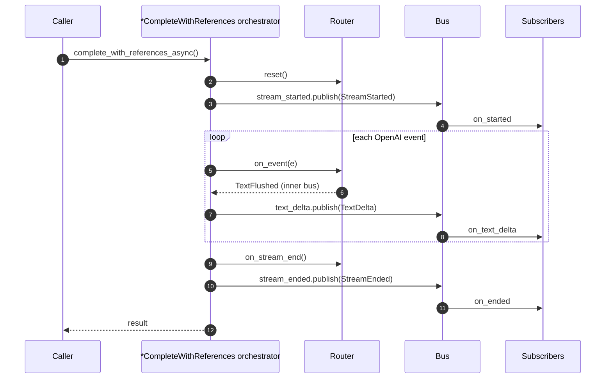

---

## 13. Sequence — code interpreter branch

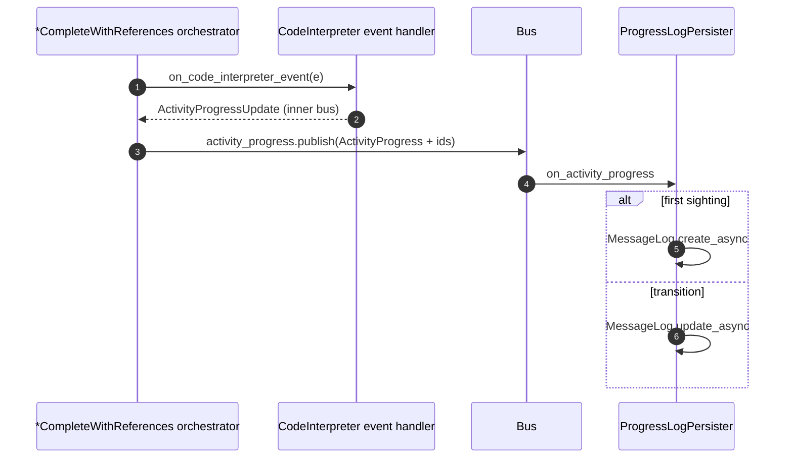

`correlation_id` is the idempotency key — repeated updates coalesce into one log.

---

## 14. Sequence — error path

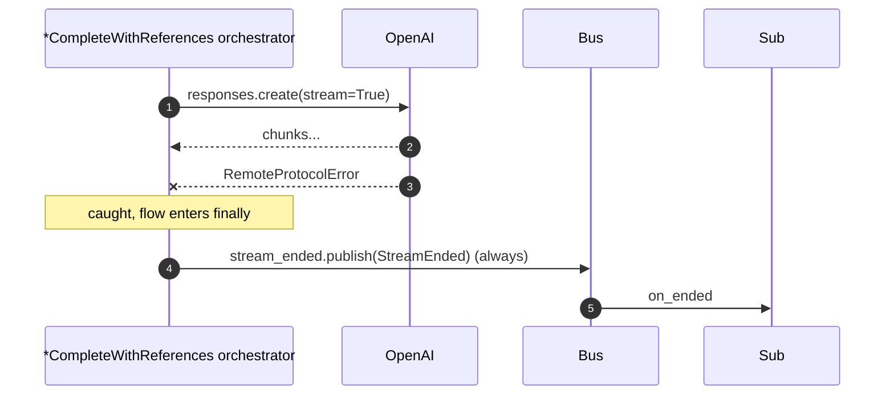

`StreamEnded` is the invariant — it **always** fires from `finally`, so the UI sees a terminal state even on a broken connection.

---

## 15. `*CompleteWithReferences` orchestrator state machine

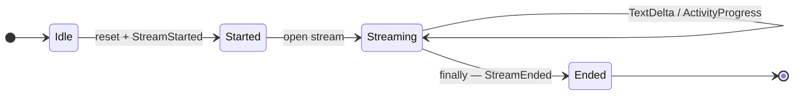

---

## 16. Inner-vs-outer bus (identity adapter)

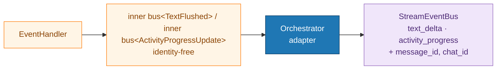

Why: event handlers know nothing about `message_id` / `chat_id`, so they're trivially reusable and testable. The adapter on the orchestrator adds identity and forwards on the matching **typed channel** of the outer bus — no Union, no `isinstance` re-dispatch at the subscriber boundary.

---

## 17. Pattern replacer — streaming normalisation

```mermaid
flowchart LR
    classDef raw  fill:#fde8e8,stroke:#d62728,color:#7a1515
    classDef buf  fill:#fff5e6,stroke:#ff7f0e,color:#8a4303
    classDef norm fill:#e6f7e6,stroke:#2ca02c,color:#1a6a1a
    classDef out  fill:#e8f4fd,stroke:#1f77b4,color:#0b3d66

    M["delta: '…see &#91;source 1&#93;…'"]:::raw
    R[process]:::buf
    B[(80-char hold-back)]:::buf
    PAT[NORMALIZATION_PATTERNS]:::norm
    OUT["'…see &lt;sup&gt;1&lt;/sup&gt;…'"]:::out

    M --> R
    R <--> B
    R --> PAT
    R --> OUT
```

`StreamingPatternReplacer` buffers the last 80 characters so a regex that straddles two deltas still matches.

---

## 18. Cascade flush at end-of-stream

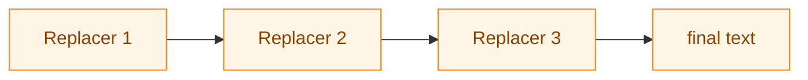

On `on_stream_end`, each replacer's tail is fed into the next replacer's `process()` before that one's `flush()`, so no partial match survives the end of the stream.

---

## 19. Responses vs Chat Completions

| | Responses | Chat Completions |
|---|---|---|
| Event types | Distinct per kind | Unified `ChatCompletionChunk` |
| Flush rule | Every non-empty delta | Every `send_every_n_events` chunks |
| Event handlers | text, tools, completed, CI | text, tools |
| Appendices | None by default; router supports `AppendixProducer` extensions | — |
| `ActivityProgress` | Yes | No |
| Default subscribers | MessagePersister + ProgressLogPersister | MessagePersister |
| Result type | `ResponsesLanguageModelStreamResponse` | `LanguageModelStreamResponse` |

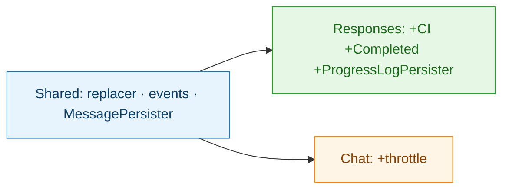

---

## 20. Extension points

| I want to… | Where to plug in |
|---|---|
| Add a provider SDK stream shape | New `*CompleteWithReferences`-style orchestrator + `*StreamEventRouter`; reuse bus, subscribers, replacer |
| Add an activity | Event handler exposes `activity_bus` of `ActivityProgressUpdate` |
| Append to final message | Implement `AppendixProducer.get_appendix()` |
| Tracing / analytics | `orchestrator.bus.text_delta.subscribe(my_fn)` (or any other typed channel) |
| Replace persistence | Implement `StreamSubscriber` (`register(bus)` + `on_*` methods), pass `subscribers=[MyPersister(...)]` to the orchestrator (defaults dropped) |
| New citation format | Add pattern to `NORMALIZATION_PATTERNS` (parity test guards drift) |

---

## 21. Cheat sheet — one-liner per file

| File | One-liner |
|---|---|
| `event_routing/events.py` | Event dataclasses + `StreamEventBus` (typed channels) + `StreamSubscriber` protocol |
| `experimental/components/streaming/common.py` | `TextState`, event handler protocols, inner-bus payloads, `AppendixProducer` |
| `event_routing/protocols/responses.py` | Responses event handler protocols |
| `event_routing/protocols/chat_completions.py` | Chat Completions event handler protocols |
| `event_routing/responses/stream_event_router.py` | Typed dispatch + `build_result` + `get_appendices` |
| `event_routing/responses/complete_with_references.py` | Orchestrator — owns bus, publishes domain events |
| `event_routing/responses/text_delta_event_handler.py` | Pure text accumulator + inner `text_bus` |
| `event_routing/responses/tool_call_event_handler.py` | Function tool call accumulator |
| `event_routing/responses/completed_event_handler.py` | Usage + output items |
| `event_routing/responses/code_interpreter_event_handler.py` | Progress updates for code interpreter activity |
| `event_routing/chat_completions/stream_event_router.py` | Broadcast dispatch over unified chunks |
| `event_routing/chat_completions/complete_with_references.py` | Chat Completions orchestrator |
| `event_routing/chat_completions/text_event_handler.py` | Throttled text accumulator |
| `event_routing/chat_completions/tool_call_event_handler.py` | Tool call assembler |
| `event_routing/subscribers/message_persister.py` | Only caller of `Message.modify_async` (start/end) and `Message.create_event_async` (deltas) |
| `event_routing/subscribers/progress_log_persister.py` | Only caller of `MessageLog.*` |
| `event_routing/_async_bridge.py` | Run an async coroutine from sync code (sync orchestrator entrypoint) |
| `experimental/components/streaming/pattern_replacer.py` | `NORMALIZATION_PATTERNS` + `StreamingPatternReplacer` |

---

## 22. Elevator pitch

> "We adapt provider SDK streams into Unique platform updates. One streaming call is owned by a `*CompleteWithReferences` orchestrator, interpreted by a **stream event router**, and handled by pure event handlers that recognize the normal stream lifecycle: start, text deltas, tool/activity progress, function calls, usage, and end. A **stream event bus** exposes the platform-facing events on typed channels, and subscribers translate those events into `unique_sdk` calls that update the backend message and progress logs. Event handlers never call the SDK — **only subscribers do** — so adding another provider stream shape means writing a new `*CompleteWithReferences`-style orchestrator/router pair while reusing the bus, subscribers, citation normalization, and result assembly patterns."
