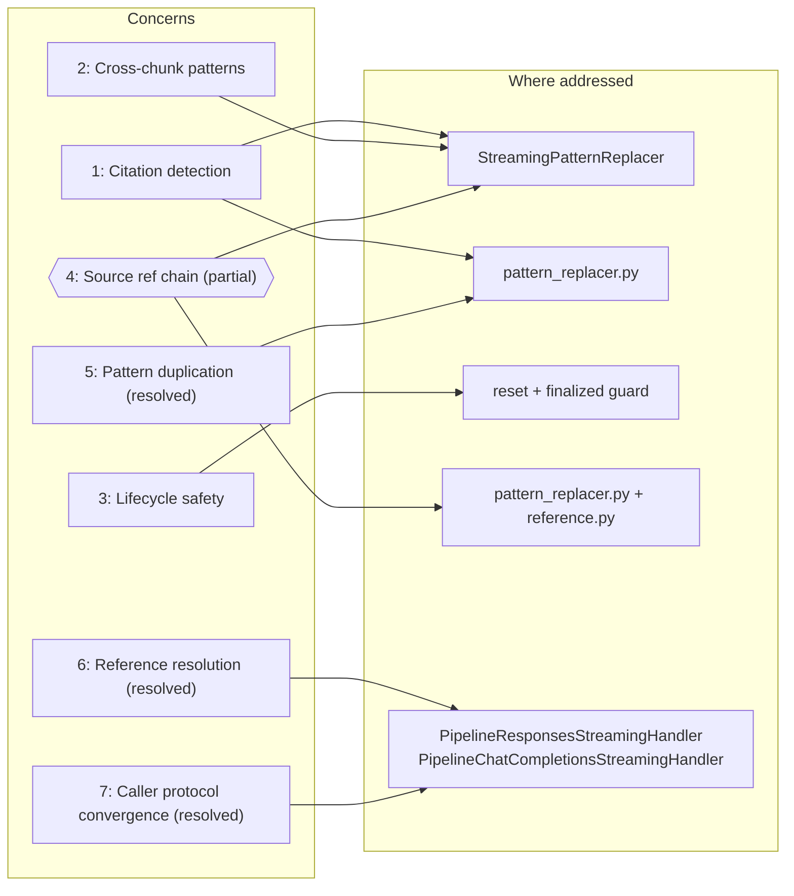
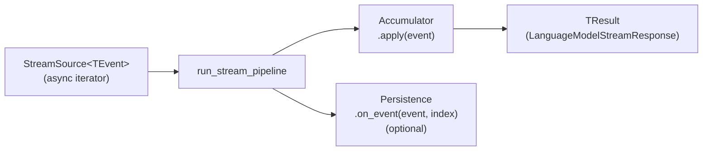
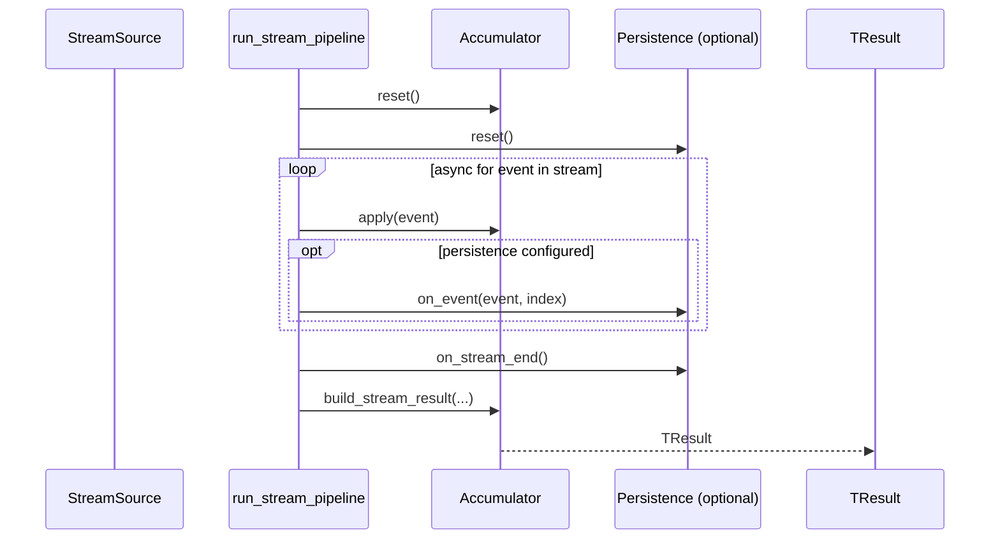

# Streaming pipeline — architecture & implementation

> **Status:** Pipeline implemented (March 2026). `PipelineResponsesStreamingHandler` and `PipelineChatCompletionsStreamingHandler` implemented.
> **Package:** `unique_toolkit.framework_utilities.openai.streaming.pipeline`
> **Supersedes:** `openai_streaming_pipeline_architecture.md`, `responses_stream_pipeline_implementation.md`

---

## Context

The Unique toolkit must consume token streams from LLM providers and produce two independent outputs from the same async iterator:

1. **Live platform updates** — persist streaming progress via the Unique SDK (`Message`, `MessageLog`, events) so the UI can show incremental text, code-interpreter status, and similar feedback while the model is still generating.
2. **Toolkit contract** — assemble a `LanguageModelStreamResponse` (assistant text, tool calls, usage) that downstream code already depends on.

Those two concerns cut across every supported wire format today (OpenAI Responses API, OpenAI Chat Completions) and every format we may add later (LangChain, Pydantic AI, Anthropic, bare `AsyncIterator`).

---

## Concerns

### 1. Citation detection and normalisation

LLMs must be instructed (via system prompt or injected context) to cite sources using a recognisable pattern such as `[source N]`. In practice, models do not follow the instruction exactly -- they produce a wide range of variants (`[<source 1>]`, `source_number="3"`, `[**2**]`, `SOURCE n°5`, `[source: 1, 2, 3]`, etc.) depending on the model family, temperature, and context length. The pipeline must detect all of these variants in the streaming output and normalise them to the stable intermediate `[N]` format before the text reaches the frontend, so that post-processing can resolve each `[N]` to its corresponding `ContentChunk` and produce the final `<sup>N</sup>` footnote.

### 2. Cross-chunk pattern matching

Tokens arrive incrementally, so a regex pattern can straddle two deltas (e.g. `[source` in one delta and ` 1>]` in the next). A naive per-delta replacement would miss or corrupt these matches. `StreamingPatternReplacer` solves this by buffering trailing characters and only releasing text once partial matches are resolved.

### 3. Lifecycle safety

Accumulators and persistence objects are stateful. Without explicit lifecycle management, sequential reuse could carry over stale state and concurrent sharing would corrupt both outputs. The pipeline enforces safety through `reset()` at the start of each run, a finalized guard after `build_stream_result`, and a documented no-concurrent-sharing rule.

### 4. Source reference handling is a fragile, multi-stage chain *(partial)*

The Unique frontend renders source citations as `<sup>N</sup>` footnotes. Producing those from raw model output requires three stages that must stay in sync:

1. **Model instruction** — the system prompt or backend-injected context that tells the model *how* to cite (e.g. "cite as `[source N]`") and *what* to cite (numbered `ContentChunk` entries presented in 1-based order).
2. **Streaming normalisation** — pattern replacers that convert the many formats models actually produce into the stable intermediate `[N]` during streaming.
3. **Post-stream reference resolution** — `language_model/reference.py` matches each `[N]` to its `ContentChunk` by position, assigns deduplicated sequence numbers, and converts `[N]` → `<sup>sequence_number</sup>`.

These three stages are maintained in separate locations. If a new model variant emits a format that the replacer patterns do not cover, or if the numbering convention between chunk presentation and post-processing drifts, references silently break.

### 5. Citation pattern duplication *(resolved)*

The 18 normalisation patterns that convert model-emitted citation formats to `[N]` previously existed in two separate locations. `NORMALIZATION_PATTERNS` in `streaming/pattern_replacer.py` is now the **single source of truth**. Both `StreamingPatternReplacer` (streaming) and `reference.py:_preprocess_message` (post-processing) import from there. A parametrised parity test guards against future drift.

> **`CitationConfig` abandoned:** An earlier design proposed a `CitationConfig` dataclass in `language_model/citation.py` that would co-locate the model instruction, patterns, and a `requires_reference_resolution` flag. This was abandoned because the history manager (`agentic/history_manager/`) is responsible for presenting messages and chunks consistently to the model — the citation instruction belongs there, not in a separate config object in `language_model/`. The current solution (`NORMALIZATION_PATTERNS` in `pattern_replacer.py` as shared truth, no instruction coupling) is sufficient.

### 6. Reference resolution *(resolved)*

After streaming completes, the persisted message must carry `ContentReference` objects that link each `[N]` back to the `ContentChunk` it was derived from.

| Path | Who resolves references | How |
|------|------------------------|-----|
| `Integrated.*` via `ChatService` | **Server-side** (Integrated backend) | `content_chunks` sent as `searchContext`; backend resolves and returns references. |
| `PipelineResponsesStreamingHandler` | **Client-side via replacer** | `ReferenceResolutionReplacer` converts `[N]` → `<sup>N</sup>` at flush time; handler reads `resolved_text` + `references`. |
| `PipelineChatCompletionsStreamingHandler` | **Client-side via replacer** | Same replacer approach. |

### 7. Caller protocol convergence *(resolved)*

Both `SupportCompleteWithReferences` (Chat Completions) and `ResponsesSupportCompleteWithReferences` (Responses API) are now implemented by pipeline-backed handlers.

### Concern map



---

## Architecture

The pipeline replaces the handler list with a single-pass **fold + optional persistence + result** model.



For every event in the stream:

1. The **accumulator** folds the event into mutable state (text, tool calls, usage).
2. The **persistence sink** (when provided) fires Unique SDK side effects (message events, log entries) — it runs *after* the accumulator so it can read consistent folded state.
3. After the stream ends, the accumulator **materialises** the result via `build_stream_result`.

Each component is defined by a **protocol** (PEP 544 structural typing), so implementations can be swapped, composed, or faked in tests without inheritance.

---

## Design decisions

| # | Decision | Rationale |
|---|----------|-----------|
| 1 | **Protocols over abstract base classes** | Structural typing lets any class with the right methods plug in. No forced inheritance, easy fakes in tests, and `run_stream_pipeline` stays free of Unique SDK imports. |
| 2 | **Generic protocols with variance annotations** | `TStreamEvent` is **contravariant** (input to `apply`/`on_event`), `TStreamResult` is **covariant** (output of `build_stream_result`). This follows PEP 544 and satisfies strict type checkers (basedpyright). |
| 3 | **Persistence is optional** | The same accumulator works in production (with SDK persistence) and in unit tests (without). No mocking of SDK calls needed to test fold logic. |
| 4 | **One accumulator per wire format** | `ResponsesStreamAccumulator` handles `ResponseStreamEvent`; `ChatCompletionStreamAccumulator` handles `ChatCompletionChunk`. They share no inheritance — only the protocol shape. This avoids a fragile "universal" accumulator that tries to understand every event family. |
| 5 | **Explicit `reset()` + finalized guard** | The runner calls `reset()` before consuming the stream, enabling safe sequential reuse. After `build_stream_result`, further `apply` or `build_stream_result` calls raise `RuntimeError` until `reset()`. This catches accidental interleaving without runtime surprises. |
| 6 | **Typed `isinstance` dispatch inside accumulators** | One event → one code path. The accumulator's `apply` method uses `isinstance` checks on concrete OpenAI SDK types, replacing the boolean-guard fan-out. Unknown event types are silently ignored for forward compatibility. |
| 7 | **Vendor types stay at the boundary** | OpenAI SDK types are imported only inside accumulators, persistence implementations, and the handler classes. The generic runner and protocols know nothing about OpenAI. |
| 8 | **Separate persistence for separate SDK surfaces** | `ResponsesSdkPersistence` handles both `Message` events (text deltas) and `MessageLog` entries (code interpreter lifecycle). `ChatCompletionSdkPersistence` handles `Message` events with pattern replacement and throttling. Each is a small, focused class. |
| 9 | **`NORMALIZATION_PATTERNS` as single source of truth in `pattern_replacer.py`** | Both the streaming replacer and `reference.py:_preprocess_message` import the same pattern list from `pattern_replacer.py`. A parity test ensures both paths produce identical output. |

---

## Module layout

```
streaming/
├── pipeline/
│   ├── __init__.py                               # Public API surface
│   ├── protocols.py                              # Generic + Responses type aliases
│   ├── run.py                                    # run_stream_pipeline (generic)
│   │                                             # run_responses_stream_pipeline
│   │                                             # run_chat_completions_stream_pipeline
│   ├── responses_accumulator.py                  # Fold: ResponseStreamEvent → LanguageModelStreamResponse
│   ├── responses_sdk_persistence.py              # Unique SDK: Message events + MessageLog (code interpreter)
│   ├── responses_streaming_handler.py            # PipelineResponsesStreamingHandler
│   │                                             #   (ResponsesSupportCompleteWithReferences impl)
│   ├── chat_completion_accumulator.py            # Fold: ChatCompletionChunk → LanguageModelStreamResponse
│   ├── chat_completion_sdk_persistence.py        # Unique SDK: Message events (with replacers + throttle)
│   └── chat_completion_streaming_handler.py      # PipelineChatCompletionsStreamingHandler
│                                                 #   (SupportCompleteWithReferences impl)
├── pattern_replacer.py                           # NORMALIZATION_PATTERNS, NORMALIZATION_MAX_MATCH_LENGTH
│                                                 # StreamingReplacerProtocol, StreamingPatternReplacer
└── reference_replacer.py                         # ReferenceResolutionReplacer
                                                  # ([N] → <sup>N</sup> + ContentReference at flush time)
```

---

## Protocols

All protocols live in `pipeline/protocols.py`.

### `StreamSource[T]`

```python
type StreamSource[T] = AsyncIterable[T]
```

Any async iterable of your event type. OpenAI SDK streams, LangChain iterators, or a hand-rolled `async def` generator all satisfy this.

### `StreamAccumulatorProtocol[TEvent, TResult]`

| Method | Purpose |
|--------|---------|
| `reset()` | Clear all state and the finalized guard for a new stream. |
| `apply(event: TEvent)` | Fold one stream element into internal state. |
| `build_stream_result(*, message_id, chat_id, created_at) → TResult` | Materialise the final result. Marks the fold as finished. |

### `StreamPersistenceProtocol[TEvent]`

| Method | Purpose |
|--------|---------|
| `reset()` | Clear per-run counters and buffers. |
| `on_event(event: TEvent, *, index: int)` | Fire side effects for one element (called after `accumulator.apply`). |
| `on_stream_end()` | Final side effects after the stream is exhausted. |

### Responses-specific aliases

| Alias | Expands to |
|-------|------------|
| `ResponseStreamSource` | `StreamSource[ResponseStreamEvent]` |
| `ResponsesStreamAccumulatorProtocol` | `StreamAccumulatorProtocol[ResponseStreamEvent, LanguageModelStreamResponse]` |
| `ResponseStreamPersistenceProtocol` | `StreamPersistenceProtocol[ResponseStreamEvent]` |

---

## The generic runner

`run_stream_pipeline` is the core loop. It is fully generic — it knows nothing about OpenAI, Unique, or `LanguageModelStreamResponse`.



`run_responses_stream_pipeline` and `run_chat_completions_stream_pipeline` are thin typed wrappers that pin `TEvent`/`TResult` so callers get better autocomplete and type safety without casting.

> **Note:** Both `PipelineResponsesStreamingHandler` and `PipelineChatCompletionsStreamingHandler` run their own `async for` loops (rather than delegating to `run_stream_pipeline`) so they can catch `httpx.RemoteProtocolError` mid-stream and finalise gracefully with whatever content was received.

---

## Implemented pipelines

### OpenAI Responses API

**Accumulator: `ResponsesStreamAccumulator`**

Handles a focused subset of `ResponseStreamEvent`:

| Event type | Action |
|------------|--------|
| `ResponseTextDeltaEvent` | Append `delta` to aggregated text. |
| `ResponseOutputItemAddedEvent` (with `ResponseFunctionToolCallItem`) | Record `item.id → name` for later name resolution. |
| `ResponseFunctionCallArgumentsDoneEvent` | Build `LanguageModelFunction` from final arguments + resolved name. |
| `ResponseCompletedEvent` | Extract `LanguageModelTokenUsage` from `response.usage`. |
| Everything else | Silently ignored (forward-compatible). |

**Name resolution for function tools:** Older OpenAI Python SDK versions omit `name` on `ResponseFunctionCallArgumentsDoneEvent`. The accumulator first checks `getattr(event, "name", None)`, then falls back to the `item_id → name` map built from `ResponseOutputItemAddedEvent`.

**Additional alias:** `build_responses_stream_result` is a descriptive alias for `build_stream_result` on `ResponsesStreamAccumulator`, returning `ResponsesLanguageModelStreamResponse` (which includes `output` from the completed response).

**Persistence: `ResponsesSdkPersistence`**

| Concern | SDK surface | Behaviour |
|---------|-------------|-----------|
| Assistant text deltas | `Message.create_event_async` | Applies pattern replacers to each delta, accumulates full text (`_full_text`), emits an event per delta. |
| Stream completed | `Message.create_event_async` | Flushes remaining replacer buffers then emits final text. |
| Code interpreter lifecycle | `MessageLog.create_async` / `MessageLog.update_async` | Creates a `MessageLog` entry on first event per `item_id`; updates status (`RUNNING` → `COMPLETED`) on state transitions. Tracks per-call state via `CodeInterpreterLogState`. |

### OpenAI Chat Completions

**Accumulator: `ChatCompletionStreamAccumulator`**

| Field | Source |
|-------|--------|
| Assistant text | `choice.delta.content` (concatenated) |
| Tool calls | `choice.delta.tool_calls` — assembled incrementally by `tc.index`, merging `id`, `function.name`, and `function.arguments` across chunks. |

`build_stream_result` converts raw `ChatCompletionMessageFunctionToolCall` objects into `LanguageModelFunction` instances, parsing JSON arguments and handling decode failures gracefully (logs a warning, sets `arguments = None`).

**Early termination helper:** `iter_chat_completion_chunks_until_tool_calls` wraps a raw stream and stops yielding after the first chunk with `finish_reason == "tool_calls"`. This is provided for callers that need the legacy break-early behaviour; `PipelineChatCompletionsStreamingHandler` does **not** use it — it consumes the full stream.

**Persistence: `ChatCompletionSdkPersistence`**

Applies pattern replacers to each chunk's content and emits `Message.create_event_async` every `send_every_n_events` chunks (configurable throttle). Maintains both `_original_text` (pre-replacement) and `_full_text` (post-replacement); both are sent in the SDK event payload (`text` and `originalText` fields).

---

## Pattern replacers *(Concerns 1, 2, 4)*

The Unique frontend renders source references as `<sup>N</sup>` footnotes. Producing those from raw LLM output is a **two-stage** process:

1. **During streaming (replacers):** Normalise the many formats LLMs emit — `[<source 1>]`, `source_number="3"`, `[**2**]`, `[source: 1, 2, 3]`, `[<[1]>]`, etc. — into the stable intermediate `[N]` bracket format. Strip non-source references like `[user]`, `[conversation]`, or `[none]`.
2. **After streaming (`language_model/reference.py`):** Match each `[N]` to a `ContentChunk` from the search context, assign deduplicated sequence numbers, and convert `[N]` → `<sup>sequence_number</sup>`. Remove any remaining `[N]` brackets that could not be matched (hallucinated references).

### `StreamingReplacerProtocol`

```python
class StreamingReplacerProtocol(Protocol):
    def process(self, delta: str) -> str: ...
    def flush(self) -> str: ...
```

Any object satisfying this protocol can be injected into the persistence layer. Both `ResponsesSdkPersistence` and `ChatCompletionSdkPersistence` accept a `replacers: list[StreamingReplacerProtocol]` and apply them sequentially to each delta before emitting SDK events.

### `StreamingPatternReplacer`

The default implementation. Holds back up to `max_match_length` trailing characters in an internal buffer between calls.

| Method | Behaviour |
|--------|-----------|
| `process(delta)` | Append delta to buffer, apply all regex replacements, release the safe prefix (everything except the trailing `max_match_length` chars). |
| `flush()` | Apply final replacements and release all remaining buffered text. |

### `NORMALIZATION_PATTERNS` (from `streaming/pattern_replacer.py`)

The canonical pattern list (`NORMALIZATION_PATTERNS`) and buffer size (`NORMALIZATION_MAX_MATCH_LENGTH = 80`) live in `streaming/pattern_replacer.py` and cover:

- **Stripping** non-source references: `[user]`, `[assistant]`, `[conversation]`, `[none]`, `[previous_answer]`, etc.
- **Normalising** source formats to `[N]`: `[<source 1>]` → `[1]`, `source_number="3"` → `[3]`, `[**2**]` → `[2]`, `SOURCE n°5` → `[5]`.
- **Expanding** multi-source references: `[source: 1, 2, 3]` → `[1][2][3]`, `[[1], [2], [3]]` → `[1][2][3]`.

Both the streaming replacer and `language_model.reference._preprocess_message` import from here — single source of truth. A parametrised parity test guards against future drift.

### `ReferenceResolutionReplacer`

Placed **after** `StreamingPatternReplacer` in the chain. During streaming it is a transparent pass-through (`process()` accumulates text and returns it unchanged for live `[N]` preview). At flush time it converts the full accumulated text to `<sup>N</sup>` and attaches `ContentReference` objects.

```
StreamingPatternReplacer          ReferenceResolutionReplacer
  process(): [source N] → [N]  →  process(): [N] (pass-through, accumulates)
  flush():   buffered tail      →  (cascade) process(tail) → accumulated += tail
                                   flush():  runs _preprocess + _add_references + _postprocess
                                             stores resolved_text + references
                                             returns ""
```

The handler reads `ref_replacer.resolved_text` and `ref_replacer.references` after `on_stream_end()` and applies them to `result.message`, replacing the raw accumulator text with the fully resolved version.

### Cascade flush in `on_stream_end()`

The persistence layer's `on_stream_end()` uses a **cascade flush** so that upstream replacers' buffered tails reach downstream replacers:

```python
remaining = ""
for replacer in self._replacers:
    if remaining:
        remaining = replacer.process(remaining)   # feed upstream tail downstream
    remaining += replacer.flush()
```

Without cascade, the pattern replacer's 80-char buffer tail would bypass the `ReferenceResolutionReplacer`, leaving the last references unresolved.

### How replacers integrate with persistence

- **`ResponsesSdkPersistence`** — on each `ResponseTextDeltaEvent`, runs `replacer.process(delta)`, accumulates replaced text, emits `Message.create_event_async`. At `on_stream_end()`, cascade-flushes all replacers.
- **`ChatCompletionSdkPersistence`** — on each `ChatCompletionChunk`, runs content through replacers, accumulates both original and replaced text, emits `Message.create_event_async` (throttled). At `on_stream_end()`, cascade-flushes all replacers.

The **accumulators** do not use replacers — they fold raw, unmodified event data. Replacement is purely a presentation concern for the SDK event stream.

---

## Lifecycle and concurrency *(Concern 3)*

| Rule | Enforcement |
|------|-------------|
| **Sequential reuse is safe.** | `run_stream_pipeline` calls `reset()` on both accumulator and persistence at the start of each run. The handler classes call `reset()` manually before starting their loops. |
| **Post-build is guarded.** | `ResponsesStreamAccumulator` raises `RuntimeError` on `apply` or `build_stream_result` after the fold is finalised, until `reset()`. |
| **No concurrent sharing.** | One accumulator + one persistence instance per in-flight stream. Sharing across concurrent tasks will corrupt state. |

---

## Caller protocols: `SupportCompleteWithReferences` and friends *(Concern 7)*

The toolkit defines two structural protocols in `protocols/support.py` that describe "something that can stream a completion with reference-aware post-processing":

| Protocol | Return type | Stream format |
|----------|-------------|---------------|
| `SupportCompleteWithReferences` | `LanguageModelStreamResponse` | Chat Completions |
| `ResponsesSupportCompleteWithReferences` | `ResponsesLanguageModelStreamResponse` | Responses API |

Both accept `content_chunks: list[ContentChunk]` — the search results the model should cite.

### Implementations

| Implementor | How it streams | Reference handling |
|-------------|----------------|-------------------|
| **`ChatService`** (via `chat/functions.py`) | `unique_sdk.Integrated.chat_stream_completion_async` with `searchContext`. | **Server-side.** |
| **`ChatService`** Responses path | `unique_sdk.Integrated.responses_stream_async` with `search_context`. | **Server-side.** |
| **`LanguageModelService`** | Non-streaming `complete_async`, then `add_references_to_message`. | **Client-side, non-streaming.** |
| **`ResponsesStreamingHandler`** | Delegates to `ChatService.complete_responses_with_references_async`. | Inherits from `ChatService`. |
| **`PipelineResponsesStreamingHandler`** | OpenAI Responses API via proxy, own `async for` loop, accumulator + SDK persistence. | **Via replacer:** `ReferenceResolutionReplacer` at flush time; handler reads result. Returns `ResponsesLanguageModelStreamResponse` with `output`. |
| **`PipelineChatCompletionsStreamingHandler`** | OpenAI Chat Completions API via proxy, own `async for` loop, accumulator + SDK persistence. | **Via replacer:** same `ReferenceResolutionReplacer` approach. Returns `LanguageModelStreamResponse`. |

### `PipelineResponsesStreamingHandler` constructor parameters

| Parameter | Default | Purpose |
|-----------|---------|---------|
| `normalization_patterns` | `NORMALIZATION_PATTERNS` | Pattern list for `StreamingPatternReplacer`. Pass `[]` to disable. |
| `max_match_length` | `NORMALIZATION_MAX_MATCH_LENGTH` (80) | Buffer size for cross-chunk matches. |
| `resolve_references` | `True` | Whether to run `add_references_to_message` after streaming. |
| `extra_replacers` | `None` | Additional `StreamingReplacerProtocol` instances applied after the normalisation replacer. |
| `additional_headers` | `None` | Extra HTTP headers forwarded to the OpenAI proxy client. |

### `PipelineChatCompletionsStreamingHandler` constructor parameters

| Parameter | Default | Purpose |
|-----------|---------|---------|
| `normalization_patterns` | `NORMALIZATION_PATTERNS` | Pattern list for `StreamingPatternReplacer`. Pass `[]` to disable. |
| `max_match_length` | `NORMALIZATION_MAX_MATCH_LENGTH` (80) | Buffer size for cross-chunk matches. |
| `resolve_references` | `True` | Whether to run `add_references_to_message` after streaming. |
| `send_every_n_events` | `1` | Throttle: emit a `Message.create_event_async` every N chunks. |
| `extra_replacers` | `None` | Additional `StreamingReplacerProtocol` instances applied after the normalisation replacer. |
| `additional_headers` | `None` | Extra HTTP headers forwarded to the OpenAI proxy client. |

### Source reference handling

For reference detection to work end-to-end:

```
┌──────────────────────┐     ┌──────────────────────┐     ┌──────────────────────┐
│  1. Model instruction │ ──► │  2. Replacer patterns │ ──► │  3. Post-processing   │
│  (history manager /   │     │  pattern_replacer.py   │     │  reference.py          │
│   caller-provided)    │     │  normalise → [N]      │     │  [N] → <sup>N</sup>   │
└──────────────────────┘     └──────────────────────┘     └──────────────────────┘
```

The model instruction (how the system prompt tells the model to cite) is provided by the caller or injected by the history manager — it is not the pipeline's responsibility. The patterns and post-processing are handled by the pipeline and share the same `NORMALIZATION_PATTERNS` source.

Two distinct citation families:

| Family | How the model cites | Normalisation | Post-processing | Instruction location |
|--------|---------------------|---------------|-----------------|---------------------|
| **RAG** (standard) | `[source N]`, `[N]`, or many variants | 18 patterns → `[N]` | `[N]` → `<sup>N</sup>` via `ContentChunk` index | Caller or Integrated backend |
| **A2A** (sub-agents) | `<sup><name>SubAgent N</name>N</sup>` copied verbatim | None | Renumbering in `agentic/tools/a2a/postprocessing/` | `agentic/tools/a2a/prompts.py` |

### Parity guarantee

A parametrised test feeds a corpus of examples (covering all 18 pattern variants) through both the streaming path (`StreamingPatternReplacer`) and the batch path (`_preprocess_message`) and asserts identical output.

---

## Extensibility: future stream sources

The generic runner and protocols are not tied to OpenAI. Adding a new provider requires:

1. **A new accumulator** implementing `StreamAccumulatorProtocol[VendorEvent, LanguageModelStreamResponse]`.
2. **A new persistence class** (optional) implementing `StreamPersistenceProtocol[VendorEvent]`.
3. **A typed runner wrapper** (optional) for better call-site ergonomics.

What does **not** change: `run_stream_pipeline`, `LanguageModelStreamResponse`, Unique SDK persistence patterns.

---

## Removed code

| Deleted module | Replacement |
|----------------|-------------|
| `streaming/base.py` (`StreamPartHandler` protocol) | `pipeline/protocols.py` |
| `streaming/responses/text_delta.py` (`TextDeltaStreamPartHandler`) | `pipeline/responses_sdk_persistence.py` |
| `streaming/responses/codeinterpreter.py` (`ResponseCodeInterpreterCallStreamPartHandler`) | `pipeline/responses_sdk_persistence.py` |
| `streaming/chat_completion_chunk.py` (`CompletionChunkStreamPartHandler`) | `pipeline/chat_completion_sdk_persistence.py` |
| `streaming/stream_to_message.py` (raw pipeline bridge) | `PipelineResponsesStreamingHandler` / `PipelineChatCompletionsStreamingHandler` |

---

## Code location

All pipeline code lives under:

```
unique_toolkit/framework_utilities/openai/streaming/pipeline/
```

The public API is re-exported from `pipeline/__init__.py`.
