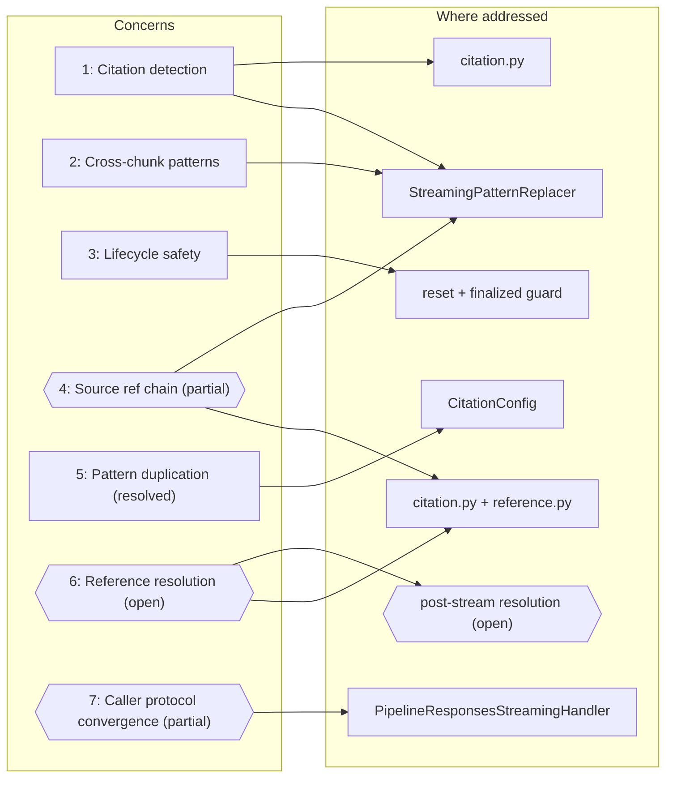
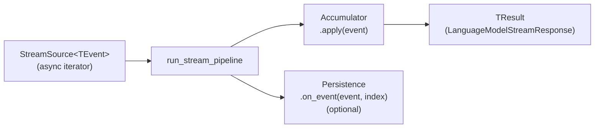
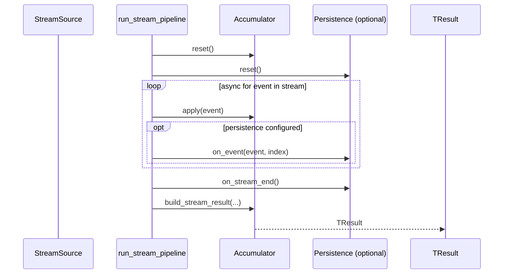
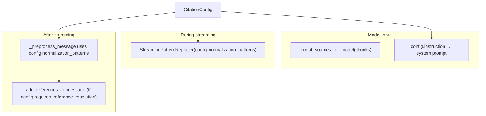

# Streaming pipeline — architecture & implementation

> **Status:** Pipeline implemented (March 2026). `CitationConfig` implemented. `PipelineResponsesStreamingHandler` implemented.
> **Package:** `unique_toolkit.framework_utilities.openai.streaming.pipeline`
> **Supersedes:** `openai_streaming_pipeline_architecture.md`, `responses_stream_pipeline_implementation.md`

---

## Context

The Unique toolkit must consume token streams from LLM providers and produce two independent outputs from the same async iterator:

1. **Live platform updates** — persist streaming progress via the Unique SDK (`Message`, `MessageLog`, events) so the UI can show incremental text, code-interpreter status, and similar feedback while the model is still generating.
2. **Toolkit contract** — assemble a `LanguageModelStreamResponse` (assistant text, tool calls, usage) that downstream code already depends on.

Those two concerns cut across every supported wire format today (OpenAI Responses API, OpenAI Chat Completions) and every format we may add later (LangChain, Pydantic AI, Anthropic, bare `AsyncIterator`).

---

## Concerns

### 1. Citation detection and normalisation

LLMs must be instructed (via system prompt or injected context) to cite sources using a recognisable pattern such as `[source N]`. In practice, models do not follow the instruction exactly -- they produce a wide range of variants (`[<source 1>]`, `source_number="3"`, `[**2**]`, `SOURCE n°5`, `[source: 1, 2, 3]`, etc.) depending on the model family, temperature, and context length. The pipeline must detect all of these variants in the streaming output and normalise them to the stable intermediate `[N]` format before the text reaches the frontend, so that post-processing can resolve each `[N]` to its corresponding `ContentChunk` and produce the final `<sup>N</sup>` footnote.

### 2. Cross-chunk pattern matching

Tokens arrive incrementally, so a regex pattern can straddle two deltas (e.g. `[source` in one delta and ` 1>]` in the next). A naive per-delta replacement would miss or corrupt these matches. `StreamingPatternReplacer` solves this by buffering trailing characters and only releasing text once partial matches are resolved.

### 3. Lifecycle safety

Accumulators and persistence objects are stateful. Without explicit lifecycle management, sequential reuse could carry over stale state and concurrent sharing would corrupt both outputs. The pipeline enforces safety through `reset()` at the start of each run, a finalized guard after `build_stream_result`, and a documented no-concurrent-sharing rule.

### 4. Source reference handling is a fragile, multi-stage chain *(partial)*

The Unique frontend renders source citations as `<sup>N</sup>` footnotes. Producing those from raw model output requires three stages that must stay in sync:

1. **Model instruction** — the system prompt or backend-injected context that tells the model *how* to cite (e.g. "cite as `[source N]`") and *what* to cite (numbered `ContentChunk` entries presented in 1-based order).
2. **Streaming normalisation** — pattern replacers that convert the many formats models actually produce (`[<source 1>]`, `source_number="3"`, `[**2**]`, `SOURCE n°5`, etc.) into the stable intermediate `[N]` during streaming, so the live preview already looks clean.
3. **Post-stream reference resolution** — `language_model/reference.py` matches each `[N]` to its `ContentChunk` by position, assigns deduplicated sequence numbers, and converts `[N]` → `<sup>sequence_number</sup>`.

These three stages are maintained in separate locations (backend / `citation.py` / `reference.py`). If a new model variant emits a format that the replacer patterns do not cover, or if the numbering convention between chunk presentation and post-processing drifts, references silently break. The pipeline must treat source handling as a first-class cross-cutting concern rather than an afterthought bolted on at each stage.

### 5. Citation pattern duplication *(resolved)*

The 18 normalisation patterns that convert model-emitted citation formats to `[N]` previously existed in two separate locations. `CitationConfig` in `language_model/citation.py` now provides the single source of truth (`NORMALIZATION_PATTERNS`). `reference.py:_preprocess_message` loops over the same list. A parametrised parity test guards against future drift.

### 6. Reference resolution is missing from the pipeline *(open)*

After streaming completes, the persisted message must carry `ContentReference` objects that link each `[N]` (or `<sup>N</sup>`) in the text back to the `ContentChunk` it was derived from. Today this happens in two incompatible ways depending on the code path:

| Path | Who resolves references | How |
|------|------------------------|-----|
| `Integrated.*` via `ChatService` | **Server-side** (Integrated backend) | `content_chunks` are sent as `searchContext`; the backend resolves references and returns them in the response. |
| `stream_to_message.py` (our pipeline) | **Nobody** | Persistence emits text via `Message.create_event_async` but never calls `add_references_to_message` and never sets `references` on the message. |
| `ReferenceInjectionTransform` (direct OpenAI) | **Client-side** | `add_references_to_message` runs on the full text after streaming, but only in the `language_model/functions.py` path. |

The `content_chunks` presented to the model are already known at call time — they are a parameter of the caller protocols (`SupportCompleteWithReferences` and `ResponsesSupportCompleteWithReferences`). The pipeline does not need to discover or reconstruct them; it simply needs to receive the same list that was used to build the model context.

When the pipeline replaces the `Integrated.*` path (Concern 7), it must add a post-stream resolution step that:

1. Takes the `content_chunks` list already available from the caller protocol (the same list used by `format_sources_for_model` or sent as `searchContext`).
2. Calls `add_references_to_message` on the accumulated text (if `CitationConfig.requires_reference_resolution` is `True`).
3. Attaches the resulting `ContentReference` list to the persisted message.

Since the chunks are supplied at call time and flow through unchanged, ordering consistency is guaranteed by construction — the pipeline uses the same list for both model presentation (1-based positional via `format_sources_for_model`) and post-stream resolution (`content_chunks[N - 1]` in `reference.py`). No deduplication, reordering, or filtering happens between these two uses.

### 7. Caller protocol convergence *(partial)*

The toolkit defines `SupportCompleteWithReferences` and `ResponsesSupportCompleteWithReferences` as structural protocols for reference-aware streaming completions. `PipelineResponsesStreamingHandler` implements `ResponsesSupportCompleteWithReferences` using the pipeline as its streaming backbone: it calls the OpenAI Responses API via the proxy, folds the stream through the accumulator and SDK persistence, and runs client-side reference resolution via `add_references_to_message` when `CitationConfig.requires_reference_resolution` is `True`. The Chat Completions counterpart (`SupportCompleteWithReferences`) is not yet implemented.

### Concern map



Rectangular nodes are implemented; hexagonal nodes (`{{ }}`) are open or future.

---

## Architecture

The pipeline replaces the handler list with a single-pass **fold + optional persistence + result** model.



For every event in the stream:

1. The **accumulator** folds the event into mutable state (text, tool calls, usage).
2. The **persistence sink** (when provided) fires Unique SDK side effects (message events, log entries) — it runs *after* the accumulator so it can read consistent folded state.
3. After the stream ends, the accumulator **materialises** the result via `build_stream_result`.

Each component is defined by a **protocol** (PEP 544 structural typing), so implementations can be swapped, composed, or faked in tests without inheritance.

---

## Design decisions

| # | Decision | Rationale |
|---|----------|-----------|
| 1 | **Protocols over abstract base classes** | Structural typing lets any class with the right methods plug in. No forced inheritance, easy fakes in tests, and `run_stream_pipeline` stays free of Unique SDK imports. |
| 2 | **Generic protocols with variance annotations** | `TStreamEvent` is **contravariant** (input to `apply`/`on_event`), `TStreamResult` is **covariant** (output of `build_stream_result`). This follows PEP 544 and satisfies strict type checkers (basedpyright). |
| 3 | **Persistence is optional** | The same accumulator works in production (with SDK persistence) and in unit tests (without). No mocking of SDK calls needed to test fold logic. |
| 4 | **One accumulator per wire format** | `ResponsesStreamAccumulator` handles `ResponseStreamEvent`; `ChatCompletionStreamAccumulator` handles `ChatCompletionChunk`. They share no inheritance — only the protocol shape. This avoids a fragile "universal" accumulator that tries to understand every event family. |
| 5 | **Explicit `reset()` + finalized guard** | The runner calls `reset()` before consuming the stream, enabling safe sequential reuse. After `build_stream_result`, further `apply` or `build_stream_result` calls raise `RuntimeError` until `reset()`. This catches accidental interleaving without runtime surprises. |
| 6 | **Typed `isinstance` dispatch inside accumulators** | One event → one code path. The accumulator's `apply` method uses `isinstance` checks on concrete OpenAI SDK types, replacing the boolean-guard fan-out. Unknown event types are silently ignored for forward compatibility. |
| 7 | **Vendor types stay at the boundary** | OpenAI SDK types are imported only inside accumulators, persistence implementations, and the thin `stream_to_message` bridge. The generic runner and protocols know nothing about OpenAI. |
| 8 | **Separate persistence for separate SDK surfaces** | `ResponsesSdkPersistence` handles both `Message` events (text deltas) and `MessageLog` entries (code interpreter lifecycle). `ChatCompletionSdkPersistence` handles `Message` events with pattern replacement and throttling. Each is a small, focused class. |
| 9 | **`CitationConfig` co-locates instruction and patterns** | A single frozen dataclass bundles the model citation instruction and the normalisation patterns. Both the streaming replacer and the post-processing pipeline import patterns from the same config, eliminating the previous duplication. `RAG_CITATION_CONFIG` is provided as a default; A2A code constructs its own instance. Chunk formatting uses the same JSON representation as the agentic tool path (`transform_chunks_to_string`). |

---

## Module layout

```
language_model/
└── citation.py                              # CitationConfig, NORMALIZATION_PATTERNS,
                                             #   RAG_CITATION_CONFIG, format_sources_for_model

streaming/
├── pipeline/
│   ├── __init__.py                          # Public API surface
│   ├── protocols.py                         # Generic + Responses type aliases
│   ├── run.py                               # run_stream_pipeline (generic)
│   │                                        # run_responses_stream_pipeline
│   │                                        # run_chat_completions_stream_pipeline
│   ├── responses_accumulator.py             # Fold: ResponseStreamEvent → LanguageModelStreamResponse
│   ├── responses_sdk_persistence.py         # Unique SDK: Message events + MessageLog (code interpreter)
│   ├── chat_completion_accumulator.py       # Fold: ChatCompletionChunk → LanguageModelStreamResponse
│   ├── chat_completion_sdk_persistence.py   # Unique SDK: Message events (with replacers + throttle)
│   └── responses_streaming_handler.py       # PipelineResponsesStreamingHandler
│                                            #   (ResponsesSupportCompleteWithReferences impl)
├── stream_to_message.py                     # High-level bridge (SDK init → pipeline → Message)
└── pattern_replacer.py                      # StreamingReplacerProtocol + implementations
```

---

## Protocols

All protocols live in `pipeline/protocols.py`.

### `StreamSource[T]`

```python
type StreamSource[T] = AsyncIterable[T]
```

Any async iterable of your event type. OpenAI SDK streams, LangChain iterators, or a hand-rolled `async def` generator all satisfy this.

### `StreamAccumulatorProtocol[TEvent, TResult]`

| Method | Purpose |
|--------|---------|
| `reset()` | Clear all state and the finalized guard for a new stream. |
| `apply(event: TEvent)` | Fold one stream element into internal state. |
| `build_stream_result(*, message_id, chat_id, created_at) → TResult` | Materialise the final result. Marks the fold as finished. |

### `StreamPersistenceProtocol[TEvent]`

| Method | Purpose |
|--------|---------|
| `reset()` | Clear per-run counters and buffers. |
| `on_event(event: TEvent, *, index: int)` | Fire side effects for one element (called after `accumulator.apply`). |
| `on_stream_end()` | Final side effects after the stream is exhausted. |

### Responses-specific aliases

| Alias | Expands to |
|-------|------------|
| `ResponseStreamSource` | `StreamSource[ResponseStreamEvent]` |
| `ResponsesStreamAccumulatorProtocol` | `StreamAccumulatorProtocol[ResponseStreamEvent, LanguageModelStreamResponse]` |
| `ResponseStreamPersistenceProtocol` | `StreamPersistenceProtocol[ResponseStreamEvent]` |

These exist for readability and to narrow type signatures in Responses-specific call sites.

---

## The generic runner

`run_stream_pipeline` is the core loop. It is fully generic — it knows nothing about OpenAI, Unique, or `LanguageModelStreamResponse`.



`run_responses_stream_pipeline` and `run_chat_completions_stream_pipeline` are thin typed wrappers that pin `TEvent`/`TResult` so callers get better autocomplete and type safety without casting.

---

## Implemented pipelines

### OpenAI Responses API

**Accumulator: `ResponsesStreamAccumulator`**

Handles a focused subset of `ResponseStreamEvent`:

| Event type | Action |
|------------|--------|
| `ResponseTextDeltaEvent` | Append `delta` to aggregated text. |
| `ResponseOutputItemAddedEvent` (with `ResponseFunctionToolCallItem`) | Record `item.id → name` for later name resolution. |
| `ResponseFunctionCallArgumentsDoneEvent` | Build `LanguageModelFunction` from final arguments + resolved name. |
| `ResponseCompletedEvent` | Extract `LanguageModelTokenUsage` from `response.usage`. |
| Everything else | Silently ignored (forward-compatible). |

**Name resolution for function tools:** Older OpenAI Python SDK versions omit `name` on `ResponseFunctionCallArgumentsDoneEvent`. The accumulator first checks `getattr(event, "name", None)`, then falls back to the `item_id → name` map built from `ResponseOutputItemAddedEvent`.

**Persistence: `ResponsesSdkPersistence`**

| Concern | SDK surface | Behaviour |
|---------|-------------|-----------|
| Assistant text deltas | `Message.create_event_async` | Applies pattern replacers to each delta, accumulates full text, emits an event per delta. |
| Stream completed | `Message.create_event_async` | Final text flush. |
| Code interpreter lifecycle | `MessageLog.create_async` / `MessageLog.update_async` | Creates a `MessageLog` entry on first event per `item_id`; updates status (`RUNNING` → `COMPLETED`) on state transitions. Tracks per-call state via `CodeInterpreterLogState` (a dataclass with `message_log_id`, `item_id`, `status`, `text`). |

### OpenAI Chat Completions

**Accumulator: `ChatCompletionStreamAccumulator`**

| Field | Source |
|-------|--------|
| Assistant text | `choice.delta.content` (concatenated) |
| Tool calls | `choice.delta.tool_calls` — assembled incrementally by `tc.index`, merging `id`, `function.name`, and `function.arguments` across chunks. |

`build_stream_result` converts the raw `ChatCompletionMessageFunctionToolCall` objects into `LanguageModelFunction` instances, parsing JSON arguments and handling decode failures gracefully (logs a warning, sets `arguments = None`).

**Early termination:** `iter_chat_completion_chunks_until_tool_calls` wraps the raw stream and stops yielding after the first chunk with `finish_reason == "tool_calls"`. This matches the legacy behaviour where the loop broke early so tool-call execution could begin.

**Persistence: `ChatCompletionSdkPersistence`**

Applies pattern replacers to each chunk's content and emits `Message.create_event_async` every `send_every_n_events` chunks (configurable throttle). Maintains both `_original_text` (pre-replacement) and `_full_text` (post-replacement) for the SDK event payload.

---

## Pattern replacers *(Concerns 1, 2, 4)*

The Unique frontend renders source references as `<sup>N</sup>` footnotes. Producing those from raw LLM output is a **two-stage** process:

1. **During streaming (replacers):** Normalise the many formats LLMs emit — `[<source 1>]`, `source_number="3"`, `[**2**]`, `[source: 1, 2, 3]`, `[<[1]>]`, etc. — into the stable intermediate `[N]` bracket format. Strip non-source references like `[user]`, `[conversation]`, or `[none]`.
2. **After streaming (`language_model/reference.py`):** Match each `[N]` to a `ContentChunk` from the search context, assign deduplicated sequence numbers, and convert `[N]` → `<sup>sequence_number</sup>`. Remove any remaining `[N]` brackets that could not be matched (hallucinated references).

The streaming replacers handle stage 1. Because tokens arrive incrementally, a naive per-delta regex replacement can mis-fire when a pattern straddles two chunks (e.g. `[source` arrives in one delta and ` 1>]` in the next). The replacer system solves this with **buffered streaming replacement**.

### `StreamingReplacerProtocol`

```python
class StreamingReplacerProtocol(Protocol):
    def process(self, delta: str) -> str: ...
    def flush(self) -> str: ...
```

Any object satisfying this protocol can be injected into the persistence layer. Both `ResponsesSdkPersistence` and `ChatCompletionSdkPersistence` accept a `replacers: list[StreamingReplacerProtocol]` and apply them sequentially to each delta before emitting SDK events.

### `StreamingPatternReplacer`

The default implementation. It holds back up to `max_match_length` trailing characters in an internal buffer between calls, ensuring partial pattern matches at chunk boundaries are resolved before any text is released to the frontend.

| Method | Behaviour |
|--------|-----------|
| `process(delta)` | Append delta to buffer, apply all regex replacements, release the safe prefix (everything except the trailing `max_match_length` chars). |
| `flush()` | Apply final replacements and release all remaining buffered text. |

Patterns are `(regex, replacement)` pairs applied sequentially. Replacements can be strings (with backreferences like `\1`) or callables receiving a `re.Match`.

### `NORMALIZATION_PATTERNS` (from `language_model/citation.py`)

The canonical pattern list (`NORMALIZATION_PATTERNS`) and buffer size (`NORMALIZATION_MAX_MATCH_LENGTH = 80`) cover:

- **Stripping** non-source references: `[user]`, `[assistant]`, `[conversation]`, `[none]`, `[previous_answer]`, etc.
- **Normalising** source formats to `[N]`: `[<source 1>]` → `[1]`, `source_number="3"` → `[3]`, `[**2**]` → `[2]`, `SOURCE n°5` → `[5]`.
- **Expanding** multi-source references: `[source: 1, 2, 3]` → `[1][2][3]`, `[[1], [2], [3]]` → `[1][2][3]`.

Both the streaming replacer and `language_model.reference._preprocess_message` import the same pattern list from `citation.py`. The conversion from `[N]` to the final `<sup>N</sup>` format happens in stage 2 (`language_model.reference.add_references_to_message`), which runs after the stream completes.

### How replacers integrate with persistence

Both SDK persistence classes apply replacers **before** emitting events to the Unique SDK:

- **`ResponsesSdkPersistence`** — on each `ResponseTextDeltaEvent`, runs `replacer.process(delta)` on the text delta, then accumulates the replaced text and emits a `Message.create_event_async`.
- **`ChatCompletionSdkPersistence`** — on each `ChatCompletionChunk`, extracts `choice.delta.content`, runs it through replacers, accumulates both original and replaced text, and emits `Message.create_event_async` (with throttling via `send_every_n_events`). The original text is preserved separately in the event payload (`originalText` field).

The **accumulators** do not use replacers — they fold raw, unmodified event data. Replacement is purely a presentation concern for the SDK event stream.

---

## Lifecycle and concurrency *(Concern 3)*

| Rule | Enforcement |
|------|-------------|
| **Sequential reuse is safe.** | `run_stream_pipeline` calls `reset()` on both accumulator and persistence at the start of each run. |
| **Post-build is guarded.** | `ResponsesStreamAccumulator` raises `RuntimeError` on `apply` or `build_stream_result` after the fold is finalised, until `reset()`. |
| **No concurrent sharing.** | One accumulator + one persistence instance per in-flight stream. Sharing across concurrent tasks will corrupt state. |

---

## Integration: `stream_to_message`

`streaming/stream_to_message.py` is the high-level entry point that:

1. Calls `Message.modify_async` to mark the assistant message as "streaming started".
2. Instantiates the appropriate accumulator + persistence pair.
3. Delegates to the typed pipeline runner.
4. Catches `httpx.RemoteProtocolError` (incomplete chunked read) and finalises with whatever content was received.

Two public functions:

| Function | Pipeline | Accumulator | Persistence |
|----------|----------|-------------|-------------|
| `stream_responses_to_message` | `run_responses_stream_pipeline` | `ResponsesStreamAccumulator` | `ResponsesSdkPersistence` |
| `stream_chat_completions_to_message` | `run_chat_completions_stream_pipeline` | `ChatCompletionStreamAccumulator` | `ChatCompletionSdkPersistence` |

Both return a Unique `Message` (the one created by `modify_async`).

---

## Caller protocols: `SupportCompleteWithReferences` and friends *(Concern 7)*

The toolkit defines two structural protocols in `protocols/support.py` that describe "something that can stream a completion with reference-aware post-processing":

| Protocol | Return type | Stream format |
|----------|-------------|---------------|
| `SupportCompleteWithReferences` | `LanguageModelStreamResponse` | Chat Completions |
| `ResponsesSupportCompleteWithReferences` | `ResponsesLanguageModelStreamResponse` | Responses API |

Both accept `content_chunks: list[ContentChunk]` — the search results the model should cite.

### Implementations

| Implementor | How it streams | Reference handling |
|-------------|----------------|-------------------|
| **`ChatService`** (via `chat/functions.py`) | Calls `unique_sdk.Integrated.chat_stream_completion_async` with `searchContext` built from `content_chunks`. | **Server-side:** the Integrated backend injects chunks into the model context and returns a `LanguageModelStreamResponse`. |
| **`ChatService`** Responses path (via `chat/responses_api.py`) | Calls `unique_sdk.Integrated.responses_stream_async` with `search_context`. | **Server-side:** same as above for the Responses API. |
| **`LanguageModelService`** | Non-streaming `complete_async`, then `add_references_to_message`. | **Client-side:** full text → `[N]` normalisation → `<sup>N</sup>` conversion. |
| **`ResponsesStreamingHandler`** | Delegates to `ChatService.complete_responses_with_references_async`. | Inherits from `ChatService`. |
| **`PipelineResponsesStreamingHandler`** | Calls OpenAI Responses API via the proxy, folds the stream through `ResponsesStreamAccumulator` + `ResponsesSdkPersistence`. | **Client-side:** `add_references_to_message` runs after streaming when `CitationConfig.requires_reference_resolution` is `True`. Returns `ResponsesLanguageModelStreamResponse` including `output`. |

### Where the streaming pipeline fits today

`PipelineResponsesStreamingHandler` is the first protocol implementation backed by the streaming pipeline. It satisfies `ResponsesSupportCompleteWithReferences` and can be used as a drop-in replacement for `ResponsesStreamingHandler` when the caller wants to bypass the Integrated backend and stream directly from the OpenAI proxy.

The `SupportCompleteWithReferences` (Chat Completions) counterpart is not yet implemented. `stream_to_message.py` remains as an independent bridge for callers that have a raw `AsyncIterator` and want pipeline-level folding without the protocol signature.

### Source reference handling: the consistency problem

For reference detection to work end-to-end, three things must agree:

```
┌──────────────────────┐     ┌──────────────────────┐     ┌──────────────────────┐
│  1. Model instruction │ ──► │  2. Replacer patterns │ ──► │  3. Post-processing   │
│  "Cite sources as     │     │  citation.py           │     │  reference.py          │
│   [source N] / [N]"   │     │  normalise → [N]      │     │  [N] → <sup>N</sup>   │
└──────────────────────┘     └──────────────────────┘     └──────────────────────┘
```

1. **Model instruction** — how the system prompt tells the model to cite. This determines what format the model actually emits (`[1]`, `[source 1]`, `source_number="3"`, etc.).
2. **Replacer patterns** — `citation.py` must recognise every format the model might produce and normalise to `[N]`.
3. **Post-processing** — `language_model/reference.py` must convert `[N]` to `<sup>sequence_number</sup>` and match indices to `ContentChunk` entries.

**Today these three are not co-located or co-validated.** Concretely:

- The **model instruction** lives outside this repository (Integrated backend, or caller-provided `instructions`). There is no default RAG citation prompt in the toolkit.
- The **18 normalisation patterns** now live in `language_model/citation.py` as `NORMALIZATION_PATTERNS`. Both the streaming replacer and `reference.py:_preprocess_message` import from there.
- The **chunk presentation** (how `ContentChunk` entries are labelled for the model) uses 1-based positional numbering, but this convention is only implicitly assumed by `reference.py:_extract_numbers_in_brackets` (`[N]` → `N - 1` index).

Two distinct citation families exist in the toolkit:

| Family | How the model cites | Normalisation | Post-processing | Instruction location |
|--------|---------------------|---------------|-----------------|---------------------|
| **RAG** (standard) | `[source N]`, `[N]`, or many variants | 18 patterns → `[N]` | `[N]` → `<sup>N</sup>` via `ContentChunk` index | No default; caller or Integrated backend provides |
| **A2A** (sub-agents) | `<sup><name>SubAgent N</name>N</sup>` copied verbatim | None — model copies references as-is | Renumbering in `agentic/tools/a2a/postprocessing/` | `agentic/tools/a2a/prompts.py` |

### Solution: `CitationConfig`

A `CitationConfig` dataclass in `language_model/citation.py` co-locates all three concerns into a single object so they cannot drift apart.

```python
@dataclass(frozen=True)
class CitationConfig:
    instruction: str
    normalization_patterns: list[tuple[str | re.Pattern[str], Replacement]]
    max_match_length: int
    requires_reference_resolution: bool
```

| Field | Purpose |
|-------|---------|
| `instruction` | System prompt snippet telling the model how to cite (co-located with the patterns that detect the output). |
| `normalization_patterns` | The pattern/replacement pairs used by both `StreamingPatternReplacer` (streaming) and `_preprocess_message` (post-processing). **Single source of truth** — eliminates the current duplication. |
| `max_match_length` | Buffer size for `StreamingPatternReplacer` to handle cross-chunk matches. |
| `requires_reference_resolution` | Whether `add_references_to_message` should run after streaming (`True` for RAG, `False` for A2A where references are already in final form). |

### Default configs

**`RAG_CITATION_CONFIG`** (in `language_model/citation.py`) — the standard path:

- `instruction`: default citation prompt instructing the model to cite inline as `[source N]`.
- `normalization_patterns`: the 18 patterns (`NORMALIZATION_PATTERNS`).
- `max_match_length`: `80`.
- `requires_reference_resolution`: `True`.

**A2A** — the sub-agent path constructs its own `CitationConfig` in the A2A module (avoids a circular import from `language_model` → `agentic`):

- `instruction`: `REFERENCING_INSTRUCTIONS_FOR_SYSTEM_PROMPT` from `agentic/tools/a2a/prompts.py`.
- `normalization_patterns`: empty (model copies references verbatim; no normalisation needed).
- `max_match_length`: `0`.
- `requires_reference_resolution`: `False`.

### How it resolves the problems



- **Single source of truth**: the patterns list lives in `language_model/citation.py` as `NORMALIZATION_PATTERNS`. Both the streaming replacer and `reference.py` (post-processing) import from there. No more duplicate definitions.
- **Closed-loop instruction ↔ detection**: the system prompt snippet and the patterns that detect the model's output are fields on the same object. Adding a new citation format means adding patterns and updating the instruction together.
- **Consistent chunk representation**: `format_sources_for_model` produces the same `{"source_number", "content_id", "content"}` JSON format as the agentic tool path (`transform_chunks_to_string`). The model always sees chunks in the same shape regardless of the code path.
- **A2A as a first-class variant**: different `instruction`, no patterns, no post-processing — all expressed declaratively through the same config shape.

### Chunk presentation contract

The model must always see content chunks in the same JSON representation, regardless of whether chunks arrive via a tool message or via injected context:

```json
[
  {"source_number": 1, "content_id": "abc", "content": "chunk text..."},
  {"source_number": 2, "content_id": "def", "content": "chunk text..."}
]
```

| Path | Producer | Numbering |
|------|----------|-----------|
| Agentic tool results | `transform_chunks_to_string` in `history_manager/utils.py` | Global enumerator (cumulative across tool calls in a loop) |
| Pipeline / direct OpenAI | `format_sources_for_model` in `language_model/citation.py` | 1-based by default (`start_index=1`) |
| Integrated backend | Server-side formatting from `SearchResult` metadata | 1-based positional (assumed) |

`format_sources_for_model` accepts a `start_index` parameter so callers can align numbering with the agentic enumerator when needed.

After streaming, `reference.py` maps `[N]` to `content_chunks[N - 1]` and converts to `<sup>sequence_number</sup>`. The `config.instruction` tells the model to cite in a format the normalisation patterns can detect.

### Parity guarantee

A parametrised test feeds a corpus of examples (covering all 18 pattern variants) through both the streaming path (`StreamingPatternReplacer`) and the batch path (`_preprocess_message`) and asserts identical output. This guards against future drift, since both paths now import the same pattern list from `citation.py`.

---

## Extensibility: future stream sources

The generic runner and protocols are not tied to OpenAI. Adding a new provider (LangChain, Pydantic AI, Anthropic, or any `AsyncIterator`) requires:

1. **A new accumulator** implementing `StreamAccumulatorProtocol[VendorEvent, LanguageModelStreamResponse]` — fold vendor-specific events into the same toolkit output type.
2. **A new persistence class** (optional) implementing `StreamPersistenceProtocol[VendorEvent]` — only if that stream needs Unique SDK side effects.
3. **A typed runner wrapper** (optional) — for better call-site ergonomics, analogous to `run_responses_stream_pipeline`.

What does **not** change:

- `run_stream_pipeline` — same loop, same lifecycle.
- `LanguageModelStreamResponse` — same output contract.
- Unique SDK persistence patterns — same `Message.create_event_async` / `MessageLog` calls, just driven by different event types.

This means vendor logic is isolated at the adapter boundary, and Unique SDK integration is never duplicated across providers.

---

## Removed code

The following modules were deleted after their logic was migrated into the pipeline package:

| Deleted module | Replacement |
|----------------|-------------|
| `streaming/base.py` (`StreamPartHandler` protocol) | `pipeline/protocols.py` |
| `streaming/responses/text_delta.py` (`TextDeltaStreamPartHandler`) | `pipeline/responses_sdk_persistence.py` |
| `streaming/responses/codeinterpreter.py` (`ResponseCodeInterpreterCallStreamPartHandler`) | `pipeline/responses_sdk_persistence.py` |
| `streaming/chat_completion_chunk.py` (`CompletionChunkStreamPartHandler`) | `pipeline/chat_completion_sdk_persistence.py` |

The handler-list fan-out in `stream_to_message` was replaced with direct pipeline runner calls.

---

## Code location

All pipeline code lives under:

```
unique_toolkit/framework_utilities/openai/streaming/pipeline/
```

The public API is re-exported from `pipeline/__init__.py`.
