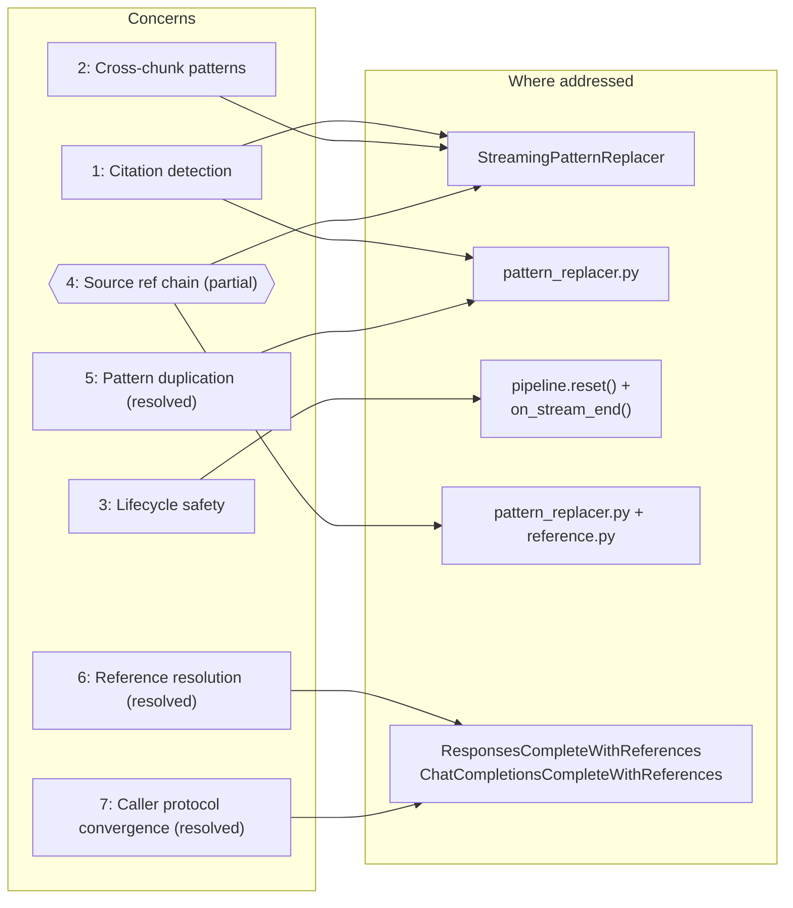
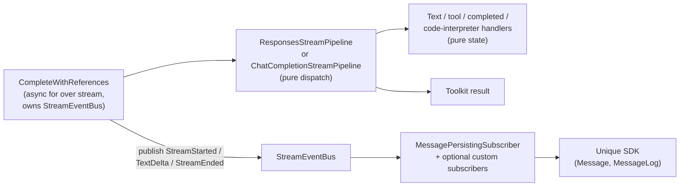

# Streaming pipeline — architecture & implementation

> **Status:** Pipeline implemented (March 2026). Event-bus refactor (April 2026) moves all SDK side-effects into `MessagePersistingSubscriber`; handlers and pipelines are now pure state machines.
> **Package:** `unique_toolkit.framework_utilities.openai.streaming.pipeline`
> **Supersedes:** `openai_streaming_pipeline_architecture.md`, `responses_stream_pipeline_implementation.md`

---

## Context

The Unique toolkit must consume token streams from LLM providers and produce two independent outputs from the same async iterator:

1. **Live platform updates** — persist streaming progress via the Unique SDK (`Message`, `MessageLog`, events) so the UI can show incremental text, code-interpreter status, and similar feedback while the model is still generating.
2. **Toolkit contract** — assemble a `LanguageModelStreamResponse` or `ResponsesLanguageModelStreamResponse` (assistant text, tool calls; usage and structured output on the Responses path when handlers provide them) for downstream code.

Those two concerns cut across every supported wire format today (OpenAI Responses API, OpenAI Chat Completions) and every format we may add later (LangChain, Pydantic AI, Anthropic, bare `AsyncIterator`).

---

## Concerns

### 1. Citation detection and normalisation

LLMs must be instructed (via system prompt or injected context) to cite sources using a recognisable pattern such as `[source N]`. In practice, models do not follow the instruction exactly — they emit a wide range of variants (`[<source 1>]`, `source_number="3"`, `[**2**]`, `SOURCE n°5`, `[source: 1, 2, 3]`, etc.) depending on the model family, temperature, and context length. `NORMALIZATION_PATTERNS` in `StreamingPatternReplacer` **directly** rewrite those variants to canonical **`<sup>N</sup>`** superscripts (multi-source callables emit a run of `<sup>…</sup>` tags). That is the form users see during streaming; separate steps (below) attach `ContentReference` objects and reconcile numbering where needed.

### 2. Cross-chunk pattern matching

Tokens arrive incrementally, so a regex pattern can straddle two deltas (e.g. `[source` in one delta and ` 1>]` in the next). A naive per-delta replacement would miss or corrupt these matches. `StreamingPatternReplacer` solves this by buffering trailing characters and only releasing text once partial matches are resolved.

### 3. Lifecycle safety

Handlers are stateful. Without explicit lifecycle management, sequential reuse could carry over stale state and concurrent sharing would corrupt streaming buffers and replacers. Each run starts with `pipeline.reset()` on the handler pipeline; streaming ends with `on_stream_end()` on each handler (cascade flush). Side-effects (SDK calls, reference filtering) run in bus subscribers that react to `StreamStarted` / `TextDelta` / `StreamEnded` events published by the orchestrator. Do not share one pipeline instance across concurrent streams.

### 4. Source reference handling is a fragile, multi-stage chain *(partial)*

The Unique frontend renders source citations as `<sup>N</sup>` footnotes. Producing those from raw model output requires three stages that must stay in sync:

1. **Model instruction** — the system prompt or backend-injected context that tells the model *how* to cite (e.g. "cite as `[source N]`") and *what* to cite (numbered `ContentChunk` entries presented in 1-based order).
2. **Streaming normalisation** — `StreamingPatternReplacer` applies `NORMALIZATION_PATTERNS` so model-specific citation shapes are replaced **directly** with **`<sup>N</sup>`** (see `pattern_replacer.py`; non-source tokens like `[user]` are stripped).
3. **Post-stream reference resolution** — `language_model/reference.py` links citations to `ContentChunk` entries (including where bracket-style `[N]` still appears), assigns deduplicated sequence numbers, and cleans up hallucinated or leftover markers — using the **same** pattern list in `_preprocess_message` for parity with streaming.

These three stages are maintained in separate locations. If a new model variant emits a format that the replacer patterns do not cover, or if the numbering convention between chunk presentation and post-processing drifts, references silently break.

### 5. Citation pattern duplication *(resolved)*

The normalisation patterns that convert model-emitted citation formats **directly to `<sup>N</sup>`** previously existed in two separate locations. `NORMALIZATION_PATTERNS` in `streaming/pattern_replacer.py` is now the **single source of truth**. Both `StreamingPatternReplacer` (streaming) and `reference.py:_preprocess_message` (post-processing) import from there. A parametrised parity test guards against future drift.

> **`CitationConfig` abandoned:** An earlier design proposed a `CitationConfig` dataclass in `language_model/citation.py` that would co-locate the model instruction, patterns, and a `requires_reference_resolution` flag. This was abandoned because the history manager (`agentic/history_manager/`) is responsible for presenting messages and chunks consistently to the model — the citation instruction belongs there, not in a separate config object in `language_model/`. The current solution (`NORMALIZATION_PATTERNS` in `pattern_replacer.py` as shared truth, no instruction coupling) is sufficient.

### 6. Reference resolution *(resolved)*

Downstream UIs typically need `ContentReference` objects (or equivalent) linking each citation to a `ContentChunk`. How that is produced depends on the integration path:

| Path | Who resolves references | How |
|------|------------------------|-----|
| `Integrated.*` via `ChatService` | **Server-side** (Integrated backend) | `content_chunks` sent as `searchContext`; backend resolves and returns references. |
| `ResponsesCompleteWithReferences` | **Streaming normalisation only** | `StreamingPatternReplacer` turns citation variants into `<sup>N</sup>` during the stream; SDK updates happen in `MessagePersistingSubscriber` reacting to `TextDelta` / `StreamEnded` events on the bus (it also runs `filter_cited_sdk_references` against the `ContentChunk`s captured at `StreamStarted`). Structured `ContentReference` objects are not produced by this path — use Integrated server-side streaming or a post-stream pass with `language_model.reference` if you need them. |
| `ChatCompletionsCompleteWithReferences` | **Streaming normalisation only** | Same as Responses: pattern replacers on deltas; persistence driven by the same bus subscriber. Structured references require Integrated or post-stream processing. |

### 7. Caller protocol convergence *(resolved)*

Both `SupportCompleteWithReferences` (Chat Completions) and `ResponsesSupportCompleteWithReferences` (Responses API) are now implemented by pipeline-backed handlers.

### Concern map



---

## Architecture

The implementation is a **handler pipeline plus a typed event bus**. `ResponsesStreamPipeline` / `ChatCompletionStreamPipeline` routes each stream event to small typed handlers (text, tools, completed, code interpreter). Handlers are **pure state machines** — they implement structural protocols in `pipeline/protocols/` (`common`, `responses`, `chat_completions`), accumulate state, and expose `get_text()` / `get_tool_calls()` / etc. They do **not** call the Unique SDK and they do **not** see retrieved `ContentChunk`s.

The top-level classes `ResponsesCompleteWithReferences` and `ChatCompletionsCompleteWithReferences` open the async stream from the OpenAI proxy, forward events to the pipeline, build `LanguageModelStreamResponse` / `ResponsesLanguageModelStreamResponse` after `on_stream_end()`, and own a `StreamEventBus`. They publish three domain events — `StreamStarted`, `TextDelta`, `StreamEnded` — consumed by subscribers. The default `MessagePersistingSubscriber` owns all `Message.modify_async` calls and reference filtering.



They run their own `async for` loops (not a shared generic runner) so they can catch `httpx.RemoteProtocolError` mid-stream and finalise with whatever content was received. `StreamEnded` always fires from the `finally` block.

---

## Design decisions

| # | Decision | Rationale |
|---|----------|-----------|
| 1 | **Protocols over abstract base classes** | Structural typing lets any class with the right methods plug in. No forced inheritance; easy fakes in tests. |
| 2 | **Explicit `reset()` on handlers** | `CompleteWithReferences` calls `pipeline.reset()` before each run so sequential reuse does not leak state. |
| 3 | **Typed dispatch inside pipelines** | `ResponsesStreamPipeline` / `ChatCompletionStreamPipeline` use `isinstance` on concrete OpenAI SDK event types. Unknown events are ignored for forward compatibility. |
| 4 | **`NORMALIZATION_PATTERNS` as single source of truth in `pattern_replacer.py`** | Both the streaming replacer and `reference.py:_preprocess_message` import the same pattern list. A parity test ensures both paths produce identical output. |
| 5 | **Pure handlers, side-effects on the bus** | Handlers know nothing about `unique_sdk` or `ContentChunk`s. The orchestrator publishes `StreamStarted` / `TextDelta` / `StreamEnded`; `MessagePersistingSubscriber` (or any user-registered subscriber) translates those into SDK calls, telemetry, or other side-effects. Callers can pass a custom `bus=` to override the default persister. |
| 6 | **Flush flag on `on_event` / `on_stream_end`** | Text handlers return `bool` to signal that observable text was produced. The orchestrator uses that flag to decide when to publish `TextDelta`, so subscribers can't under- or over-fire on partial buffers. |

---

## Module layout

```
streaming/
├── pipeline/
│   ├── __init__.py                               # Public API surface (re-exports)
│   ├── events.py                                 # StreamStarted, TextDelta, StreamEnded, StreamEventBus
│   ├── protocols/                                # Handler protocols (by API + shared base)
│   │   ├── common.py                             # TextState, StreamHandlerProtocol
│   │   ├── responses.py                          # Responses*HandlerProtocol
│   │   ├── chat_completions.py                   # ChatCompletion*HandlerProtocol
│   │   └── __init__.py                           # Flat re-exports
│   ├── subscribers/                              # Default StreamEvent subscribers
│   │   ├── __init__.py                           # Re-exports MessagePersistingSubscriber
│   │   └── message_persister.py                  # Message.modify_async + reference filtering
│   ├── responses/                                # OpenAI Responses API (responses.create stream)
│   │   ├── stream_pipeline.py                    # ResponsesStreamPipeline (pure dispatch)
│   │   ├── complete_with_references.py           # ResponsesCompleteWithReferences (owns bus)
│   │   ├── text_delta_handler.py                 # pure state machine
│   │   ├── tool_call_handler.py
│   │   ├── completed_handler.py
│   │   └── code_interpreter_handler.py
│   └── chat_completions/                         # Chat Completions API (chat.completions.create stream)
│       ├── stream_pipeline.py                    # ChatCompletionStreamPipeline (pure dispatch)
│       ├── complete_with_references.py           # ChatCompletionsCompleteWithReferences (owns bus)
│       ├── text_handler.py                       # pure state machine
│       └── tool_call_handler.py
└── pattern_replacer.py                           # NORMALIZATION_PATTERNS, NORMALIZATION_MAX_MATCH_LENGTH
                                                  # StreamingReplacerProtocol, StreamingPatternReplacer
```

---

## Protocols

Handler protocols live under `pipeline/protocols/`: shared `StreamHandlerProtocol` and `TextState` in `common.py`; Responses-specific and Chat-Completions-specific protocols in `responses.py` and `chat_completions.py`. The package `__init__.py` re-exports the same flat names as before. Non-text handlers extend `StreamHandlerProtocol` (`reset`, `on_stream_end() → None`). The text handler protocols are **standalone** so they can narrow `on_stream_end` to return `bool` without a variance conflict.

| Protocol | Role |
|----------|------|
| `ResponsesTextDeltaHandlerProtocol` | Text deltas; `on_text_delta` / `on_stream_end` return `bool` to signal flush boundaries |
| `ResponsesToolCallHandlerProtocol` | Function tool calls from Responses events |
| `ResponsesCompletedHandlerProtocol` | Usage + output from `ResponseCompletedEvent` |
| `ResponsesCodeInterpreterHandlerProtocol` | `MessageLog` lifecycle for code interpreter |
| `ChatCompletionTextHandlerProtocol` | Chat completion chunks; `on_chunk` / `on_stream_end` return `bool` |
| `ChatCompletionToolCallHandlerProtocol` | Tool calls from chat completion chunks |

---

## Implemented handlers (summary)

### OpenAI Responses API

`ResponsesTextDeltaHandler` applies replacers per delta, accumulates `TextState`, and returns `True` when observable text was produced so the orchestrator can publish a `TextDelta` event. `ResponsesToolCallHandler` assembles function calls. `ResponsesCompletedHandler` captures usage and structured output. `ResponsesCodeInterpreterHandler` manages `MessageLog` for code interpreter runs. None of these handlers call `Message.modify_async` — that lives in `MessagePersistingSubscriber`.

### OpenAI Chat Completions

`ChatCompletionTextHandler` applies replacers per chunk (with optional throttling via `send_every_n_events`), accumulates `TextState`, and returns `True` at flush boundaries. `ChatCompletionToolCallHandler` assembles tool calls from chunks. Same principle: no SDK calls; side-effects flow through the bus.

### Default subscriber

`MessagePersistingSubscriber` reacts to the three domain events:

| Event | `Message.modify_async` kwargs |
|-------|------------------------------|
| `StreamStarted` | `references=[]`, `startedStreamingAt` |
| `TextDelta` | `text`, `originalText`, `references=filter_cited_sdk_references(chunks, full_text)` |
| `StreamEnded` | `text`, `originalText`, `references`, `stoppedStreamingAt`, `completedAt` |

Chunks are stored per `message_id` (seeded on `StreamStarted`, cleared on `StreamEnded`) so concurrent streams with distinct message IDs stay isolated.

---

## Pattern replacers *(Concerns 1, 2, 4)*

The Unique frontend renders source references as `<sup>N</sup>` footnotes. In practice this is a **two-stage** process:

1. **During streaming (replacers):** `StreamingPatternReplacer` applies `NORMALIZATION_PATTERNS` so model variants — `[<source 1>]`, `source_number="3"`, `[**2**]`, `[source: 1, 2, 3]`, etc. — are **directly** rewritten to **`<sup>N</sup>`** (multi-source patterns emit a sequence of `<sup>…</sup>` tags). Strip non-source references like `[user]`, `[conversation]`, or `[none]`.
2. **After streaming (`language_model/reference.py`):** Build `ContentReference` objects, map citations to `ContentChunk`s, renumber/dedupe footnotes where the batch pipeline applies, and remove leftover hallucinated bracket markers. `_preprocess_message` repeats the same pattern list so batch and streaming stay aligned.

### `StreamingReplacerProtocol`

```python
class StreamingReplacerProtocol(Protocol):
    def process(self, delta: str) -> str: ...
    def flush(self) -> str: ...
```

Text handlers accept a `replacers: list[StreamingReplacerProtocol]` and apply them sequentially to each delta before emitting SDK events.

### `StreamingPatternReplacer`

The default implementation. Holds back up to `max_match_length` trailing characters in an internal buffer between calls.

| Method | Behaviour |
|--------|-----------|
| `process(delta)` | Append delta to buffer, apply all regex replacements, release the safe prefix (everything except the trailing `max_match_length` chars). |
| `flush()` | Apply final replacements and release all remaining buffered text. |

### `NORMALIZATION_PATTERNS` (from `streaming/pattern_replacer.py`)

The canonical pattern list (`NORMALIZATION_PATTERNS`) and buffer size (`NORMALIZATION_MAX_MATCH_LENGTH = 80`) live in `streaming/pattern_replacer.py` and cover:

- **Stripping** non-source references: `[user]`, `[assistant]`, `[conversation]`, `[none]`, `[previous_answer]`, etc.
- **Normalising** source formats **directly to `<sup>N</sup>`**: e.g. `[<source 1>]` → `<sup>1</sup>`, `[source 0]` → `<sup>0</sup>`, `source_number="3"` → `<sup>3</sup>`, `[**2**]` → `<sup>2</sup>`, `SOURCE n°5` → `<sup>5</sup>`.
- **Expanding** multi-source references to a run of superscripts: `[source: 1, 2, 3]` → `<sup>1</sup><sup>2</sup><sup>3</sup>` (same idea for bracket-list variants).

Both the streaming replacer and `language_model.reference._preprocess_message` import from here — single source of truth. A parametrised parity test guards against future drift.

`Pipeline.build_result()` builds the returned `ChatMessage` from the text handler’s `get_text()` (streaming accumulation through each replacer’s `process()`).

### Cascade flush in `on_stream_end()`

Text handlers' `on_stream_end()` uses a **cascade flush** so that upstream replacers' buffered tails reach downstream replacers:

```python
remaining = ""
for replacer in self._replacers:
    if remaining:
        remaining = replacer.process(remaining)   # feed upstream tail downstream
    remaining += replacer.flush()
```

Without cascade, an upstream replacer’s buffered tail (for example the pattern replacer’s trailing `max_match_length` window) would not be fed through downstream replacers’ `process()` before their `flush()`, which can leave partial matches unresolved at the end of the stream.

### How replacers integrate with handlers

- **`ResponsesTextDeltaHandler`** — on each `ResponseTextDeltaEvent`, runs replacers on the delta, updates `TextState`, and returns `True` if observable text was produced. At `on_stream_end()`, cascade-flushes all replacers and returns `True` if residual text emerged.
- **`ChatCompletionTextHandler`** — on each chunk with content, runs replacers (with optional throttle) and returns `True` at flush boundaries. At `on_stream_end()`, cascade-flushes all replacers and returns `True` on residual text.

In both cases, the orchestrator observes the returned `bool` and publishes a `TextDelta` — the persister then issues the corresponding `Message.modify_async`.

---

## Lifecycle and concurrency *(Concern 3)*

| Rule | Enforcement |
|------|-------------|
| **Sequential reuse is safe.** | `CompleteWithReferences` calls `pipeline.reset()` before each stream. |
| **No concurrent sharing of pipelines.** | One pipeline instance per in-flight stream. Sharing across concurrent tasks will corrupt handler state. |
| **Subscribers can be shared across streams.** | `MessagePersistingSubscriber` keys chunks by `message_id`; concurrent streams with distinct message IDs stay isolated. |
| **`StreamEnded` always fires.** | Published from the `finally` block, so the persister always records `stoppedStreamingAt` / `completedAt` — even on partial streams. |

---

## Caller protocols: `SupportCompleteWithReferences` and friends *(Concern 7)*

The toolkit defines two structural protocols in `protocols/support.py` that describe "something that can stream a completion with reference-aware post-processing":

| Protocol | Return type | Stream format |
|----------|-------------|---------------|
| `SupportCompleteWithReferences` | `LanguageModelStreamResponse` | Chat Completions |
| `ResponsesSupportCompleteWithReferences` | `ResponsesLanguageModelStreamResponse` | Responses API |

Both accept `content_chunks: list[ContentChunk]` — the search results the model should cite.

### Implementations

| Implementor | How it streams | Reference handling |
|-------------|----------------|-------------------|
| **`ChatService`** (via `chat/functions.py`) | `unique_sdk.Integrated.chat_stream_completion_async` with `searchContext`. | **Server-side.** |
| **`ChatService`** Responses path | `unique_sdk.Integrated.responses_stream_async` with `search_context`. | **Server-side.** |
| **`LanguageModelService`** | Non-streaming `complete_async`, then `add_references_to_message`. | **Client-side, non-streaming.** |
| **`ResponsesStreamingHandler`** | Delegates to `ChatService.complete_responses_with_references_async`. | Inherits from `ChatService`. |
| **`ResponsesCompleteWithReferences`** | OpenAI Responses API via proxy, own `async for` loop, `ResponsesStreamPipeline`. | Streaming citation normalisation via replacers; see §6. Returns `ResponsesLanguageModelStreamResponse` with `output` from the completed event when present. |
| **`ChatCompletionsCompleteWithReferences`** | OpenAI Chat Completions API via proxy, own `async for` loop, `ChatCompletionStreamPipeline`. | Streaming citation normalisation via replacers; see §6. Returns `LanguageModelStreamResponse`. |

### `ResponsesCompleteWithReferences` constructor parameters

| Parameter | Default | Purpose |
|-----------|---------|---------|
| `settings` | *(required)* | `UniqueSettings` with auth and chat context. |
| `pipeline` | *(required)* | Pre-built `ResponsesStreamPipeline` with handlers and replacers configured externally. |
| `client` | `None` | Optional pre-built `AsyncOpenAI` client. If `None`, one is created via `get_async_openai_client`. |
| `additional_headers` | `None` | Extra HTTP headers forwarded to the OpenAI proxy client (only used when `client` is `None`). |
| `bus` | `None` | Optional pre-configured `StreamEventBus`. When omitted, the orchestrator creates one and auto-registers `MessagePersistingSubscriber(settings)`. When provided, the caller owns the subscriber set (the default persister is **not** auto-added). |

### `ChatCompletionsCompleteWithReferences` constructor parameters

| Parameter | Default | Purpose |
|-----------|---------|---------|
| `settings` | *(required)* | `UniqueSettings` with auth and chat context. |
| `pipeline` | *(required)* | Pre-built `ChatCompletionStreamPipeline` with handlers and replacers configured externally. |
| `client` | `None` | Optional pre-built `AsyncOpenAI` client. If `None`, one is created via `get_async_openai_client`. |
| `additional_headers` | `None` | Extra HTTP headers forwarded to the OpenAI proxy client (only used when `client` is `None`). |
| `bus` | `None` | Same semantics as above. Use it to attach tracing, analytics, or an alternative persister. |

### Adding subscribers

When you accept the default bus, attach extras via the `bus` property:

```python
orchestrator = ChatCompletionsCompleteWithReferences(settings, pipeline=pipeline)
orchestrator.bus.subscribe(my_tracing_subscriber)       # runs alongside the default persister
```

To fully replace persistence, provide a pre-built bus:

```python
bus = StreamEventBus()
bus.subscribe(my_custom_persister.handle)
orchestrator = ChatCompletionsCompleteWithReferences(settings, pipeline=pipeline, bus=bus)
```

### Source reference handling

For reference detection to work end-to-end:

```
┌──────────────────────┐     ┌───────────────────────────┐     ┌──────────────────────┐
│  1. Model instruction │ ──► │  2. Replacer patterns     │ ──► │  3. Post-processing   │
│  (history manager /   │     │  pattern_replacer.py      │     │  reference.py          │
│   caller-provided)    │     │  → `<sup>N</sup>` directly │     │  ContentReference,   │
│                       │     │    (NORMALIZATION_PATTERNS) │     │  dedupe, cleanup      │
└──────────────────────┘     └───────────────────────────┘     └──────────────────────┘
```

The model instruction (how the system prompt tells the model to cite) is provided by the caller or injected by the history manager — it is not the pipeline's responsibility. Streaming normalisation (`NORMALIZATION_PATTERNS` in `pattern_replacer.py`) and batch post-processing (`language_model/reference.py`) share the same pattern list for parity.

Two distinct citation families:

| Family | How the model cites | Normalisation | Post-processing | Instruction location |
|--------|---------------------|---------------|-----------------|---------------------|
| **RAG** (standard) | `[source N]`, `[N]`, or many variants | 18 patterns → **`<sup>N</sup>`** directly | `reference.py`: link to `ContentChunk`, dedupe / cleanup | Caller or Integrated backend |
| **A2A** (sub-agents) | `<sup><name>SubAgent N</name>N</sup>` copied verbatim | None | Renumbering in `agentic/tools/a2a/postprocessing/` | `agentic/tools/a2a/prompts.py` |

### Parity guarantee

A parametrised test feeds a corpus of examples (covering all 18 pattern variants) through both the streaming path (`StreamingPatternReplacer`) and the batch path (`_preprocess_message`) and asserts identical output.

---

## Extensibility: future stream sources

Adding a new wire format means a new pipeline class (or extending an existing one) with handlers that implement the appropriate protocols, plus a `CompleteWithReferences`-style entry point if you need the same toolkit contract.

---

## Removed code

| Deleted module | Replacement |
|----------------|-------------|
| `streaming/base.py` (`StreamPartHandler` protocol) | `pipeline/protocols/` |
| `streaming/responses/text_delta.py` (`TextDeltaStreamPartHandler`) | Handler pipeline (`responses/text_delta_handler.py`, etc.) |
| `streaming/responses/codeinterpreter.py` (`ResponseCodeInterpreterCallStreamPartHandler`) | `responses/code_interpreter_handler.py` |
| `streaming/chat_completion_chunk.py` (`CompletionChunkStreamPartHandler`) | `chat_completions/text_handler.py` |
| `streaming/stream_to_message.py` (raw pipeline bridge) | `ResponsesCompleteWithReferences` / `ChatCompletionsCompleteWithReferences` |

Earlier experimental modules (`run.py`, `*SdkPersistence`, `*accumulator`) were removed in favour of the handler pipeline only.

---

## Code location

All pipeline code lives under:

```
unique_toolkit/framework_utilities/openai/streaming/pipeline/
```

The public API is re-exported from `pipeline/__init__.py`.
