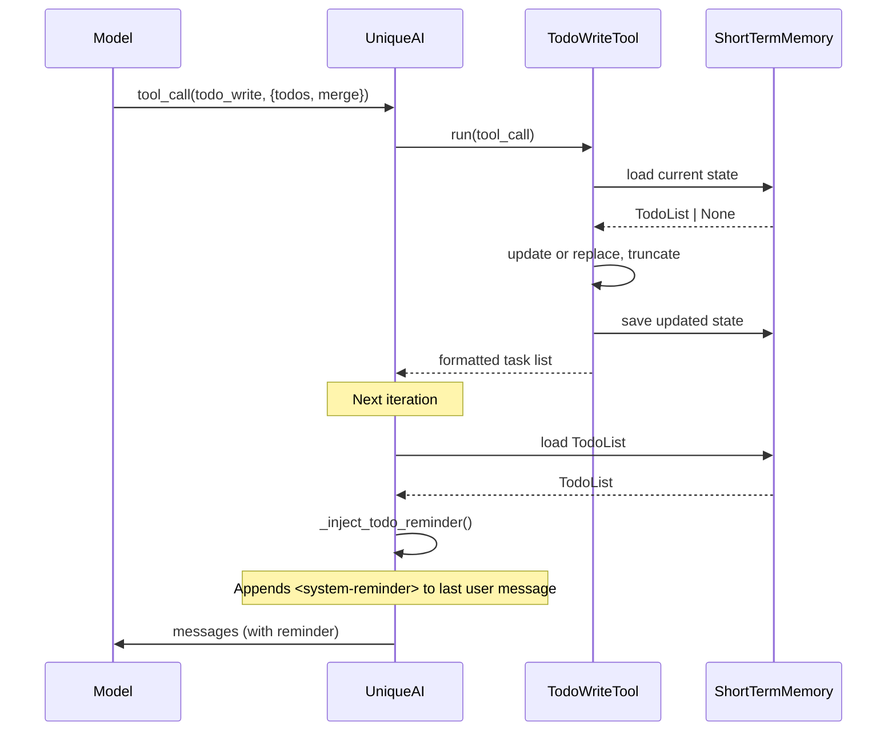

# TODO Task Tracking

Agent-side task tracking tools that give the model a persistent, visible TODO list for multi-step work. Inspired by the TodoWrite/TodoRead pattern in Claude Code.

## Why

Long agentic conversations lose track of progress. The model may repeat steps, skip items, or forget the overall plan. TODO tracking solves this by:

- Giving the model a structured task list it controls
- Injecting current progress into every turn via `<system-reminder>`
- Persisting state across iterations within the same chat session

## Architecture



### Components

| Component | Location | Purpose |
|-----------|----------|---------|
| `TodoStatus` | `unique_toolkit/agentic/tools/todo/schemas.py` | StrEnum: `pending`, `in_progress`, `completed`, `cancelled` |
| `TodoItem`, `TodoList`, `TodoWriteInput` | `unique_toolkit/agentic/tools/todo/schemas.py` | Pydantic data models |
| `TodoConfig` | `unique_toolkit/agentic/tools/todo/config.py` | Per-tool configuration |
| `TodoWriteTool`, `TodoReadTool` | `unique_toolkit/agentic/tools/todo/service.py` | Tool implementations |
| `TodoList.format()`, `TodoList.format_reminder()` | `unique_toolkit/agentic/tools/todo/schemas.py` | Formatting methods |
| `_inject_todo_reminder` | `unique_orchestrator/unique_ai.py` | System-reminder injection |
| `_build_todo_memory_manager` | `unique_orchestrator/unique_ai_builder.py` | Wiring and feature detection |

## Enabling

Enable via the Experimental config in the admin UI (Loop Agent Configuration > TODO Tracking), or programmatically:

```python
# In ExperimentalConfig
experimental = ExperimentalConfig(
    todo_tracking=TodoTrackingConfig()  # uses defaults
)
```

The tools are dynamically injected at runtime when `todo_tracking` is active. If not enabled, the feature is completely dormant -- no memory manager is created, no injection occurs, and no behavior changes for existing users.

## Configuration

`TodoConfig` (and its mirror `TodoTrackingConfig` in the orchestrator) extends `BaseToolConfig` with three fields:

| Field | Type | Default | Description |
|-------|------|---------|-------------|
| `memory_key` | `str` | `"agent_todo_state"` | ShortTermMemory key for persisting state |
| `max_todos` | `int` | `20` (1-50) | Maximum items stored; excess is truncated |
| `inject_system_reminder` | `bool` | `True` | Whether to inject progress into messages |

## Tool Behavior

### TodoWriteTool (`todo_write`)

Accepts a list of `TodoItem` objects and a `merge` flag:

- **`merge=True`** (default): Updates existing items by ID, appends new ones, preserves items not mentioned in the call.
- **`merge=False`**: Replaces the entire list.

After update/replace, the list is truncated to `max_todos` and saved to ShortTermMemory. Returns a formatted summary.

Each `TodoItem` has:
- `id` -- model-generated, free-form string identifier (e.g. `"research-apis"`, `"step-1"`)
- `content` -- task description
- `status` -- a `TodoStatus` value: `pending`, `in_progress`, `completed`, `cancelled`

### TodoReadTool (`todo_read`)

Takes no parameters. Returns the current formatted task list.

### Status Icons

```
[ ] pending
[>] in_progress
[x] completed
[-] cancelled
```

### System-Reminder Injection

When `inject_system_reminder=True` (the default), the orchestrator's `_inject_todo_reminder()` method runs during message composition:

1. Loads `TodoList` from ShortTermMemory
2. **Skips injection** if state is empty or `has_active_items()` returns false (all completed/cancelled)
3. Calls `state.format_reminder()` to produce the `<system-reminder>` block
4. Appends it to the content of the **last user message**

This ensures the model sees its current progress on every turn without consuming a separate system message slot.

## Testing

### Unit Tests

`tests/agentic/tools/test_todo_service.py` -- tests covering:
- `TodoList.update()` logic (update, append, preserve)
- `TodoList.has_active_items()` logic
- `TodoWriteTool.run()` (create, update, replace, truncate, formatting)
- `TodoReadTool.run()` (empty state, existing state)
- `TodoList.format()` and `TodoList.format_reminder()` methods
- Tool registration, config validation

`unique_orchestrator/tests/test_todo_injection.py` -- tests covering:
- Injection enabled/disabled, empty state, all-completed skip, completed+cancelled skip
- Correct injection target (last user message)
- `_build_todo_memory_manager()` detection logic

### Multi-Step Workflow Tests

`tests/agentic/tools/test_todo_eval.py` -- scripted conversation simulations:
- Full lifecycle: pending -> in_progress -> completed across multiple iterations
- Update behavior with mid-conversation additions
- Truncation at max_todos boundary
- System-reminder content validation after each state change
- Iteration counter preserved across replace operations

### Manual QA Scenarios

Use these prompts in a real chat session with TODO tools enabled:

**Scenario 1: Multi-step research (should create todos)**
```
Compare the performance of Tesla, Apple, and Microsoft stock over the last year.
For each, provide key metrics, recent news, and your recommendation.
```
- Expect: 3+ todos created, progressive status updates, formatted list in responses.

**Scenario 2: Simple question (should NOT create todos)**
```
What's the current price of AAPL?
```
- Expect: Direct answer, no todo_write calls.

**Scenario 3: Merge behavior**
```
Research emerging market trends.
```
Then follow up with:
```
Also add a section about regulatory risks.
```
- Expect: New todos added via update, original list preserved.

**Scenario 4: Large task list**
```
Create a comprehensive analysis of all 30 DJIA components including financial
metrics, recent earnings, analyst ratings, and technical indicators.
```
- Expect: List truncated at `max_todos`, clean formatted output.

**Scenario 5: Session continuity**
Send a multi-step prompt, wait for todos to be created, then send a follow-up.
- Expect: `<system-reminder>` in composed messages shows previous state; model resumes from where it left off.

**What to check:**
- Tool calls visible in debug logs (`TodoWriteTool: saved N items`)
- `<system-reminder>` block present in composed messages (enable debug logging)
- Task list rendered in assistant responses
- Status transitions follow `pending -> in_progress -> completed` lifecycle

## Relationship with PlanningMiddleware

The codebase has an existing `PlanningMiddleware` (in `unique_toolkit/agentic/loop_runner/middleware/planning/`). These two features solve different problems and compose well together.

### What PlanningMiddleware does

PlanningMiddleware wraps the loop iteration runner. Before each main LLM call, it runs an extra LLM call with structured output, forcing the model to produce a `{ "plan": "I should do X because Y" }` JSON. This plan is appended to the conversation as an assistant message, and the main LLM call then sees it.

- **Scope**: Single next step -- "what should I do right now and why?"
- **Persistence**: None. The plan lives in conversation history only.
- **Trigger**: Always runs (middleware), not model-initiated.
- **Cost**: Doubles LLM calls per iteration (one planning, one execution).
- **Activated via**: `config.agent.experimental.loop_configuration.planning_config`

### What TODO tools do

The model voluntarily calls `todo_write` to create and update a structured task list with status tracking. The list persists in ShortTermMemory and is re-injected as a `<system-reminder>` each iteration.

- **Scope**: Full multi-step plan -- "what is the overall task breakdown?"
- **Persistence**: ShortTermMemory (survives across all iterations in the chat).
- **Trigger**: Model-initiated (voluntary tool call).
- **Cost**: One ShortTermMemory read per iteration (for injection), writes only when the model calls the tool.
- **Activated via**: `todo_tracking` in `ExperimentalConfig` (admin UI toggle).

### How they compose

| Aspect | PlanningMiddleware | TODO Tools |
|---|---|---|
| Level of abstraction | Tactical (this iteration) | Strategic (overall task) |
| Who decides? | Always runs | Model decides when to use |
| Output | Free-text reasoning | Structured items with statuses |
| Memory | Ephemeral (conversation history) | Persistent (ShortTermMemory) |
| Without the other | Must infer progress from raw history | Model plans implicitly |

When both are active, the planning step sees the TODO reminder in the messages and can make better decisions:

```
Iteration N:
  1. _compose_message_plan_execution()
     └─ Injects TODO reminder: "Step 1 [completed], Step 2 [in_progress], Step 3 [pending]"
  2. PlanningMiddleware._run_plan_step()
     └─ Sees the reminder, reasons: "Step 2 is in progress, I have the search
        results I need. I should now call the comparison tool."
  3. Main LLM call sees the plan + the reminder, makes tool calls
  4. Tool calls execute (may include todo_write to update statuses)
  5. Results added to history
```

Without the TODO list, the planning step must re-derive progress from the full conversation history -- increasingly difficult as the conversation grows and may be compacted. The TODO list provides structured context that makes the planning step's reasoning more reliable.

**Either feature works independently.** TODO tools are useful without PlanningMiddleware (the model self-organizes). PlanningMiddleware is useful without TODO tools (forces explicit reasoning). Together, they reinforce each other.

## Injection Timing: Design Rationale

### Current approach: inject at iteration start

The `<system-reminder>` is injected in `_compose_message_plan_execution()`, which runs at the **start of each loop iteration** -- after the previous iteration's tool calls completed and their results were added to history.

This placement means:
- The model sees fresh TODO state **before** deciding what to do next.
- If PlanningMiddleware is active, the planning step also sees the reminder.
- The reminder is on the user message, so it benefits from prompt caching (only the last user message changes between iterations).

### Alternative: inject after each tool call

An alternative design would inject the reminder **after each individual tool call completes**, as a separate message or appended to tool results. This would matter in these scenarios:

**Sequential tool execution.** If the architecture moves from parallel tool execution (`asyncio.gather`) to sequential execution where the model can react to each tool result, injecting the reminder after each tool call would give the model continuous awareness of state changes within a single iteration.

**Responses API.** The OpenAI Responses API uses an event-driven model where tool results are submitted incrementally. Injecting after each submission would keep the TODO state current throughout the conversation turn.

**Higher prominence.** Injecting as a separate message (rather than appending to user text) makes the reminder more visible and keeps the user message pristine.

### Why iteration-start injection is correct today

In the current architecture, all tool calls within an iteration are determined by a single LLM response and execute in parallel. The model cannot react to individual tool results mid-iteration. Therefore, the relevant decision point is the **start of the next iteration**, which is exactly where we inject.

If the platform moves to sequential execution or the Responses API, the injection point should move closer to individual tool completions.

## Design Doc

For the full design rationale, alternatives considered, and future work (PubSub frontend rendering, PlanningMiddleware integration), see the design document in the finance agentic harness docs.
