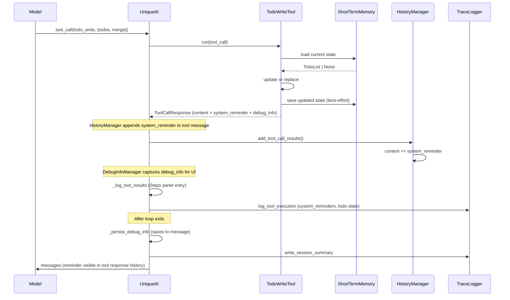

# TODO Task Tracking

Agent-side task tracking that gives the model a persistent, visible TODO list for multi-step work. Inspired by the TodoWrite/TodoRead pattern in Claude Code.

## Why

Long agentic conversations lose track of progress. The model may repeat steps, skip items, or forget the overall plan. TODO tracking solves this by:

- Giving the model a structured task list it controls
- Attaching execution reminders to tool responses via `system_reminder` on `ToolCallResponse`
- Providing structured debug info for observability in the debug UI and terminal logs
- Supporting multi-step workflows (10-50+ steps) and batch operations (process ALL items)

## Architecture



### How the reminder works

The `TodoWriteTool` sets `system_reminder` on its `ToolCallResponse`. The `HistoryManager` appends this reminder to the tool message content in the conversation history (line 191-192 of `history_manager.py`). This follows the same pattern used by sub-agent (a2a) tools. The model sees the reminder on all subsequent iterations because it persists in the conversation history.

When all items are terminal (completed/cancelled), the `system_reminder` is set to empty — no need to push autonomous execution when nothing remains.

### Components

| Component | Location | Purpose |
|-----------|----------|---------|
| `TodoStatus` | `unique_toolkit/agentic/tools/todo/schemas.py` | StrEnum: `pending`, `in_progress`, `completed`, `cancelled` |
| `TodoItem`, `TodoList`, `TodoWriteInput` | `unique_toolkit/agentic/tools/todo/schemas.py` | Pydantic data models |
| `TodoConfig` | `unique_toolkit/agentic/tools/todo/config.py` | Per-tool configuration |
| `TodoWriteTool` | `unique_toolkit/agentic/tools/todo/service.py` | Tool implementation |
| `TodoReadTool` | `unique_toolkit/agentic/tools/todo/service.py` | Read-only tool (not registered by default) |
| `_inject_todo_tools` | `unique_orchestrator/unique_ai_builder.py` | Adds `todo_write` to space tools when enabled |
| `TraceLogger` | `unique_orchestrator/trace_logger.py` | Per-iteration trace logging for debugging |

## Enabling

Enable via the Experimental config in the admin UI (Loop Agent Configuration > TODO Tracking), or programmatically:

```python
# In ExperimentalConfig
experimental = ExperimentalConfig(
    todo_tracking=TodoTrackingConfig()  # uses defaults
)
```

The tool is dynamically injected at runtime when `todo_tracking` is active. If not enabled, the feature is completely dormant.

## Configuration

`TodoConfig` (and its mirror `TodoTrackingConfig` in the orchestrator) extends `BaseToolConfig`:

| Field | Type | Default | Description |
|-------|------|---------|-------------|
| `memory_key` | `str` | `"agent_todo_state"` | ShortTermMemory key for persisting state |

There is no artificial limit on the number of todo items. Multi-step workflows and batch operations may have 50+ items, and all are preserved.

## Tool Behavior

### TodoWriteTool (`todo_write`)

Accepts a list of `TodoItem` objects and a `merge` flag:

- **`merge=True`** (default): Updates existing items by ID, appends new ones, preserves items not mentioned in the call.
- **`merge=False`**: Replaces the entire list.

After update/replace, the state is saved to ShortTermMemory. Returns a formatted summary.

Each `TodoItem` has:
- `id` -- model-generated, free-form string identifier (e.g. `"research-apis"`, `"step-1"`)
- `content` -- task description
- `status` -- a `TodoStatus` value: `pending`, `in_progress`, `completed`, `cancelled`

### TodoReadTool (`todo_read`)

Not registered by default. The LLM never used it because `todo_write` already returns the full state in its response content. Available for manual registration if needed.

### Status Icons

```
[ ] pending
[>] in_progress
[x] completed
[-] cancelled
```

### Autonomous Execution

The system prompt establishes a two-phase workflow:

1. **Clarification Phase** (before creating the task list): Ask all clarifying questions in a single message upfront.
2. **Execution Phase** (after creating the task list): Execute every step autonomously without stopping. No follow-up questions. Sensible defaults for ambiguous details.

Execution rules enforced by the prompt:
- After creating a task list, execute each step immediately
- Work through ALL items until every item is in a terminal state
- Do not ask the user for confirmation between steps
- When multiple items are completed in one iteration (e.g. parallel tool calls), batch-update all of them in a single `todo_write` call
- Do NOT summarize remaining items or ask if you should continue
- Only stop for hard blockers (missing credentials, nonexistent resources, unrecoverable errors)

Completion rules enforced by the prompt:
- Before writing a final response, call `todo_write` one last time to mark all remaining items as completed or cancelled — the final list must have zero pending/in_progress items
- Never write a final response while items are still pending
- For complex tasks, include a final "verify and synthesize" item to ensure clean wrap-up

The `system_reminder` on each tool response reinforces this: "You are in the EXECUTION PHASE... Do NOT write a final text response while items are still pending or in_progress — keep executing until every item reaches a terminal state, then call todo_write one final time before responding."

### Debug Info

The `todo_write` response includes structured `debug_info` for the debug UI:

```json
{
  "input": {
    "merge": true,
    "items": [{"id": "t1", "content": "Research APIs", "status": "pending"}]
  },
  "state": {
    "total": 3,
    "completed": 1,
    "in_progress": 1,
    "pending": 1,
    "items": [...]
  },
  "iteration": 2
}
```

Terminal logging is also enhanced — `DEBUG` level logs the full input arguments, `INFO` level logs the resulting state.

### Debug Info in the UI

The orchestrator persists accumulated `debug_info` from all tools to the message's `debugInfo` field after every loop exit (including on error, as a best-effort save). This means the debug panel in the UI always shows which tools ran and their structured output — not just for tools that "take control" (like DeepResearch).

Additionally, after tool execution, tools with `debug_info` get a summary entry in the Steps panel. For `todo_write` this shows the current item counts:

```
**todo_write** — 3 items (1 completed, 1 in_progress, 1 pending)
```

## Testing

### Unit Tests

`tests/agentic/tools/test_todo_service.py` -- tests covering:
- `TodoList.update()` logic (update, append, preserve)
- `TodoList.has_active_items()` logic
- `TodoWriteTool.run()` (create, update, replace, formatting)
- Large todo lists (100 items) preserved without truncation
- `debug_info` structure on tool response
- `system_reminder` set when active items, empty when all terminal
- Tool registration, config validation

`unique_orchestrator/tests/test_todo_injection.py` -- tests covering:
- `_inject_todo_tools` adds `todo_write` when enabled, skips when disabled
- `todo_read` not auto-registered
- Config fields (`inject_system_reminder`, `system_reminder_location`) removed

`unique_orchestrator/tests/test_unique_ai_update_debug_info_for_tool_control.py` -- tests covering:
- `_persist_debug_info` always runs (not gated by tool-took-control)
- `_persist_debug_info` skips DeepResearch (case-sensitive check)
- `_persist_debug_info_best_effort` swallows errors
- `_build_debug_info_event` includes assistant metadata
- `_log_tool_results` creates Steps entries for tools with debug_info
- `_format_tool_result_summary` formats todo state and generic debug info

`unique_orchestrator/tests/test_trace_logger.py` -- tests covering:
- `_serialize` and `_strip_chunks` helpers (recursive chunk removal)
- TraceLogger disabled when no env var and non-dev mode
- TraceLogger enabled via `UNIQUE_AI_TRACE_DIR` or dev-mode auto-enable
- LLM call logging, tool execution logging with system_reminder extraction
- Session summary writing with model, timing, todo progression

### Multi-Step Workflow Tests

`tests/agentic/tools/test_todo_eval.py` -- scripted conversation simulations:
- Full lifecycle: pending -> in_progress -> completed across multiple iterations
- Update behavior with mid-conversation additions
- Large merge preserves all items (no truncation)
- System-reminder on tool response validates active state tracking
- Iteration counter preserved across replace operations

### Automated Prompt Evaluation

`tests/agentic/tools/todo_prompt_eval/` -- LLM-powered prompt evaluation:
- `scenarios.yaml`: 14 behavioral scenarios including simple questions, multi-step research, batch operations, sequential-dependency chains, stress tests (25/50/100 items), and ambiguous/clarification tasks
- `eval_runner.py`: Runs scenarios through actual OpenAI API with tool calling and mock work tools (search_web, send_email, write_document, read_database), uses LLM-as-judge to score behavior, supports injection mode comparison (system_message vs tool_result)
- `view_traces.py`: Human-readable trace viewer for reviewing full conversation logs and tool call sequences

Run with:
```bash
cd unique_toolkit
python -m tests.agentic.tools.todo_prompt_eval.eval_runner
python -m tests.agentic.tools.todo_prompt_eval.eval_runner --compare  # compare injection modes
```

### Manual QA Scenarios

Use these prompts in a real chat session with TODO tools enabled:

**Scenario 1: Multi-step research (should create todos)**
```
Compare the performance of Tesla, Apple, and Microsoft stock over the last year.
For each, provide key metrics, recent news, and your recommendation.
```
- Expect: 3+ todos created, progressive status updates, formatted list in responses.
- Verify: Debug panel shows `debug_info` with input/state structure.

**Scenario 2: Simple question (should NOT create todos)**
```
What's the current price of AAPL?
```
- Expect: Direct answer, no todo_write calls.

**Scenario 3: Batch operation (should create todo per item)**
```
Summarize each of these 10 emails: [list 10 topics]
```
- Expect: 10 todos created, all reach completed status, no mid-execution questions.

**Scenario 4: Autonomous execution (should NOT ask for confirmation)**
```
Research emerging market trends, compare with developed markets, and provide a recommendation.
```
- Expect: Model creates todos, then proceeds through each step without asking "shall I continue?".
- Verify: Terminal logs show each `TodoWriteTool` call with full state.

**What to check:**
- Tool calls visible in terminal logs (`TodoWriteTool: saved N items — Task list (...)`)
- Debug panel shows structured `debug_info` (input items, resulting state counts)
- `system_reminder` appears in tool response message history (drives autonomous execution)
- Status transitions follow `pending -> in_progress -> completed` lifecycle
- Trace files in `/tmp/unique-ai-traces/` (or custom `UNIQUE_AI_TRACE_DIR`)

## Debugging

### Trace Logging

Set `UNIQUE_AI_TRACE_DIR=/tmp/unique-ai-traces` to write per-iteration JSON files capturing the full agent flow. In dev mode (`ENV=local` or `ENV=dev`), tracing auto-enables to `/tmp/unique-ai-traces`.

Each agent run creates a timestamped session directory with:
- `iter-NNN-llm.json`: messages sent to LLM + model response (excluding content chunks)
- `iter-NNN-tools.json`: tool calls + responses, system_reminders extracted, todo state snapshots
- `session-summary.json`: iteration count, tools used, todo progression, timing, model

### Recommended Model

GPT-5.4 (`AZURE_GPT_54_2026_0305`) is recommended for agentic use with todo tracking — it follows multi-step plans more reliably than earlier models. Set via the admin UI or the `DEFAULT_LANGUAGE_MODEL` environment variable:

```
DEFAULT_LANGUAGE_MODEL=AZURE_GPT_54_2026_0305
```

## Relationship with PlanningMiddleware

The codebase has an existing `PlanningMiddleware` (in `unique_toolkit/agentic/loop_runner/middleware/planning/`). These two features solve different problems and compose well together.

| Aspect | PlanningMiddleware | TODO Tools |
|---|---|---|
| Level of abstraction | Tactical (this iteration) | Strategic (overall task) |
| Who decides? | Always runs | Model decides when to use |
| Output | Free-text reasoning | Structured items with statuses |
| Memory | Ephemeral (conversation history) | Best-effort ShortTermMemory + conversation history |
| Without the other | Must infer progress from raw history | Model plans implicitly |

**Either feature works independently.** Together, the planning step sees the TODO state in the conversation history and can make better decisions about what to do next.

## Known Issue: ShortTermMemory Persistence

The `ShortTermMemory.create_async` API requires scoping by `chatId`, `messageId`, or `companyId`. During tool execution, the `messageId` available from the `ChatEvent` is the **user's** message ID. This can cause `InvalidRequestError` when `TodoWriteTool` tries to persist state.

### Current workaround

`TodoWriteTool.run()` wraps persistence calls in `try/except`. If the save fails, the tool still returns the formatted state and `system_reminder` to the LLM. The state is visible in the tool response (part of conversation history), so the model can track progress even without backend persistence.

### Why this works

The tool response containing the TODO state is part of the conversation history. On subsequent iterations, the LLM sees its own previous `todo_write` responses. This is effectively how Claude Code handles TODO state — it lives in the conversation context, not in an external database.
