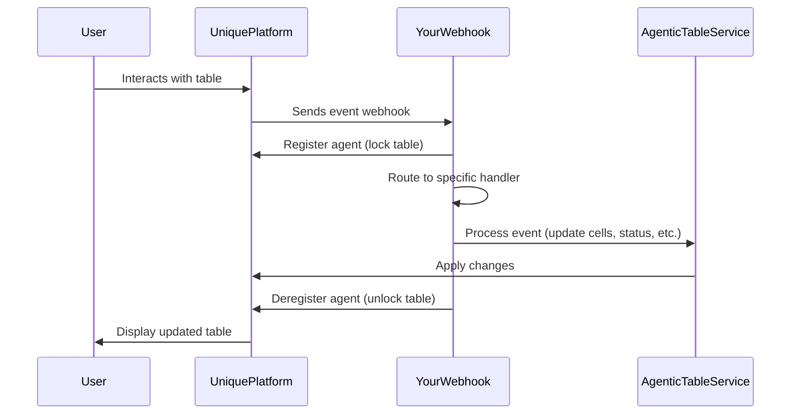

# Building an Event-Driven Agentic Table Application

This tutorial shows how to build an Agentic Table application that responds to user interactions through event handlers. An Agentic Table is an interactive spreadsheet component in the Unique platform that can be automated using Python event handlers.

## What You'll Learn

- Understanding the event-driven architecture of Agentic Tables
- Setting up a FastAPI application to receive and route table events
- Implementing handlers for different table lifecycle events
- Using the AgenticTableService to interact with tables programmatically

## Understanding the Event Flow

Agentic Tables work through an event-driven architecture. When users interact with a table in the Unique platform, events are sent to your webhook server. Here are the main events you'll handle:

### Table Lifecycle Events

1. **`SHEET_CREATED`** 
    - Triggered when a user creates a new table sheet
    - Use this to initialize your table structure (headers, column styles)

2. **`ADD_META_DATA`** 
    - Triggered when a user adds question files or source files
    - Use this to process uploaded files and populate table data
    - Implement custom logic for handling different file types

3. **`UPDATE_CELL`** 
    - Triggered when a user edits an editable cell
    - Use this to implement business rules and automation
    - React to specific column changes with custom workflows

4. **`GENERATE_ARTIFACT`** 
    - Triggered when a user clicks to export -> generate a document
    - Use this to create exportable reports or documents from table data

5. **`SHEET_COMPLETED`** 
    - Triggered when a user marks a sheet as completed
    - Use this for final validation, archival, or triggering downstream processes

Here's how the event flow works:



## Essential Setup: The Event Handler and Application

Before diving into individual handlers, let's set up the core infrastructure. The main event handler receives all events and routes them to specialized handlers:

```{.python #main_event_handler}
import logging
from unique_sdk.api_resources._agentic_table import ActivityStatus
from unique_toolkit.agentic_table.service import AgenticTableService
from unique_toolkit.agentic_table.schemas import MagicTableAction, MagicTableEvent

logger = logging.getLogger(__name__)


async def agentic_table_event_handler(event: MagicTableEvent) -> int:
    """
    Main event handler that routes table events to specialized handlers.
    """
    # Initialize the service to interact with the table
    at_service = AgenticTableService(
        user_id=event.user_id,
        company_id=event.company_id,
        table_id=event.payload.table_id,
    )

    # Register agent - locks the table during processing
    await at_service.register_agent()

    try:
        # Route events based on action type
        if event.payload.action == MagicTableAction.SHEET_CREATED:
            await at_service.deregister_agent()
            await handle_sheet_created(at_service, event.payload)
        
        elif event.payload.action == MagicTableAction.ADD_META_DATA:
            downloader = get_downloader(event.user_id, event.company_id, event.payload.chat_id)
            await handle_metadata_added(at_service, event.payload, downloader)
        
        elif event.payload.action == MagicTableAction.UPDATE_CELL:
            await handle_cell_updated(at_service, event.payload)
        
        elif event.payload.action == MagicTableAction.GENERATE_ARTIFACT:
            uploader = get_uploader(event.user_id, event.company_id, event.payload.chat_id)
            await handle_artifact_generated(at_service, event.payload, uploader)
        
        elif event.payload.action == MagicTableAction.SHEET_COMPLETED:
            logger.info(f"Sheet completed: {event.payload.sheet_name}")
            # Implement your completion logic here
        
        else:
            await at_service.set_activity(
                activity=event.payload.action,
                status=ActivityStatus.FAILED,
                text=f"Unknown action: {event.payload.action}",
            )
            raise Exception(f"Unknown action: {event.payload.action}")
        
        return 0  # Success
    
    except Exception as e:
        logger.error(f"Error in handler: {e}")
        return 1  # Failure
    
    finally:
        # Always deregister - unlocks the table
        await at_service.deregister_agent()
```

Now create the FastAPI application and run it:

```{.python #create_and_run_app}
from pathlib import Path
from unique_toolkit.agentic_table.schemas import MagicTableEventTypes
from unique_toolkit.app.fast_api_factory import build_unique_custom_app
from unique_toolkit.app.unique_settings import UniqueSettings

# Initialize settings
_SETTINGS = UniqueSettings.from_env(env_file=Path(__file__).parent / "unique.env")
_SETTINGS.init_sdk()

# Create app with the event handler
_MINIMAL_APP = build_unique_custom_app(
    title="Unique Minimal Agentic Table App",
    settings=_SETTINGS,
    event_handler=agentic_table_event_handler,
    event_constructor=MagicTableEvent,
    subscribed_event_names=[ev.value for ev in MagicTableEventTypes],
)

# Run the application
if __name__ == "__main__":
    import uvicorn
    
    uvicorn.run(
        "fastapi_app_agentic_table:_MINIMAL_APP",
        host="0.0.0.0",
        port=5001,
        reload=True,
        log_level="debug",
    )
```

Run with: `python fastapi_app_agentic_table.py`

## Defining Your Table Structure

Before implementing the handlers, we need to define what our table looks like. This example demonstrates a configuration pattern for defining columns. While this is hardcoded here, you can easily initialize it from a configuration payload, database, or user settings.

The column definitions specify:

- **Order**: Position of the column (0-indexed)
- **Name**: Column header text
- **Width**: Column width in pixels
- **Renderer**: Type of cell renderer (dropdown, checkbox, collaborator selector, etc.)
- **Editable**: Whether users can edit the column

??? example "Column Definition Example (Click to expand)"
    
    <!--codeinclude-->
    [Column Definitions](../examples_from_docs/agentic_table_example_column_definition.py)
    <!--/codeinclude-->

This creates a typed interface for your table that ensures consistency across all operations. You'll reference these definitions in your handlers to access columns by name.

## Implementing Event Handlers

Now let's implement each handler. Each one uses the `AgenticTableService` (`at_service`) to interact with the table.

### Handler 1: Sheet Created Event

**When**: Triggered when a user creates a new table sheet.

**Goal**: Initialize the table by setting up column headers and applying styling.

**What we do with `at_service`**:

- `set_activity()` - Shows status messages to users (e.g., "Initializing table schema...")
- `set_cell()` - Sets individual cell values (used here to write column headers in row 0)
- `set_column_style()` - Applies styling to columns (width, renderer type, editability)

This handler prepares the empty table structure so it's ready to receive data. After this runs, users will see a properly formatted table with headers and the correct column configurations.

??? example "Sheet Created Handler Implementation (Click to expand)"
    
    <!--codeinclude-->
    [Sheet Created Handler](../examples_from_docs/agentic_table_example_sheet_created_event_handler.py)
    <!--/codeinclude-->

### Handler 2: Metadata Added Event

**When**: Triggered when a user uploads a question file or source file to the table.

**Goal**: Process the uploaded file and populate the table with data. In this example, we demonstrate parsing a CSV file and batch-populating cells.

**What we do with `at_service`**:

- `set_activity()` - Updates users on progress through multiple stages ("Downloading CSV...", "Parsing...", "Populating...")
- `set_multiple_cells()` - Batch operation to set many cells at once (much more efficient than individual updates)

This handler showcases how to automate data entry. You could extend this to:

- Use AI agents to generate answers for questions in the CSV
- Extract and index information from source documents
- Validate or enrich data before populating the table
- Implement custom parsing logic for different file types

The key takeaway is the batch operation pattern - when dealing with large datasets, always use `set_multiple_cells()` instead of individual `set_cell()` calls.

??? example "Metadata Added Handler Implementation (Click to expand)"
    
    <!--codeinclude-->
    [Metadata Added Handler](../examples_from_docs/agentic_table_example_metadata_added_event_handler.py)
    <!--/codeinclude-->

### Handler 3: Cell Updated Event

**When**: Triggered when a user edits an editable cell.

**Goal**: Implement business rules that react to cell changes. In this example, we monitor a specific column and lock rows when they reach a certain state.

**What we do with `at_service`**:

- `set_cell()` - Updates the cell with additional context (log entries)
- `update_row_verification_status()` - Changes the verification status of entire rows (can be used to lock/unlock or mark as verified)

This handler demonstrates workflow automation. The example checks if the "Critical Consistency" column is changed to "Consistent" and then:

1. Adds a log entry documenting the change (creates an audit trail)
2. Marks the row as verified (which can trigger visual indicators or prevent further edits)

You could extend this pattern to:

- Regenerate AI responses when questions are modified
- Trigger validation workflows
- Update dependent cells automatically
- Send notifications or trigger external systems
- Implement approval chains or review processes

The power here is in defining your business logic - the framework just provides the hooks.

??? example "Cell Updated Handler Implementation (Click to expand)"
    
    <!--codeinclude-->
    [Cell Updated Handler](../examples_from_docs/agentic_table_example_cell_updated_event_handler.py)
    <!--/codeinclude-->

### Handler 4: Artifact Generation Event

**When**: Triggered when a user clicks a button to generate a document or report.

**Goal**: Create exportable artifacts from table data. In this example, we generate a formatted Word document, but you could create any type of output.

**What we do with `at_service`**:

- `set_activity()` - Provides progress updates during the potentially long-running generation process
- `get_sheet()` - Retrieves all table data (you can specify row ranges for large tables)
- `set_artifact()` - Links the generated file back to the table so users can easily find and download it

This handler shows the complete artifact generation workflow:

1. Read table data
2. Process/transform it (here we group by sections and format as markdown)
3. Generate output file (DOCX in this case)
4. Upload to the content system
5. Link back to the table as an artifact

You could make this much more sophisticated:

- Use AI agents to synthesize intelligent summaries
- Generate multiple artifact types (PDF, Excel, PowerPoint)
- Include charts, visualizations, or analytics
- Apply custom templates and branding
- Add conditional logic based on table content

The example demonstrates the basic pattern - reading data, transforming it, and creating a downloadable result.

??? example "Artifact Generation Handler Implementation (Click to expand)"
    
    <!--codeinclude-->
    [Artifact Generated Handler](../examples_from_docs/agentic_table_example_artifact_generated_event_handler.py)
    <!--/codeinclude-->

## Key Concepts

### Agent Registration
Before processing any event, you must call `at_service.register_agent()`. This locks the table to prevent concurrent modifications. Always deregister in a `finally` block to ensure proper cleanup even if errors occur.

### Activity Status Updates
Use `at_service.set_activity()` liberally to communicate with users. These appear as status banners in the UI and are essential for long-running operations. Include:

- IN_PROGRESS status with descriptive text during processing
- COMPLETED status when successful
- FAILED status with error messages if something goes wrong

### Batch Operations
The `set_multiple_cells()` method is crucial for performance when dealing with multiple cell updates. It's dramatically faster than individual `set_cell()` calls and reduces network overhead.

### File Upload/Download Patterns
The tutorial demonstrates factory functions (`get_downloader` and `get_uploader`) that encapsulate authentication context. This pattern:

- Keeps authentication logic centralized
- Makes handlers more testable
- Simplifies the handler function signatures

### Flexibility is Key
Remember that all handlers in this tutorial are **examples**. The framework provides events and tools - how you use them depends on your business requirements. You can integrate with any external system, use AI models, implement complex workflows, or create custom validation rules.

## Next Steps

- Review the [Agentic Table API Reference](../modules/agentic_table.md) for all available methods and schemas
- Learn about [Event-Driven Applications](../application_types/event_driven/index.md) for deployment options
- Explore [platform setup](../application_types/event_driven/event_driven_platform_setup.md) for configuring webhooks and ngrok

??? example "Full Example Files (Click to expand)"
    
    <!--codeinclude-->
    [Complete FastAPI App](../examples_from_docs/fastapi_app_agentic_table.py)
    [Column Definitions](../examples_from_docs/agentic_table_example_column_definition.py)
    [Sheet Created Handler](../examples_from_docs/agentic_table_example_sheet_created_event_handler.py)
    [Metadata Added Handler](../examples_from_docs/agentic_table_example_metadata_added_event_handler.py)
    [Cell Updated Handler](../examples_from_docs/agentic_table_example_cell_updated_event_handler.py)
    [Artifact Generated Handler](../examples_from_docs/agentic_table_example_artifact_generated_event_handler.py)
    <!--/codeinclude-->
