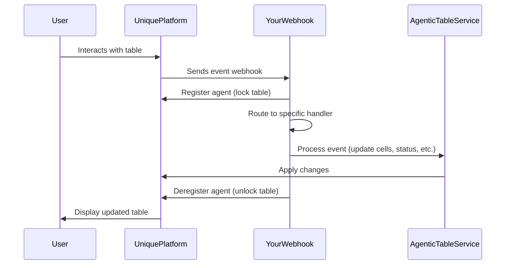

# Building an Event-Driven Agentic Table Application

This tutorial shows how to build an Agentic Table application that responds to user interactions through event handlers. An Agentic Table is an interactive spreadsheet component in the Unique platform that can be automated using Python event handlers.

## What You'll Learn

- Understanding the event-driven architecture of Agentic Tables
- Setting up a FastAPI application to receive and route table events
- Implementing handlers for different table lifecycle events
- Using the AgenticTableService to interact with tables programmatically
- **Working with file metadata** to build intelligent routing logic
- **Creating clickable references** that link table content to source documents

## Understanding the Event Flow

Agentic Tables work through an event-driven architecture. When users interact with a table in the Unique platform, events are sent to your webhook server. Here are the main events you'll handle:

### Table Lifecycle Events

1. **`SHEET_CREATED`** 
    - Triggered when a user creates a new table sheet
    - Use this to initialize your table structure (headers, column styles)

2. **`ADD_META_DATA`** 
    - Triggered when a user adds question files or source files
    - Use this to process uploaded files and populate table data
    - Implement custom logic for handling different file types

3. **`UPDATE_CELL`** 
    - Triggered when a user edits an editable cell
    - Use this to implement business rules and automation
    - React to specific column changes with custom workflows

4. **`GENERATE_ARTIFACT`** 
    - Triggered when a user clicks to export -> generate a document
    - Use this to create exportable reports or documents from table data

5. **`SHEET_COMPLETED`** 
    - Triggered when a user marks a sheet as completed
    - Use this for final validation, archival, or triggering downstream processes

Here's how the event flow works:



## Essential Setup: The Event Handler and Application

Before diving into individual handlers, let's set up the core infrastructure. The main event handler receives all events and routes them to specialized handlers:

```{.python #main_event_handler}
import logging
from unique_sdk.api_resources._agentic_table import ActivityStatus
from unique_toolkit.agentic_table.service import AgenticTableService
from unique_toolkit.agentic_table.schemas import MagicTableAction, MagicTableEvent

logger = logging.getLogger(__name__)


async def agentic_table_event_handler(event: MagicTableEvent) -> int:
    """
    Main event handler that routes table events to specialized handlers.
    """
    # Initialize the service to interact with the table
    at_service = AgenticTableService(
        user_id=event.user_id,
        company_id=event.company_id,
        table_id=event.payload.table_id,
    )

    # Register agent - locks the table during processing
    await at_service.register_agent()

    try:
        # Route events based on action type
        if event.payload.action == MagicTableAction.SHEET_CREATED:
            await at_service.deregister_agent()
            await handle_sheet_created(at_service, event.payload)
        
        elif event.payload.action == MagicTableAction.ADD_META_DATA:
            downloader = get_downloader(event.user_id, event.company_id, event.payload.chat_id)
            file_content_getter = get_file_content_getter(event.user_id, event.company_id, event.payload.chat_id)
            reference_builder = get_augmented_text_with_references(
                event.user_id, event.company_id, event.payload.chat_id, event.payload.assistant_id
            )
            await handle_metadata_added(
                at_service, 
                event.payload, 
                downloader,
                file_content_getter,
                reference_builder
            )
        
        elif event.payload.action == MagicTableAction.UPDATE_CELL:
            await handle_cell_updated(at_service, event.payload)
        
        elif event.payload.action == MagicTableAction.GENERATE_ARTIFACT:
            uploader = get_uploader(event.user_id, event.company_id, event.payload.chat_id)
            await handle_artifact_generated(at_service, event.payload, uploader)
        
        elif event.payload.action == MagicTableAction.SHEET_COMPLETED:
            logger.info(f"Sheet completed: {event.payload.sheet_name}")
            # Implement your completion logic here
        
        else:
            await at_service.set_activity(
                activity=event.payload.action,
                status=ActivityStatus.FAILED,
                text=f"Unknown action: {event.payload.action}",
            )
            raise Exception(f"Unknown action: {event.payload.action}")
        
        return 0  # Success
    
    except Exception as e:
        logger.error(f"Error in handler: {e}")
        return 1  # Failure
    
    finally:
        # Always deregister - unlocks the table
        await at_service.deregister_agent()
```

Now create the FastAPI application and run it:

```{.python #create_and_run_app}
from pathlib import Path
from unique_toolkit.agentic_table.schemas import MagicTableEventTypes
from unique_toolkit.app.fast_api_factory import build_unique_custom_app
from unique_toolkit.app.unique_settings import UniqueSettings

# Initialize settings
_SETTINGS = UniqueSettings.from_env(env_file=Path(__file__).parent / "unique.env")
_SETTINGS.init_sdk()

# Create app with the event handler
_MINIMAL_APP = build_unique_custom_app(
    title="Unique Minimal Agentic Table App",
    settings=_SETTINGS,
    event_handler=agentic_table_event_handler,
    event_constructor=MagicTableEvent,
    subscribed_event_names=[ev.value for ev in MagicTableEventTypes],
)

# Run the application
if __name__ == "__main__":
    import uvicorn
    
    uvicorn.run(
        "fastapi_app_agentic_table:_MINIMAL_APP",
        host="0.0.0.0",
        port=5001,
        reload=True,
        log_level="debug",
    )
```

Run with: `python fastapi_app_agentic_table.py`

## Defining Your Table Structure

Before implementing the handlers, we need to define what our table looks like. This example demonstrates a configuration pattern for defining columns. While this is hardcoded here, you can easily initialize it from a configuration payload, database, or user settings.

The column definitions specify:

- **Order**: Position of the column (0-indexed)
- **Name**: Column header text
- **Width**: Column width in pixels
- **Renderer**: Type of cell renderer (dropdown, checkbox, collaborator selector, etc.)
- **Editable**: Whether users can edit the column

??? example "Column Definition Example (Click to expand)"
    
    <!--codeinclude-->
    [Column Definitions](../examples_from_docs/agentic_table_example_column_definition.py)
    <!--/codeinclude-->

This creates a typed interface for your table that ensures consistency across all operations. You'll reference these definitions in your handlers to access columns by name.

## Implementing Event Handlers

Now let's implement each handler. Each one uses the `AgenticTableService` (`at_service`) to interact with the table.

### Handler 1: Sheet Created Event

**When**: Triggered when a user creates a new table sheet.

**Goal**: Initialize the table by setting up column headers and applying styling.

**What we do with `at_service`**:

- `set_activity()` - Shows status messages to users (e.g., "Initializing table schema...")
- `set_cell()` - Sets individual cell values (used here to write column headers in row 0)
- `set_column_style()` - Applies styling to columns (width, renderer type, editability)

This handler prepares the empty table structure so it's ready to receive data. After this runs, users will see a properly formatted table with headers and the correct column configurations.

??? example "Sheet Created Handler Implementation (Click to expand)"
    
    <!--codeinclude-->
    [Sheet Created Handler](../examples_from_docs/agentic_table_example_sheet_created_event_handler.py)
    <!--/codeinclude-->

### Handler 2: Metadata Added Event

**When**: Triggered when a user uploads a question file or source file to the table.

**Goal**: Process the uploaded file and populate the table with data. This handler demonstrates two powerful framework capabilities:

1. **CSV Processing**: Parse question files and batch-populate cells
2. **Content Metadata & References**: Retrieve file metadata and create clickable references

#### Part A: Processing Question Files (CSV)

The first part handles question files by downloading and parsing CSV data:

**What we do with `at_service`**:

- `set_activity()` - Updates users on progress through multiple stages ("Downloading CSV...", "Parsing...", "Populating...")
- `set_multiple_cells()` - Batch operation to set many cells at once (much more efficient than individual updates)

This showcases how to automate data entry. You could extend this to:

- Use AI agents to generate answers for questions in the CSV
- Validate or enrich data before populating the table
- Implement custom parsing logic for different file types

#### Part B: Processing Source Files with Metadata

The second part demonstrates **two core framework capabilities** that are essential for building sophisticated applications:

##### 1. Retrieving File Content and Metadata

When users upload source files, you can retrieve the full `Content` objects which include:

- **content.id**: Unique identifier
- **content.metadata**: Custom key-value pairs (e.g., `{"section": "Finance", "department": "Legal"}`)
- **content.title**: File name or title
- **content.text**: Extracted text content
- **content.chunks**: List of ContentChunk objects for chunked documents

**Example: Organizing Files by Metadata**

```python
# Retrieve Content objects for uploaded files
content = file_content_getter_fn(file_id)

# Access metadata
if content.metadata:
    section = content.metadata.get("section")
    department = content.metadata.get("department")
    
# EXAMPLE: Use ContentRegistry to group files by metadata keys
# (This is just one approach - implement your own filtering logic!)
content_registry = ContentRegistry(
    keys=["Finance", "Legal", "Technical"],
    contents=all_contents
)

# Retrieve all files with specific metadata key
finance_files = content_registry.get_contents_by_metadata_key("Finance")

# Alternative: Implement your own filtering
finance_files = [
    c for c in all_contents 
    if c.metadata and c.metadata.get("department") == "Finance"
]
```

**Use Cases**:
- Route different source files to different table rows based on categories
- Filter content by department, section, or custom tags
- Build conditional logic based on file properties

##### 2. Creating Clickable References

The framework provides a reference system that converts inline citations into clickable links in the UI. This is crucial when AI agents generate text with citations to source documents.

**Why This Matters**:
- Users can click references to view source documents
- Creates audit trails for AI-generated content
- Improves transparency and trust in automated workflows
- Enables verification of information

**The Reference Workflow**:

```
Step 1: AI/Logic generates text with inline citations
  "According to the Q3 report [chunk_abc123], revenue increased [chunk_xyz789]."

Step 2: Create reference registry mapping IDs to Content objects
  {
    "chunk_abc123": <Content object for Q3 report>,
    "chunk_xyz789": <Content object for financial data>
  }

Step 3: Convert citations to numbered references
  "According to the Q3 report [1], revenue increased [2]."
  
Step 4: Frontend renders as clickable links
  "According to the Q3 report [1]↗, revenue increased [2]↗."
  (clicking [1] opens the Q3 report document)
```

**Implementation Example**:

```python
# Step 1: Create temporary IDs for your content items
reference_registry = create_id_map(relevant_contents, prefix="chunk")
# Returns: {"chunk_a1b2c3d4": content1, "chunk_x9y8z7w6": content2, ...}

# Step 2: Generate text with inline citations (from AI or your logic)
text_with_citations = "Based on the analysis [chunk_a1b2c3d4], we conclude..."

# Step 3: Convert to clickable references
augmented_text = augmented_text_with_references_fn(
    text_with_citations,
    reference_registry,
    prefix="chunk",
    citation_pattern=r"\[chunk_([a-zA-Z0-9\-]+)\]"
)
# Returns: "Based on the analysis [1&message_123], we conclude..."
# Frontend renders as: "Based on the analysis [1]↗, we conclude..." (clickable)
```

**Use Cases**:
- Link AI-generated answers to source documents
- Create audit trails for compliance and review
- Enable fact-checking and verification workflows
- Build transparent, explainable AI systems
- Track provenance of information across your pipeline

**What we do with `at_service`**:

- `set_activity()` - Provides progress updates during processing
- `get_sheet()` - Retrieves table data to understand what's already populated
- `get_num_rows()` - Gets the current number of rows
- `set_multiple_cells()` - Batch updates cells with referenced content

The key takeaway is the batch operation pattern - when dealing with large datasets, always use `set_multiple_cells()` instead of individual `set_cell()` calls.

??? example "Metadata Added Handler Implementation (Click to expand)"
    
    <!--codeinclude-->
    [Metadata Added Handler](../examples_from_docs/agentic_table_example_metadata_added_event_handler.py)
    <!--/codeinclude-->

### Handler 3: Cell Updated Event

**When**: Triggered when a user edits an editable cell.

**Goal**: Implement business rules that react to cell changes. In this example, we monitor a specific column and lock rows when they reach a certain state.

**What we do with `at_service`**:

- `set_cell()` - Updates the cell with additional context (log entries)
- `update_row_verification_status()` - Changes the verification status of entire rows (can be used to lock/unlock or mark as verified)

This handler demonstrates workflow automation. The example checks if the "Critical Consistency" column is changed to "Consistent" and then:

1. Adds a log entry documenting the change (creates an audit trail)
2. Marks the row as verified (which can trigger visual indicators or prevent further edits)

You could extend this pattern to:

- Regenerate AI responses when questions are modified
- Trigger validation workflows
- Update dependent cells automatically
- Send notifications or trigger external systems
- Implement approval chains or review processes

The power here is in defining your business logic - the framework just provides the hooks.

??? example "Cell Updated Handler Implementation (Click to expand)"
    
    <!--codeinclude-->
    [Cell Updated Handler](../examples_from_docs/agentic_table_example_cell_updated_event_handler.py)
    <!--/codeinclude-->

### Handler 4: Artifact Generation Event

**When**: Triggered when a user clicks a button to generate a document or report.

**Goal**: Create exportable artifacts from table data. In this example, we generate a formatted Word document, but you could create any type of output.

**What we do with `at_service`**:

- `set_activity()` - Provides progress updates during the potentially long-running generation process
- `get_sheet()` - Retrieves all table data (you can specify row ranges for large tables)
- `set_artifact()` - Links the generated file back to the table so users can easily find and download it

This handler shows the complete artifact generation workflow:

1. Read table data
2. Process/transform it (here we group by sections and format as markdown)
3. Generate output file (DOCX in this case)
4. Upload to the content system
5. Link back to the table as an artifact

You could make this much more sophisticated:

- Use AI agents to synthesize intelligent summaries
- Generate multiple artifact types (PDF, Excel, PowerPoint)
- Include charts, visualizations, or analytics
- Apply custom templates and branding
- Add conditional logic based on table content

The example demonstrates the basic pattern - reading data, transforming it, and creating a downloadable result.

??? example "Artifact Generation Handler Implementation (Click to expand)"
    
    <!--codeinclude-->
    [Artifact Generated Handler](../examples_from_docs/agentic_table_example_artifact_generated_event_handler.py)
    <!--/codeinclude-->

## Framework Utilities: Helper Functions

The tutorial examples use several helper functions that encapsulate common patterns for working with files, metadata, and references. These are available in the toolkit and demonstrate best practices for your own applications.

### File Content Retrieval

**Function**: `get_file_content_getter_fn(user_id, company_id, chat_id)`

Creates a function to retrieve full `Content` objects by file ID. This is essential for accessing file metadata and properties.

```python
# Create the getter function with authentication context
file_content_getter = get_file_content_getter_fn(user_id, company_id, chat_id)

# Retrieve content by ID
content = file_content_getter(file_id)

# Access properties
if content:
    metadata = content.metadata  # Custom key-value pairs
    title = content.title        # File name
    text = content.text          # Extracted text
    chunks = content.chunks      # ContentChunk objects
```

**Use in your handlers**: Pass this function to handlers that need to access source file metadata.

### File Download

**Function**: `get_downloader_fn(user_id, company_id, chat_id)`

Creates a function to download raw file bytes. Useful for processing CSV, Excel, or other binary formats.

```python
# Create the downloader with authentication context
downloader = get_downloader_fn(user_id, company_id, chat_id)

# Download file content
file_bytes = downloader(file_id)

# Process the bytes (e.g., parse CSV)
csv_data = pd.read_csv(io.BytesIO(file_bytes))
```

**Use in your handlers**: Pass this function to handlers that need to download and process file contents.

### File Upload

**Function**: `get_uploader_fn(user_id, company_id, chat_id)`

Creates a function to upload files to the chat. Used for uploading generated artifacts.

```python
# Create the uploader with authentication context
uploader = get_uploader_fn(user_id, company_id, chat_id)

# Upload a file
content = uploader(
    file_bytes,
    "application/vnd.openxmlformats-officedocument.wordprocessingml.document",
    "report.docx"
)

# Use the returned content ID
content_id = content.id
```

**Use in your handlers**: Pass this function to artifact generation handlers.

### Reference Creation

**Function**: `get_augmented_text_with_references_fn(user_id, company_id, chat_id, assistant_id)`

Creates a function to convert inline citations into clickable references. This is the core utility for building traceable, source-linked content.

```python
# Create the reference builder with authentication context
reference_builder = get_augmented_text_with_references_fn(
    user_id, company_id, chat_id, assistant_id
)

# Create a reference registry
reference_registry = create_id_map(content_items, prefix="chunk")

# Convert citations to references
text_with_citations = "According to the report [chunk_abc123]..."
augmented_text = reference_builder(
    text_with_citations,
    reference_registry,
    prefix="chunk",
    citation_pattern=r"\[chunk_([a-zA-Z0-9\-]+)\]"
)
# Result: "According to the report [1]..." (clickable in UI)
```

**Use in your handlers**: Pass this function to handlers that generate AI content with source citations.

### Content Organization

**Class**: `ContentRegistry(keys, contents)`

An **example** utility class demonstrating how to organize Content objects by metadata keys. This is just one approach - you should implement your own filtering logic based on your specific needs.

**Example usage**:

```python
# Create a registry with metadata keys
content_registry = ContentRegistry(
    keys=["Finance", "Legal", "Technical"],
    contents=all_content_objects
)

# Retrieve files by metadata key
finance_files = content_registry.get_contents_by_metadata_key("Finance")
legal_files = content_registry.get_contents_by_metadata_key("Legal")
```

**This example shows**: Grouping by metadata key existence (e.g., file has `{"Finance": "true"}`)

**Your implementation might**:
- Filter by metadata **values** instead of keys (e.g., `{"status": "approved"}`)
- Support complex queries (AND/OR conditions, ranges, regex)
- Combine multiple metadata attributes (e.g., section AND department)
- Implement scoring/ranking logic for content relevance
- Use caching strategies for large content sets

**Key point**: Build your own registry class that matches your business logic and metadata structure!

### ID Mapping

**Function**: `create_id_map(items, prefix)`

Generates temporary IDs for a list of items. Essential for creating citation systems.

```python
# Create unique IDs for content items
id_map = create_id_map(content_list, prefix="chunk")
# Returns: {"chunk_a1b2c3d4": content1, "chunk_x9y8z7w6": content2, ...}

# Use in text generation
text = f"See source [{list(id_map.keys())[0]}]"
```

**Pattern**: Always use consistent prefixes and citation patterns throughout your application.

??? example "Helper Functions Implementation (Click to expand)"
    
    <!--codeinclude-->
    [Helper Functions](../examples_from_docs/agentic_table_helper_functions.py)
    <!--/codeinclude-->

## Key Concepts

### Agent Registration
Before processing any event, you must call `at_service.register_agent()`. This locks the table to prevent concurrent modifications. Always deregister in a `finally` block to ensure proper cleanup even if errors occur.

### Activity Status Updates
Use `at_service.set_activity()` liberally to communicate with users. These appear as status banners in the UI and are essential for long-running operations. Include:

- IN_PROGRESS status with descriptive text during processing
- COMPLETED status when successful
- FAILED status with error messages if something goes wrong

### Batch Operations
The `set_multiple_cells()` method is crucial for performance when dealing with multiple cell updates. It's dramatically faster than individual `set_cell()` calls and reduces network overhead.

### File Operations and Metadata Patterns

The tutorial demonstrates factory functions that encapsulate authentication context. This pattern:

- Keeps authentication logic centralized
- Makes handlers more testable
- Simplifies the handler function signatures

#### File Download Pattern

Use `get_downloader_fn()` for downloading raw file bytes (CSV, Excel, binary formats):

```python
downloader = get_downloader_fn(user_id, company_id, chat_id)
file_bytes = downloader(file_id)
```

#### Content Retrieval Pattern

Use `get_file_content_getter_fn()` for accessing file metadata and properties:

```python
content_getter = get_file_content_getter_fn(user_id, company_id, chat_id)
content = content_getter(file_id)

# Access metadata
if content.metadata:
    section = content.metadata.get("section")
```

#### File Upload Pattern

Use `get_uploader_fn()` for uploading generated artifacts:

```python
uploader = get_uploader_fn(user_id, company_id, chat_id)
content = uploader(file_bytes, mime_type, filename)
```

#### Reference Creation Pattern

Use `get_augmented_text_with_references_fn()` for creating clickable source links:

```python
reference_builder = get_augmented_text_with_references_fn(
    user_id, company_id, chat_id, assistant_id
)

# Create ID mapping for your content
id_map = create_id_map(content_items, prefix="chunk")

# Convert citations to references
augmented_text = reference_builder(
    text_with_citations,
    id_map,
    prefix="chunk",
    citation_pattern=r"\[chunk_([a-zA-Z0-9\-]+)\]"
)
```

**Key Benefits**:
- Citations become clickable links in the UI
- Users can verify source information
- Creates audit trails for AI-generated content
- Improves transparency and trust

### Flexibility is Key
Remember that all handlers in this tutorial are **examples**. The framework provides events and tools - how you use them depends on your business requirements. You can integrate with any external system, use AI models, implement complex workflows, or create custom validation rules.

## Summary of Core Capabilities

This tutorial covered the essential building blocks for Agentic Table applications:

### Event Handling
- **SHEET_CREATED**: Initialize table structure with headers and styling
- **ADD_META_DATA**: Process uploaded files (questions and sources)
- **UPDATE_CELL**: React to user edits with business logic
- **GENERATE_ARTIFACT**: Export table data as documents
- **SHEET_COMPLETED**: Finalize and validate completed tables

### Data Operations
- **Batch updates**: Use `set_multiple_cells()` for performance
- **Row operations**: Read, update, and verify individual rows
- **Status management**: Communicate progress with `set_activity()`
- **Artifact linking**: Connect generated files back to tables

### File Management
- **Download files**: Process CSV, Excel, and binary formats
- **Retrieve content**: Access file metadata and properties
- **Upload artifacts**: Create and link generated documents

### Advanced Capabilities
- **Metadata filtering**: Organize files by custom categories
- **Reference creation**: Convert citations to clickable links
- **Content routing**: Direct files to appropriate table rows
- **Audit trails**: Track provenance of data and decisions

### Integration Patterns
All helper functions use the factory pattern with authentication context:
- Centralizes authentication logic
- Makes handlers testable
- Simplifies function signatures
- Enables dependency injection

**Key Takeaway**: The framework provides the infrastructure (events, table operations, content management) while you implement the business logic (AI agents, validation rules, custom workflows).

## Next Steps

- Review the [Agentic Table API Reference](../modules/agentic_table.md) for all available methods and schemas
- Learn about [Event-Driven Applications](../application_types/event_driven/index.md) for deployment options
- Explore [platform setup](../application_types/event_driven/event_driven_platform_setup.md) for configuring webhooks and ngrok

??? example "Full Example Files (Click to expand)"
    
    <!--codeinclude-->
    [Complete FastAPI App](../examples_from_docs/fastapi_app_agentic_table.py)
    [Column Definitions](../examples_from_docs/agentic_table_example_column_definition.py)
    [Sheet Created Handler](../examples_from_docs/agentic_table_example_sheet_created_event_handler.py)
    [Metadata Added Handler](../examples_from_docs/agentic_table_example_metadata_added_event_handler.py)
    [Cell Updated Handler](../examples_from_docs/agentic_table_example_cell_updated_event_handler.py)
    [Artifact Generated Handler](../examples_from_docs/agentic_table_example_artifact_generated_event_handler.py)
    <!--/codeinclude-->
