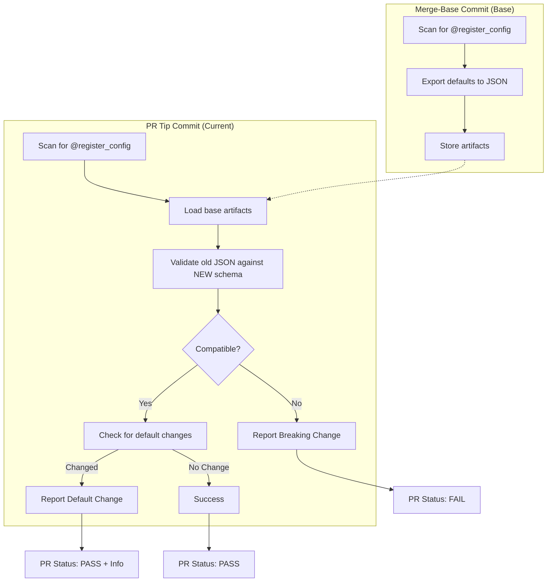

# Configuration Breaking Change Detector

A reusable, production-ready system for detecting configuration breaking changes in CI/CD pipelines before they hit production.

## Problem

Silent configuration breakages occur across commits when:
- A config schema changes (field removed, type changed)
- A config class is renamed or removed
- Default values shift in incompatible ways

These failures often don't surface until runtime in production, causing incidents.

**Solution**: This tool exports default configurations at merge-base and validates them at PR tip, catching breaking changes early with precise feedback.

## Quick Start (5 minutes)

### 1. Explicit Registration (REQUIRED)

All configs must be explicitly registered using the `@register_config()` decorator. This puts the burden on teams to declare what they want to protect—enforcing ownership.

```python
from unique_toolkit._common.config_checker import register_config

@register_config()  # Required!
class Settings(BaseSettings):
    api_key: str = "default"
    timeout: int = 30

@register_config(name="custom_name")  # Optional: custom name
class WebSearchConfig(BaseModel):
    mode: str = "fast"
```

**Why explicit registration?**
- Teams own what gets checked
- No surprise breaking changes in configs you forgot about
- Clear intent: "I want to protect this config"
- Encourages discipline: one decorator per important config

### 2. What Gets Checked

At **merge-base** (before your changes):
- Find all `@register_config` decorated models
- Export their code-level defaults to JSON

At **PR tip** (your changes):
- Find all `@register_config` decorated models
- **Validate the old JSON against the NEW schema**
- This catches: removed fields, type changes, required fields added

**Examples**:
- ✅ **PASS**: Add a new optional field with a default
- ❌ **FAIL**: Remove a field
- ❌ **FAIL**: Change a field type
- ✅ **PASS + REPORT**: Change a default value (non-breaking)

### 3. CI is Already Running

The workflow `.github/workflows/ci-config-check.yaml` automatically:
- Runs on every PR
- Detects `@register_config` decorated configs
- Exports defaults at merge-base
- Validates at PR tip
- Reports breaking changes in PR checks

No additional setup needed!

## How It Works

### High-Level Flow



**Key Insight**: We validate that old data can be loaded with new schema.
If you removed a field, old configs using that field will fail to validate.

### What Gets Checked

| Scenario | Result | Exit Code |
|----------|--------|-----------|
| Schema compatible | ✓ PASS | 0 |
| Field removed or type changed | ❌ FAIL | 1 |
| Config class removed/renamed | ❌ FAIL | 1 |
| Default values changed (schema OK) | ⚠️ PASS + REPORT | 0 |

## CLI Usage

The tool can be run manually locally for debugging:

### Export Defaults (run at base commit)

```bash
python -m unique_toolkit._common.config_checker export \
    --output ./artifacts/
```

Output:
```
📦 Exporting configs from: .
📁 Output directory: ./artifacts/
✓ Discovered 8 config(s)
✓ Export complete!
  - 8 exported
```

Generates:
- `artifacts/WebSearchSettings.json` - Default values
- `artifacts/manifest.json` - Export metadata

### Validate Against New Schema (run at tip commit)

```bash
python -m unique_toolkit._common.config_checker check \
    --artifacts ./artifacts/ \
    --report-defaults
```

Output:
```
🔍 Validating configs from: .
📁 Artifact directory: ./artifacts/
✓ Discovered 8 config(s) at tip
📊 Validation Results:
  - Total: 8
  - Valid: 7
  - Invalid: 1

❌ Validation FAILED
```

### Local Testing Workflow

Test breaking changes locally before committing:

```bash
# Save current state
git stash

# Export base defaults
git checkout main
python -m unique_toolkit._common.config_checker export \
    --output /tmp/base-defaults

# Restore your changes
git stash pop

# Validate
python -m unique_toolkit._common.config_checker check \
    --artifacts /tmp/base-defaults
```

## Understanding Reports

### Passing Check
```markdown
## ✓ All Configurations Compatible

### Summary
All 8 config(s) validated successfully.
```

### Failing Check with Details
```markdown
## ❌ Configuration Breaking Changes Detected

### 🔴 Schema Validation Failures

**unique_web_search.config.Settings**
- `google_search_api_key`: Removing a required field
- `max_results`: Type changed from `int` to `str`

**unique_stock_ticker.config.StockTickerConfig**
- `plotting_config.backend`: Unknown enum value 'matplotlib'

### 📊 Default Value Changes (non-breaking)

**unique_web_search.config.Settings**
- `web_search_mode`: "v1" → "v2"
- `active_search_engines`: ["google"] → ["google", "bing"]

### Summary
1 config(s) failed validation.
```

## Common Patterns

### Renaming a Config Class (Migration)

To rename without breaking CI:

**Before (base commit):**
```python
class WebSearchConfig(BaseModel):
    ...
```

**After (your PR):**
```python
# Keep old name temporarily with decorator
@register_config(name="WebSearchConfig")
class SearchConfig(BaseModel):
    ...
```

Once merged and stable, remove the decorator.

### Removing a Config (Intentional)

If a config is genuinely removed (not renamed), CI will fail. To proceed:

1. Understand the implications (what code uses this config?)
2. Update consuming code first
3. Remove the config in a separate PR with justification

### Changing Defaults Safely

Default changes that maintain schema compatibility pass CI but are reported:

```markdown
### 📊 Default Value Changes (non-breaking)
- `max_results`: 10 → 20
```

These are safe and don't break existing configs. The report is informational.

### Adding New Fields

New fields with defaults are safe:

```python
class ConfigV2(BaseModel):
    existing_field: str = "value"
    new_field: str = "new_default"  # Safe: has default
```

Fields added without defaults will cause validation errors for old configs missing them.

## Environment Variables & BaseSettings

The exporter **ignores environment variables** and exports only code-level defaults. This ensures:
- Reproducible exports across CI environments
- Detection of schema-level changes, not env-driven behavior
- Consistent baselines for comparison

**If env vars are detected during export:**
```
⚠️  1 warning(s):
  - Environment variable DB_HOST set during export (will be ignored, using code defaults)
```

This is normal in CI—the check continues with code defaults.

## Architecture

### Core Modules

- **registry.py**: Manages config registration (explicitly decorated models only)
- **exporter.py**: Exports config defaults to JSON
- **validator.py**: Validates old JSON against new schemas
- **differ.py**: Detects non-breaking default changes
- **cli.py**: Command-line interface
- **models.py**: Internal data structures

### Integration Points

**For Developers**:
- `@register_config()` decorator for explicit registration

**For CI/CD**:
- `.github/workflows/ci-config-check.yaml` runs on every PR
- `export` and `check` CLI commands for manual runs
- Markdown reports in GitHub Step Summary

## Troubleshooting

### Q: My config uses environment variables. Will this break CI?

**A:** No. The exporter uses code-level defaults only, ignoring env vars. This ensures the baseline is deterministic and reproducible across CI environments.

### Q: I renamed a config class. How do I avoid CI failure?

**A:** Use the same name in `@register_config()` on both old and new classes during transition:

```python
# At base (old class)
@register_config(name="WebSearchSettings")
class WebSearchSettings(BaseSettings):
    ...

# At tip (new class with same registered name)
@register_config(name="WebSearchSettings")
class SearchSettings(BaseSettings):
    ...
```

Once stable, you can rename the decorator or remove it if the class will always be called `WebSearchSettings`.

### Q: What if I don't use @register_config?

**A:** Your config won't be checked. This is intentional. You must explicitly declare what configs to protect.

### Q: A field changed type but I coerced it in the schema. Will CI fail?

**A:** It depends. If Pydantic can coerce the old value to the new type, it passes. If not, CI fails. This is intentional—we want to catch type changes that might cause runtime errors.

### Q: Can I test this locally?

**A:** Yes! Use the CLI commands:

```bash
# At base
git checkout main
python -m unique_toolkit._common.config_checker export --package . --output /tmp/base

# At tip
git checkout your-branch
python -m unique_toolkit._common.config_checker check --artifacts /tmp/base --package .
```

### Q: The report says a config is "missing". What does that mean?

**A:** A config JSON file from base commit couldn't find a matching model at tip. Either:
- The config class was removed (breaking change)
- The config class was renamed without using `@register_config()`

To fix: Either restore the class or use `@register_config()` to map the old name.

### Q: Can I ignore a specific breaking change?

**A:** Not recommended (defeats the purpose), but you can:

1. **Fix the schema** to maintain compatibility

2. **Create a migration guide** for users

The system is designed to catch issues early. If you need to skip, understand why.

## Performance

Typical CI impact per package: **30-60 seconds**

- Discovery: ~5s
- Export at base: ~15-20s
- Validation at tip: ~15-20s
- Report generation: ~5s

Impact is proportional to package complexity (number of configs, nesting depth).

## Limits & Assumptions

- **Pydantic v2 only**: Uses Pydantic v2 APIs (`model_validate`, `model_dump`)
- **Python 3.11+**: Requires Python 3.11 or later
- **Explicit Registration Required**: All configs must be decorated with `@register_config()`. Auto-discovery is disabled to enforce ownership.
- **SecretStr values**: Exported as plain strings in ephemeral CI artifacts (safe: artifacts auto-deleted)
- **Code-Level Defaults Only**: Env vars are ignored; only code-level defaults are checked

## Future Enhancements

Potential improvements (not in MVP):

- [ ] Support other config frameworks (dataclasses, attrs)
- [ ] Warn-only mode for rollout phase
- [ ] Config change changelog generation
- [ ] Integration with migration scripts
- [ ] Custom validation hooks

## Development


### Running Tests

```bash
pytest unique_toolkit/tests/unique_toolkit/_common/config_checker -v
```

### CLI Development

The CLI uses Click. To add a new command:

```python
@cli.command()
@click.option('--name', required=True)
def my_command(name):
    """My new command."""
    ...
```

## Support & Feedback

This tool is designed for early breaking change detection. If you encounter issues or have feature requests, please document them with:

1. Config structure (BaseModel vs BaseSettings)
2. The specific breaking change scenario
3. Expected vs actual behavior
4. Any custom validators or field configurations

