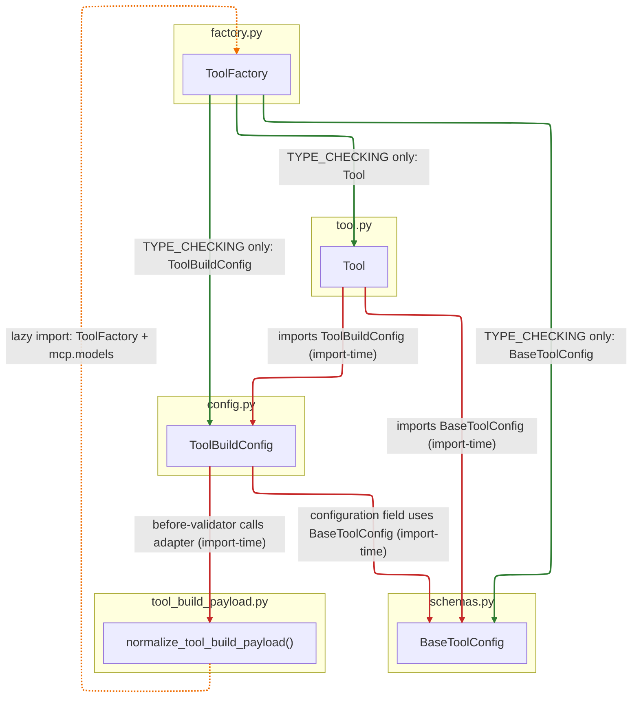

# Agentic tools: configuration and factory

This document describes how the core tool types relate to each other, where they live in the package, and what is awkward or worth improving.

## Terminology

| Name (colloquial) | Primary symbol | Module | Role |
|-------------------|----------------|--------|------|
| **Tool config** | `BaseToolConfig` (subclass per tool) | `schemas.py` | Pydantic model for a **single tool’s parameters** (what the LLM / UI configure for that tool). |
| **Tool** | `Tool[ConfigType]` | `tool.py` | Abstract **implementation**: `run()`, `tool_description()`, prompts, optional legacy chat/event wiring. |
| **Tool build config** | `ToolBuildConfig` | `config.py` | **Persisted / agent-facing envelope**: tool identity, UI metadata (`display_name`, `icon`, `selection_policy`, …) plus nested `configuration` (an instance of the tool-specific config model). |
| **Tool factory** | `ToolFactory` | `factory.py` | **Runtime registry**: maps tool **name** → tool class and → config class; builds instances from those maps. **No runtime imports** from other agentic-tools modules: `BaseToolConfig`, `Tool`, and `ToolBuildConfig` are referenced only under `TYPE_CHECKING` with `from __future__ import annotations` (postponed annotations). |
| **Build payload normalizer** | `normalize_tool_build_payload` | `tool_build_payload.py` | **Adapter** between envelope validation and the registry: turns raw dicts (MCP/sub-agent/normal) into a `ToolBuildConfig`-ready dict without `config.py` importing `ToolFactory`. |

Concrete tool configs are almost always subclasses of `BaseToolConfig`, not `BaseToolConfig` itself.

## How they depend on each other

Dependencies fall into three buckets:

| Kind | Meaning in this package | Diagram edge color |
|------|-------------------------|-------------------|
| **Import-time (runtime)** | The module executes a normal `import` when loaded; the dependency is always pulled in with the parent module. | **Red** |
| **Lazy (runtime)** | Import inside ``normalize_tool_build_payload`` so ``mcp`` / ``factory`` load only after ``Tool`` exists (avoids cycles via ``mcp/__init__.py`` and jinja). | **Amber** |
| **Type-checking only** | Names exist for **mypy / Pyright / pylance** under `typing.TYPE_CHECKING`; they are **not** imported when `TYPE_CHECKING` is false, so they do not add a runtime import edge from that module. | **Green** |

### Module-level picture

| From | To | Kind | Color |
|------|-----|------|-------|
| `config.py` | `schemas.py` (`BaseToolConfig`) | Import-time | Red |
| `tool.py` | `config.py`, `schemas.py`, … | Import-time | Red |
| `factory.py` | `schemas.py`, `tool.py`, `config.py` | **Type-checking only** (`TYPE_CHECKING` + postponed annotations); **no** runtime import of those modules | Green |
| `config.py` | `tool_build_payload.py` | **Import-time**; the envelope’s `before` validator delegates here | Red |
| `tool_build_payload.py` | `factory.py`, `mcp.models` | **Lazy** (inside `normalize_tool_build_payload` on first use) | Amber |
| `tool_build_payload.py` | `a2a.config` | **Lazy** (sub-agent branch only) | Amber |

`config.py` does **not** import `factory.py`. At **runtime**, `ToolFactory` still **holds** concrete `Tool` subclasses and builds instances (`build_tool`, etc.); that is **value** flow through `tool_map`, not `factory.py` importing `tool.py`.

1. **`BaseToolConfig`** has no dependency on tools, factory, or `ToolBuildConfig`. It is the leaf type for “parameters of tool X”.

2. **`ToolBuildConfig`** depends on **`BaseToolConfig`** at **import time** and imports only **`tool_build_payload`** (no **`factory`**). **`normalize_tool_build_payload`** loads **`ToolFactory`** and **`MCPToolConfig` lazily** on first use so imports do not pull in **`mcp/__init__.py`** (which needs **`Tool`**) while **`tool.py`** is still loading. Registry dispatch remains **`ToolFactory.resolve_tool_configuration`**.

3. **`Tool`** depends on **`ToolBuildConfig`** and **`BaseToolConfig`** at **import time**. Its constructor builds a **`ToolBuildConfig`** with `name=self.name` and `configuration=config`, so a running tool always carries a `settings` object compatible with the envelope model (often a subset of fields compared to stored agent config).

4. **`ToolFactory`** does **not** import **`schemas`**, **`tool`**, or **`config`** at **runtime**. **`BaseToolConfig`**, **`Tool`**, and **`ToolBuildConfig`** are imported only under **`TYPE_CHECKING`**, with **`from __future__ import annotations`** so annotations are postponed and the registry body never needs those names at import time. Concrete classes still arrive via **`register_tool`** / **`register_tool_config`**.

## Typical lifecycle

1. **Define** a `MyToolConfig(BaseToolConfig)` and `MyTool(Tool[MyToolConfig])` with `name = "MyTool"` (or equivalent class attribute used by the factory).
2. **Register**: `ToolFactory.register_tool(MyTool, MyToolConfig)` so name → classes.
3. **Deserialize agent settings**: JSON / DB becomes `ToolBuildConfig` (or a specialized generic alias). The `before` validator delegates to **`normalize_tool_build_payload`**, which uses **`ToolFactory`** when `configuration` is still a dict for a registered tool.
4. **Execute**: `ToolManager` (see `tool_manager.py`) uses `ToolFactory.build_tool_with_settings` / `build_tool` plus `ToolBuildConfig` entries to create runnable tools bound to an event when needed.

## Where there is room for improvement

### Coupling and import structure

- **`tool_build_payload` ↔ `ToolFactory`**: Wire-format normalization calls the registry (`resolve_tool_configuration`) from inside **`normalize_tool_build_payload`**, not from **`config.py`**. **`factory.py`** has **no runtime imports** from **`schemas`**, **`tool`**, or **`config`** (only `TYPE_CHECKING` + postponed annotations). The adapter module is **import-light** (no toolkit imports at module level) so **`config` → `tool`** can complete before **`mcp`** pulls in **`Tool`**.

- **`Tool` imports `ToolBuildConfig`**: Load order is roughly **`factory`** (no sibling imports) → **`config`** (pulls in **`tool_build_payload`**) → **`tool`**, then first **`ToolBuildConfig`** validation may lazily import **`mcp`** / **`factory`** use paths.

### `ToolFactory` design

- **Mutable class attributes** (`tool_map`, `tool_config_map`) behave like a **process-wide singleton**. That is simple but makes **tests and multiple isolated registries** harder (order-dependent imports, accidental double registration).

- **`tool_config_map` is typed as `Callable`**, which is weaker than `type[BaseToolConfig]` and hides mistakes until runtime.

- Registration assumes **tool name consistency** between `Tool.name`, dict keys, and `ToolBuildConfig.name` without a single enforced invariant (convention + discipline).

### Two shapes of “settings”

- **`Tool.__init__`** constructs a **minimal** `ToolBuildConfig` (essentially name + configuration) while orchestration often has a **full** `ToolBuildConfig` from config (display name, policies, etc.). Merging semantics live partly in `build_tool_with_settings`. This is easy to follow once explained but **easy to get wrong** when adding new envelope fields.

### `BaseToolConfig` and shared schemas

- `BaseToolConfig` is intentionally minimal; **cross-field validation** for tool parameters is still called out as TODO in `schemas.py`. Stronger shared validation would help misconfiguration fail earlier.

### Side effects at import

- **`ToolBuildConfig.model_rebuild()`** in `tool.py` ties forward references / generics; any heavy or fragile rebuild ordering can surface as import-order bugs.

### Validator complexity

- `ToolBuildConfig.initialize_config_based_on_tool_name` bundles **normal tools**, **MCP**, and **sub-agent** branches. Extracting **strategy functions** or separate discriminated models could reduce complexity and make testing easier.

---

For execution wiring, filtering, and OpenAI/MCP integration, see `tool_manager.py` and the `mcp/`, `a2a/`, and `openai_builtin/` subpackages.
