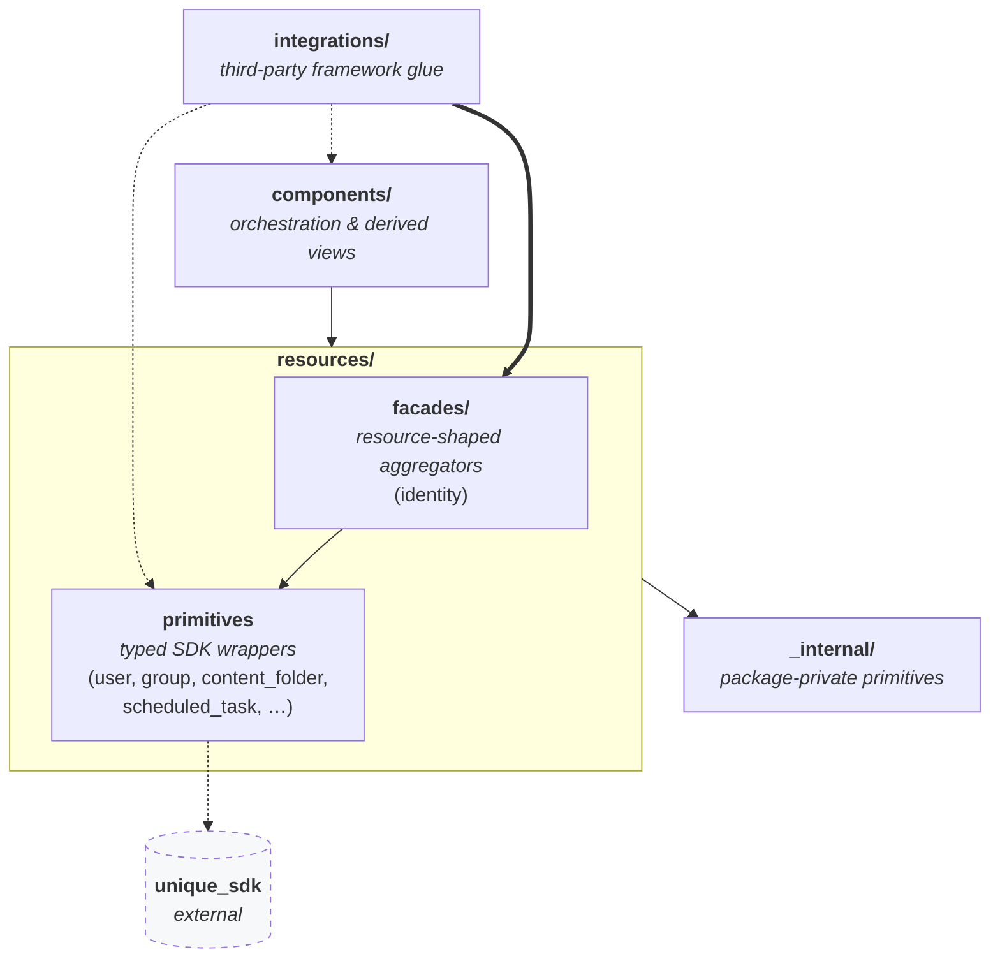
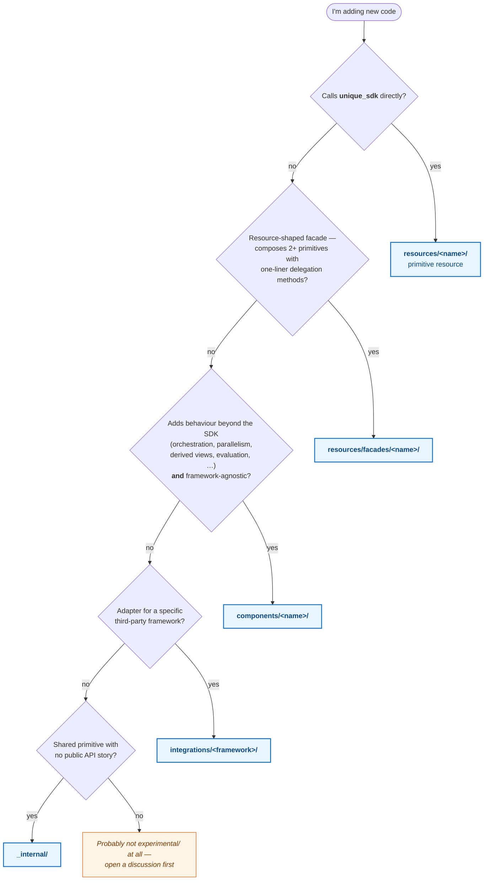

# `experimental/` — reorg proposal

This subpackage is the **staging area for the next-generation toolkit
layout**. Nothing here is stable; the public API, import paths, and class
names may change without notice and are not covered by the toolkit's normal
stability guarantees.

The goal of the reorganization is to replace the current "organize by file
type" layout with a layered layout where the **direction of dependencies is
visible at the folder level**. If you know which layer something lives in,
you know what it's allowed to import.

> **Contract:** every module in `experimental/` belongs to exactly one
> layer, and a layer may only import from layers *below* it. Violations are
> bugs; please fix them as you find them.

---

## The stack



**Reading the arrows:**

- **Solid arrows** are the default dependency path for a layer.
- **Dotted arrows** are allowed but discouraged — use them when the default
  path does not cover your case, and consider whether the missing path is
  a signal that something should be refactored.
- `integrations/` and `components/` are **peers**, not stacked. Both
  sit directly above `resources/`. An integration's default path is a
  facade (which is why `integrations ==> facades` is drawn bold); reaching
  a primitive resource is fine when no facade fits; reaching into
  `components/` is the escape hatch of last resort.
- `components/` never imports `integrations/`. Orchestration must stay
  framework-agnostic — that is the entire reason integrations are a
  separate layer.

---

## What goes where

### `_internal/` — package-private primitives

Shared low-level helpers that are deliberately **not** part of the public
API. Think: HTTP plumbing, Pydantic helpers, time/string/exception utilities.

- **May import:** stdlib, third-party libs (Pydantic, etc.).
- **Must not import:** anything else in `experimental/`. This is the
  bottom of the stack; it would be a dependency inversion.
- **Public exposure:** none. If something here is genuinely useful to
  users, promote it into `resources/`, `components/`, or
  `integrations/` — whichever layer fits — and re-export it there.

### `resources/<name>/` — typed adapters over `unique_sdk`

One subfolder per SDK resource family. The canonical shape is:

```
resources/<name>/
    schemas.py     # Pydantic models for request/response payloads
    functions.py   # (optional) free-standing sync + async call pairs
    service.py     # stateful, keyword-only class over functions.py
    __init__.py    # re-exports
```

A module belongs here **iff** it could be deleted without losing any
functionality relative to raw `unique_sdk` usage — it's pure typing + a
slightly nicer call surface, nothing more.

- **May import:** `unique_sdk`, `_internal/`, stdlib, third-party libs.
- **Must not import:** sibling resources (see `facades/` below for the
  exception), `components/`, `integrations/`.
- **Concrete examples in-tree today:** `user/`, `group/`,
  `content_folder/`, `scheduled_task/`.
- **Resources** should be stateless classes

### `resources/facades/<name>/` — aggregating resources

A **facade** (GoF pattern) is a resource-shaped object with no SDK calls
of its own that composes two or more sibling resources behind a single
`(user_id, company_id)` context. Constructor shape and keyword-only
convention match the sibling resources, so callers cannot tell the
difference at the call site.

Facades are the **preferred entry point for `integrations/`** — they give
framework adapters a single object to bridge instead of N resource
services to wire up individually.

- **May import:** two or more sibling `resources/<primitive>/` packages,
  `_internal/`, stdlib, third-party libs.
- **Must not import:** `unique_sdk` directly (go through a sibling
  resource instead — a facade that calls the SDK directly is actually a
  primitive resource with an identity crisis), `components/`,
  `integrations/`.
- **Test to decide "facade vs component":** if every public method is a
  one-liner that forwards to a sub-resource attribute, it is a facade.
  As soon as a method adds orchestration (parallel fan-out, caching,
  derived views, retry/fallback, cross-resource validation), it belongs
  in `components/` instead.
- **Concrete example in-tree today:** `facades/identity/` composes
  `user/` + `group/` behind `Identity.users` / `Identity.groups`.

### `components/<name>/` — behaviour beyond the SDK

Everything the SDK does not provide by itself: agent loops, evaluation,
rule compilation, tokenization, data extraction, derived views (e.g. a
trie over content), parallel pagination, post-processing.

- **May import:** `resources/` (primitives and facades), `_internal/`,
  stdlib, third-party libs.
- **Must not import:** `integrations/`, `unique_sdk` directly (every SDK
  call lives in a `resources/` module so there is exactly one place to
  patch when the SDK changes).
- **Concrete example in-tree today:** `components/content_tree/` — a
  derived trie + fuzzy-search view over the `content` resource.

### `integrations/<framework>/` — third-party framework adapters

Leaf layer. One subfolder per external framework (OpenAI SDK, LangChain,
LlamaIndex, …). Every module here is a thin adapter that maps toolkit
types to a framework's types.

- **May import (default path):** `resources/facades/` — the one-object
  entry point that a framework adapter typically wants to bridge.
- **May import (fine when no facade fits):** primitive `resources/<x>/`.
- **May import (escape hatch — discouraged):** `components/`. If you
  reach for this, stop and consider: is the orchestration you need truly
  framework-specific (then it belongs inside this `integrations/<x>/`
  module)? Or is it general-purpose orchestration that any caller would
  want (then it stays in `components/`, and you import it, but
  double-check whether another integration will need the same pass and
  whether a facade could replace the dependency entirely)?
- **Always may import:** `_internal/`, stdlib, third-party libs
  (including the framework itself).
- **Must not import:** another `integrations/<framework>/` — each
  framework adapter stands alone. Share code via `_internal/` or by
  lifting it into `components/`.
- **Optional dependencies:** integrations that depend on libraries the
  toolkit does not pin (e.g. LangChain) stay importable even when the
  library is missing; the framework itself is loaded lazily inside the
  adapter.

---

## Import-rule cheat sheet

| From ↓ \ May import → | `_internal` | `resources/<primitive>` | `resources/facades` | `components` | `integrations` |
| --- | :-: | :-: | :-: | :-: | :-: |
| `_internal`                | —   | no  | no  | no  | no  |
| `resources/<primitive>`    | yes | no¹ | no  | no  | no  |
| `resources/facades`        | yes | **yes** | no² | no  | no  |
| `components`             | yes | yes | yes | yes³ | no  |
| `integrations/<framework>` | yes | ok⁴ | **yes** | discouraged⁵ | no⁶ |

¹ A primitive resource imports only `unique_sdk`, not sibling resources.
If two primitives need to call each other, you have discovered a facade.

² Facades do not import other facades; they compose primitives. Stacking
facades is an orchestration concern — that lives in `components/`.

³ Importing a *sibling* module inside the same layer is fine when the
dependency is genuinely intra-layer (one component building on another).
Cross-layer is what the rules above constrain.

⁴ Primitive resources are a fine fallback when no facade covers the
integration's use case. Prefer the facade when one exists so there is a
single bridge to maintain per framework.

⁵ Allowed but flagged as a smell. Ask whether the orchestration you need
is framework-specific (belongs in this integration) or general-purpose
(stays in `components/`, possibly behind a new facade).

⁶ One integration never imports another integration. Share via
`_internal/` or promote to `components/`.

---

## Decision tree — "I'm adding new code"

Walk the diagram top to bottom; the first **yes** wins. A **no** all the
way to the bottom is a signal that the module probably does not belong in
`experimental/` at all.



---

## Experimental ≠ "hidden"

The point of `experimental/` is **staging**, not secrecy. Modules here are
expected to graduate into the stable tree once:

- their public API has survived at least one integration at a customer
  site or internal app,
- the naming and boundaries match the final-state convention documented
  above,
- they have tests and Google-style docstrings on public symbols.

Graduation is a straight-through move: delete the `experimental/` ancestor
from the import path, keep everything else identical. Because layers and
sub-bucket names are the same in both places, the graduation diff is a
`git mv` plus an import sweep — no architectural rework.
