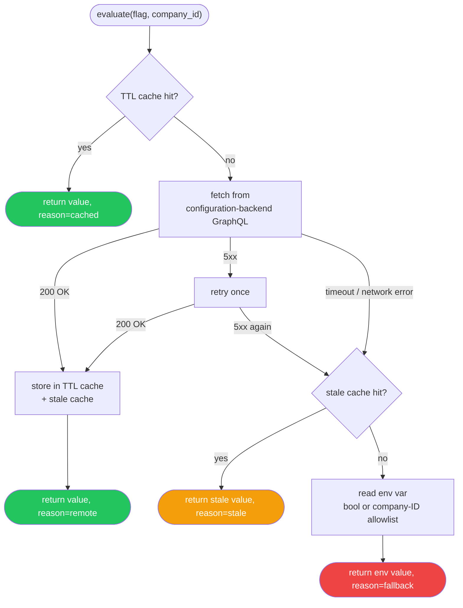

# `feature_flags` — Python feature flag client

Remote feature flag evaluation backed by configuration-backend's GraphQL API,
with in-process TTL caching and graceful env-var fallback.

Mirrors the OpenFeature `evaluate` / `isEnabled` semantics used by the
Node.js `@unique/feature-flags` package. The OpenFeature Python SDK is
deliberately **not** used as a dependency — the interface is implemented
directly to avoid SDK overhead.

---

## Environment variables

| Variable | Required | Default | Description |
|---|---|---|---|
| `CONFIGURATION_BACKEND_URL` | **Yes** | — | Base URL of your configuration-backend instance. |
| `FEATURE_FLAG_SERVICE_ID` | **Yes** | — | Service identifier sent as `x-service-id`. Must match a value in configuration-backend's `Service` enum (e.g. `agentic-ingestion`). |
| `FEATURE_FLAG_CACHE_TTL_MS` | No | `30000` | In-process cache TTL in milliseconds. |

---

## `flag` argument convention

The `flag` argument to `evaluate()` / `is_enabled()` must be the
**upper-snake env-var-style key**, e.g.:

```
FEATURE_FLAG_ENABLE_PDF_CONTENT_EXTRACTION
FEATURE_FLAG_ENABLE_AGENTIC_METADATA_EXTRACTION_UN_15619
FEATURE_FLAG_ENABLE_IMAGE_CONTENT_EXTRACTION_UN_17223
```

This matches both the configuration-backend registry key convention and the
existing env-var names in Python services, so the env-var fallback path
requires no transformation.

Define flag name constants in your service (not in the toolkit) to avoid
magic strings:

```python
# in your service, e.g. agentic-ingestion
class IngestionFlags:
    PDF_EXTRACTION = "FEATURE_FLAG_ENABLE_PDF_CONTENT_EXTRACTION"
    IMAGE_EXTRACTION = "FEATURE_FLAG_ENABLE_IMAGE_CONTENT_EXTRACTION_UN_17223"
```

---

## Usage

### Constructor injection (recommended for testing)

```python
from unique_toolkit.experimental.components.feature_flags import FeatureFlagClient

client = FeatureFlagClient(
    url="https://your-configuration-backend",
    service_id="agentic-ingestion",
    ttl_ms=30_000,
)

result = await client.evaluate(
    "FEATURE_FLAG_ENABLE_PDF_CONTENT_EXTRACTION",
    company_id=company_id,
    user_id=user_id,
)
# result.value  → bool
# result.reason → "remote" | "cached" | "stale" | "fallback"

enabled = await client.is_enabled(
    "FEATURE_FLAG_ENABLE_PDF_CONTENT_EXTRACTION",
    company_id=company_id,
    user_id=user_id,
)
```

### `from_settings()` factory (recommended for services)

`from_settings()` is a process-level singleton — repeated calls always return
the same instance, keeping the TTL cache warm across requests.

```python
# Call lazily — inside a request handler or app startup hook,
# NOT at module import time. Env vars must be fully injected before
# the first call or a ValueError is raised.
client = FeatureFlagClient.from_settings()
```

> **⚠️ Do not call `from_settings()` at module level.** In some container
> runtimes, env vars are not yet available when Python modules are imported.
> Call it inside your app's startup hook or on first request.

### `bind_settings()` — per-request bound client

For services that use `UniqueSettings` / `AuthContext`, bind the singleton
once per request to avoid passing `company_id` / `user_id` at every call site:

```python
from unique_toolkit.experimental.components.feature_flags import (
    BoundFeatureFlagClient,
    FeatureFlagClient,
)

# once at startup
client = FeatureFlagClient.from_settings()

# once per request (settings carries company_id / user_id)
bound: BoundFeatureFlagClient = client.bind_settings(settings)

if await bound.is_enabled("FEATURE_FLAG_ENABLE_PDF_CONTENT_EXTRACTION"):
    ...
```

---

## Evaluation order

1. **TTL cache** — returns the cached value if present (within the TTL window).
2. **Remote** — calls configuration-backend's `evaluateFlag` GraphQL query.
   One retry on transient 5xx errors.
3. **Stale cache** — on failure, returns the last successfully fetched value
   for this `(flag, company_id, user_id)` key if one exists.
4. **Env-var fallback** — if no stale value is available, reads the flag's
   env var. Supports plain booleans (`"true"` / `"false"`) and
   comma-separated company-ID allowlists (`"company1,company2"`), consistent
   with `unique_toolkit.agentic.feature_flags.FeatureFlags`.



---

## `FlagEvaluation.reason` values

| Value | Meaning |
|---|---|
| `"remote"` | Value was freshly fetched from configuration-backend. |
| `"cached"` | Value was returned from the in-process TTL cache. |
| `"stale"` | Transport error; last-known-good value for this company returned. |
| `"fallback"` | No prior value available; env-var default used. |

---

## Adopting in another Python service

1. Install `unique-toolkit` (cachetools is a core dep, no extra group needed): `uv add unique-toolkit`
2. Set env vars: `CONFIGURATION_BACKEND_URL`, `FEATURE_FLAG_SERVICE_ID`
3. Add the service ID to configuration-backend's `Service` enum (`tyk-auth`)
   and to the `@AllowAccess` whitelist on the `evaluateFlag` resolver.
4. Register any new flag keys in `feature-flag.registry.ts`.
5. Define flag name constants in your service (see convention above).
6. Replace `os.getenv("FEATURE_FLAG_*", "false")` call sites with
   `await client.is_enabled("FEATURE_FLAG_*", company_id=..., user_id=...)`.
